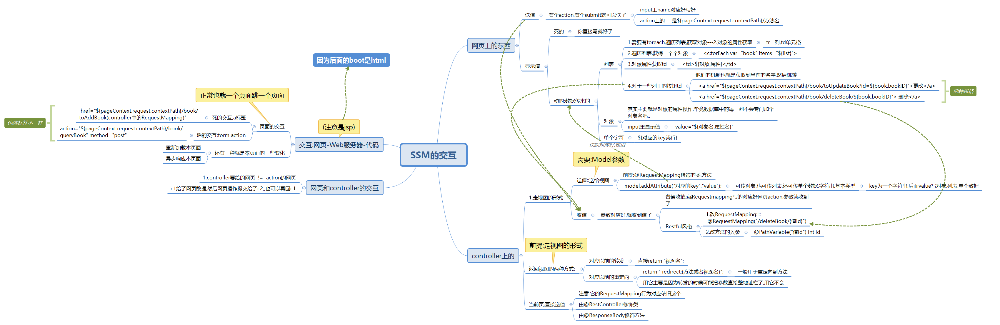

# SSM_Problem
- 遇到的一些问题
- 1.web服务启动时,没在Artifacts 中配lib会导致失败
- 2.在前端代码中,给数据传值时注意空格
- 3.redirect:/book/allbook 直接事件比较好


## 开发的一些心得
- 先整图




- 交易通了后,最为关键的是传值问题

- 1.直接将我们后端数据发给前端是简单的,只需要 ---返回类型return 地址---就是要转发或者重定向的地址
  - 1.执行自身的查询 List<Books> list = bookService.queryAllBook();
  - 2.model.addAttribute("list",list); 是直接的送,,送去哪里了?
  - 3.送到了jsp---jsp怎么接收? 使用${}---接收
    
- 2.后端送值也可以直接@ResponseBody 直接送,它要求的返回类型--return String;  送到字符串  
  - 接收还是${}
    
    ````
            标准的带按钮的遍历查询
             <c:forEach var="book" items="${list}">
                    <tr>
                        <td>${book.bookID}</td>
                        <td>${book.bookName}</td>
                        <td>${book.bookCounts}</td>
                        <td>${book.detail}</td>
                        <td>
                            <a href="${pageContext.request.contextPath}/book/toUpdateBook?id=${book.bookID}">更改</a>
                            <a href="${pageContext.request.contextPath}/book/del/${book.getBookID()}"> 删除</a></td>
                    </tr>
                </c:forEach>
  
    ````
  
- 2.JSP如何将接收到的参数送到后端
    - 1.自身对应好接收的参数
    - 2.submit走method送值
 - 对应的后端怎么接?
     - 只要action对了,后端的方法上对应好action就可以接收到了
       (老早也是,配servlet,然后使用action对应好,后端的controller就收到了)
     - 方法上写上要接收的东西就好了  

    ```
   <form action="${pageContext.request.contextPath}/book/addBook" method="post">
        书籍名称：<input type="text" name="bookName" required><br><br><br>
        书籍数量：<input type="text" name="bookCounts" required><br><br><br>
        书籍详情：<input type="text" name="detail" required><br><br><br>
        <input type="submit" value="添加">
  
  
    ```
  
   - 还有一种直接ahref地址栏送
         -  <a href="${pageContext.request.contextPath}/book/toUpdateBook?id=${book.bookID}">更改</a>
     

## 总
- 后端送值
    - .addAttribute("接收对象",送的东西);
    - @ResponseBody 直接return 字符串; --- 直接响应到当前(action)的页面
    
- 前端获取 ${}

- 前端送值 action写好 然后submit 
    - 中途写好对应的Bean就好
    - 例如` 书籍名称：<input type="text" name="bookName" required>`
    
- 后端取值,直接方法的括号内对应上取就行了
    - `public String addBook(Books books){之后service用值}`


### 常规操作
- 1.前端既取值又送值(update)
    - 思考:几个东西完成
    - 两个页面,两个后端---两两交互  
    - 后端送值-->前端${}获取到值-->前端送值可直接${}(取到的直接送)-->后端获取再add转给其它-->前端获取

- 2.后期既取值又送值(add)
    - 思考:几个东西完成
    - 其它页面送给后端-->后端方法中获取,然后add,或者ResponseBody直接将值给前端
    
- 3.还是前端既取值再送值delete
    - 思考:几个东西完成
    - 后端送值-->前端${}获取到值-->前端送值可直接${}(取到的直接送)-->后端获取到,执行操作-->返回页面
 


