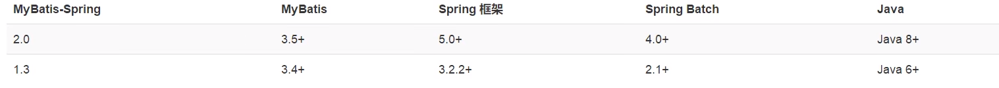

# Spring+Mybatis
> Thinking is more important than learning
## 前言
- 先回忆Mybatis
    - 干什么的? 作用: 开始---用户输入的参数,
      1.(mapper遥控板的一个按钮),
      2.接口方法捕获到,
      3.将数据给xml 
      4.xml同pojo进行处理 
      5.接口方法从xml或pojo拿到数据
      6.然后回显给用户
    - 配置?
      - 1.获取sqlSession的工具(因为要钥匙模板)  所以2
      - 2.配置文件中心,配置数据库的连接,别名（result别名），Mapper.xml的配置,提供一些服务
      - 3.pojo --> Mapper接口 --->Mapper.xml
      - 4.测试-获取sqlSession->mapper->调用方法--
      
- 回忆Spring
    - 干什么的?作用:将new对象的事情完完整整的全权接收,由容器进行.

    - 配置
        - 1.先applicationContext吧
        - 2.类的装配:有一个类就有一个bean,类直接的关系,要不ref,要不@autowire
        - 3.如果想要加入一些日志啥的,AOP开始
        - 4.调用:ApplicationContext和CPX---产出一个上下文context 然后再获取你要的bean
    

## 整合



- 步骤:
    - 1.导入相关的jar包--
        - junit
        - mybatis
        - mysql数据库的
        - spring相关的
        - aop织入
        - mybatis-spring(新知识)
    
- 配置
  - 先Mybatis 注：：所有涉及new对象的，都有spring来了。。。 
    - 1.pom 所有的
    - 2.mybatis-config.xml --- 只留个设置，别名---其它的由spring来
    - 3.sqlSession的获取 --- 改为spring的方式来
    - 4.pojo dao
    - 5.test
    

## mybatis-spring
- 1.编写数据源配置
- 2.sqlSessionFactory
- 3.sqlSessionTemplate
- 4.需要给接口加实现类
- 5.将自己的实现类注入到spring中
- 6.测试只需拿个xml，getBean就行了


### 一种简单的方式
- 在实现类直接继承SqlSessionDaoSupport
- 然后就有一个getSqlSession(); 直接直接操作就行了
- 当然这个类还是得配bean，注入spring中，set属性要引入SqlSessionFactory


# 声明式事务
- 1.回顾事务
    - 把一组业务当成一个业务来做，要么都成功，要么都失败
    - 事务在项目开发中，十分的重要，涉及到数据一致性问题，不能马虎！！
    - 确保完整性，一致性
    
- 2.事务的ACID原则
    - 原子性
    - 一致性
    - 隔离性
      - 多个业务可能同时操作一个资源，防止数据损坏
    - 持久性
      - 事务一旦提交，无论系统发生什么问题，结果都不会被影响，被持久化的写的存储器中
    

## spring中的事务管理
- 声明式事务：AOP---交由容器管理
- 编程式事务：需要在代码中，进行事务的管理
- 配置声明式事务
  
  ```
  
              <?xml version="1.0" encoding="UTF-8"?>
            <beans xmlns="http://www.springframework.org/schema/beans"
            xmlns:xsi="http://www.w3.org/2001/XMLSchema-instance"
            xmlns:context="http://www.springframework.org/schema/context"
            xmlns:aop="http://www.springframework.org/schema/aop"
            xmlns:tx="http://www.springframework.org/schema/tx"
            xsi:schemaLocation="http://www.springframework.org/schema/beans
            http://www.springframework.org/schema/beans/spring-beans.xsd
            http://www.springframework.org/schema/context
            http://www.springframework.org/schema/context/spring-context.xsd
            http://www.springframework.org/schema/aop
            http://www.springframework.org/schema/aop/spring-aop.xsd
            http://www.springframework.org/schema/tx
            http://www.springframework.org/schema/tx/spring-tx.xsd">
            
                <!--DataSource，使用Spring的数据源替换Myabtis的配置 c3p0 dbcp druid
                    我们这里使用Spring提供的JDBC
                -->
                <bean id="dataSource" class="org.springframework.jdbc.datasource.DriverManagerDataSource">
                    <property name="driverClassName" value="com.mysql.cj.jdbc.Driver"/>
                    <property name="url" value="jdbc:mysql://localhost:3306/mybatis? useSSL=true&amp;useUnicode=true&amp;characterEncoding=utf8&amp;useJDBCCompliantTimezoneShift=true&amp;useLegacyDatetimeCode=false&amp;serverTimezone=UTC"/>
                    <property name="username" value="root"/>
                    <property name="password" value="123456"/>
                </bean>
            
                <!--SqlSessionFactory-->
                <bean id="sqlSessionFactory" class="org.mybatis.spring.SqlSessionFactoryBean">
                    <property name="dataSource" ref="dataSource"/>
                    <!--绑定Mybatis的配置文件-->
                    <property name="configLocation" value="classpath:mybatis-config.xml"/>
                    <property name="mapperLocations" value="classpath:com/zjz/mapper/*.xml"/>
                </bean>
            
            
                <!--sqlSessionTemplate:就是我们使用的sqlSession-->
                <bean id="sqlSessionTemplate" class="org.mybatis.spring.SqlSessionTemplate">
                    <!-- 只能构造器注入sqlSessionFactory，它没有set方法-->
                    <constructor-arg index="0" ref="sqlSessionFactory"/>
                </bean>
            
                <!-- 配置声明式事务-->
                <bean id="transactionManager" class="org.springframework.jdbc.datasource.DataSourceTransactionManager">
                    <constructor-arg ref="dataSource"/>
                </bean>
            
                <!--结合AOP实现事务的织入-->
                <!--配置事务的通知-->
            
                <tx:advice id="txAdvice" transaction-manager="transactionManager">
                    <tx:attributes>
                    <!--给哪些方法配置事务-->
                    <!--配置事务的传播特性，新知识，propagation 默认REQUIRED-->
                        <tx:method name="add" propagation="REQUIRED"/>
                        <tx:method name="delete" propagation="REQUIRED"/>
                        <tx:method name="update" propagation="REQUIRED"/>
                        <tx:method name="*" propagation="REQUIRED"/>
                    </tx:attributes>
                </tx:advice>
            
                <!--配置事务切入-->
            
                <aop:config>
                    <aop:pointcut id="txPointCut" expression="execution(* com.zjz.mapper.*.*(..))"/>
                    <aop:advisor advice-ref="txAdvice" pointcut-ref="txPointCut"/>
                </aop:config>
            
            
            
            </beans>
  ```


## 对于Mybatis操作
> 如果有自增,以及引入别的类,以及日期
- pojo类,如果自增,日期,二者出其一,我们就得重写编写构造器,如果有其它类,只定义属性写上就行了
    - 如果自增,构造器中除了自增,剩下都得有
    - 如果日期,构造器在this.日期时进行处理

- mapper接口无变动
- mapper.xml
    - 按照构造器写就行,如果是计算的年龄也不用写,自增的不用写,日期正常写


- 对于多对一,这个一有可能有两个属性
- pojo就写属性就行,
- mapper接口无变化
- mapper.xml
    - 1.查询返回resultMap  -- sql语句写上:
        - 1.所有的select 都得写别名,如:Student s,Teacher t,,,那么你将所有的s.-->sid,sname 所有的t.-->tid,tname(根据要的来)
        - 2.where 连接上表,如果要ById那么and下就行
    - 2.结果集id 对应resultMap type为主pojo---那么子pojo?--在association或者 collection中
        - 1.其实也好记,就是一个property(pojo里的set)对应一个column(上面的别名)
        - 2.遇到association -- 多对一
            - property为主pojo引入的名字,javaType也是主pojo引入的名字
            - 里面对应好子查询的pojo和别名就行
        - 3.遇到collection---一对多
            - property为主pojo引入的名字,ofType是子pojo名字,要对应主pojo的泛型
            - 里面对应好子查询的pojo和别名就行


- zjz说:如果是联表查询
    - 关于查询,别名,连接
    - 关于结果集,前面的property对应好主pojo的属性,后面的column就是上面写的别名
    - 遇到association或者 collection中,里面对应好子查询的pojo属性(property)和别名


