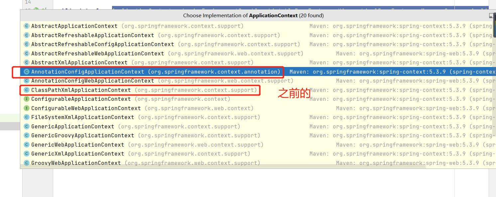

# Spring
> 在我看来，它最大的帮助就是方便我随时使用一个Bean
> 


## Spring的交互
> 注入到其中类的交互（注入过程） - 将对象的创建方式注入，将方法注入，将依赖注入
> 从它里面取值的交互（取值过程）- CPX 获取bean---》操作
> 

### 这里以XML讲解
- 一个类---有对象，对象有属性，有方法
- 而对于Spring，它关心的是对象进去了，方法进去了，就好了---因为这两样足够让它获取数据了！！
> 之前的IOC主要就是控制对象的注入，而DI，它主要就是按Type||Name的形式让主类拥有从类的使用权！！！
> 
> 
> 
> 总：第一步塞对象，IOC，DI，将一个**主体（has-a）**成功的注入进去！！---注意接口塞不进去...
> 第二步，对象进去，对象的方法也要进去---而数据的注入操作就是通过方法的set进去的（对应的property），get也进去了哈
> 第三步 方法进去，我们想办法拿到bean，然后使用bean的get方法，这样就可以取值了，同样也可以使用set方法，让它获取值
> 
> 流程：对象的管理--交给--》Spring容器《-交互-》入参，出参操作
- IOC注入对象，注入属性---
  - 注入对象，注入对象的引用（DI）（之前的IOC文章）
  - 当时也说明怎么注入了，那实际有什么依据，，表面是注入进去了，规范
  - 自动装配指的是has-a
  
```
    <!--Bean注入-->
    <bean id="address" class="com.zjz.pojo.Address"/>
    <bean  class="com.zjz.pojo.Student">
     <!--DI注入 ref-->
        <property name="address" ref="address"/>
     </bean>   
        <!--DI注入 Autowire-->
        <bean id="studnet" class="com.zjz.pojo.Student" autowire="byType||byName"/>
        
        // 自动装配
        <!--可以直接属性上加@Autowire--->
        
```
  

## 使用注解开发
- 在Spring4之后，要使用注解开发，必须要保证aop的包导入了
- 使用注解需要导入context约束，增加注解的支持

- ApplicationContext.xml 中配置
  
    ```
        <?xml version="1.0" encoding="UTF-8"?>
        <beans xmlns="http://www.springframework.org/schema/beans"
               xmlns:xsi="http://www.w3.org/2001/XMLSchema-instance"
               xmlns:context="http://www.springframework.org/schema/context"
               xsi:schemaLocation="http://www.springframework.org/schema/beans
               http://www.springframework.org/schema/beans/spring-beans.xsd
               http://www.springframework.org/schema/context
               http://www.springframework.org/schema/context/spring-context.xsd">
        
            <context:annotation-config/>
    
        </beans>
    ```
- 1.bean
- 类下使用@Component
  
    ```
        // 等价于  <bean id="user" class="com.zjz.pojo.User"/>
         // @Component 组件
        @Component
  
    ```
  


- 2.属性值如何注入
  - 类下使用  @Value("zjz")

  ```   
        /*   @Value("zjz") ---放在field 和 set的method上
        *     <bean id="user" class="com.zjz.pojo.User">
        *        <property name="name" value="zjz"></property>
        *   </bean>
        * */
    
        @Value("zjz")
        public String name;
  
  ```
  
- 3.衍生的注解
 -  @Component 有几个衍生注解，比如在web开发中，会按照mvc三层架构分层---都是组件的意思
    - dao【@Repository】
    - service[@Service]
    - controller【@Controller】
 - 四个功能都一样，都是代表将某个类注册到Spring中，装配Bean
   
- 4.自动装配置
  - 在  `<!--注解驱动--> <context:annotation-config/>`
    - @Autowired   自动注入（主类引入子类） 
    - @Nullable  可以为null                
    - @Qualifier(value = "XXX") 专门用于对应ID     
  
- 5.作用域
  - @Scope("singleton")
- 6.小结
  - xml和注解
  - xml更加万能，适用于任何场景！维护简单方便
  - 注解：注解，不是自己的类使用不了，维护相对复杂
  
### 最佳实践
- xml用来管理Bean
- 注解完成属性的注入
- 我们在使用的过程中，只需要注意一个问题，必须让注解生效，就需要开启注解的支持


# 使用java的方式配置Spring
- 我们现在要完全不使用Spring的xml配置了，全权交给java来做
- javaConfig 是Spring的一个子项目---Spring4之后，成为了核心功能




- 1. 编写一个实体类，Dog
    ```
        @Component //将这个类标注为Spring的一个组件，放到容器中！ 
         public class Dog {
            public String name = "dog";
           }
  
   ```
  
- 2.新建一个config配置包，编写一个MyConfig配置类

    ```
    
        @Configuration //代表这是一个配置类 
        public class MyConfig {
         @Bean //通过方法注册一个bean，这里的返回值就Bean的类型，方法名就是bean的id！ 
         public Dog dog(){
          return new Dog();
           }
         }
    
    ```
  
- 3.测试
  
    ```
        @Test public void test2(){
         ApplicationContext applicationContext = new AnnotationConfigApplicationContext(MyConfig.class); 
         Dog dog = (Dog) applicationContext.getBean("dog");
          System.out.println(dog.name);
           }
          
    ```
  
- 这种纯java的配置方式，在SpringBoot中随处可见


### context获取bean
- .
  ```
          // 获取ApplicationContext;拿到Spring容器--此时的bean是扫描了xml文件,装配完了
          ApplicationContext context = new ClassPathXmlApplicationContext("beans.xml");
  
          // 容器在手，天下我有，需要什么，就get什么！前提是知道这个接口实现类...
          UserServiceImpl userServiceImpl = (UserServiceImpl)context.getBean("userServiceImpl");
          userServiceImpl.getUser();
  
  
  
  
          // 使用java的方式配置Spring
          ApplicationContext applicationContext = new AnnotationConfigApplicationContext(MyConfig.class); 
           Dog dog = (Dog) applicationContext.getBean("dog");
  ```


  


