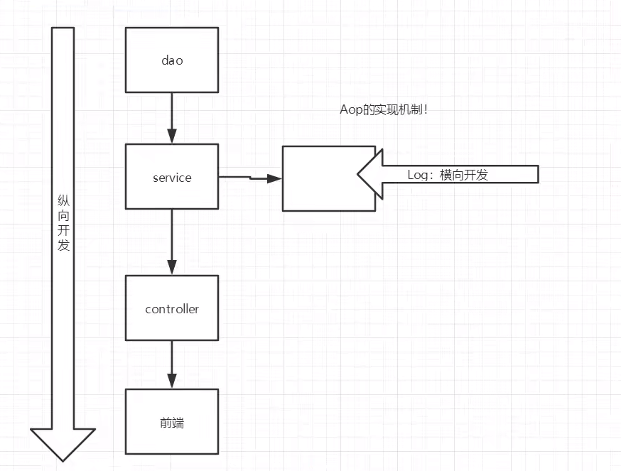
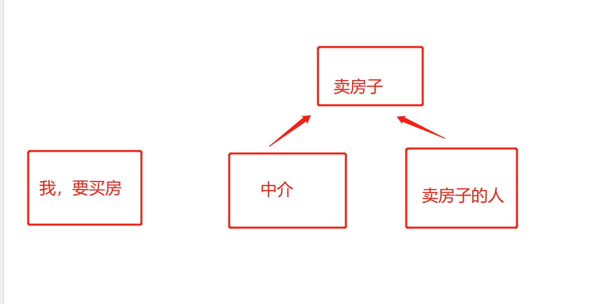
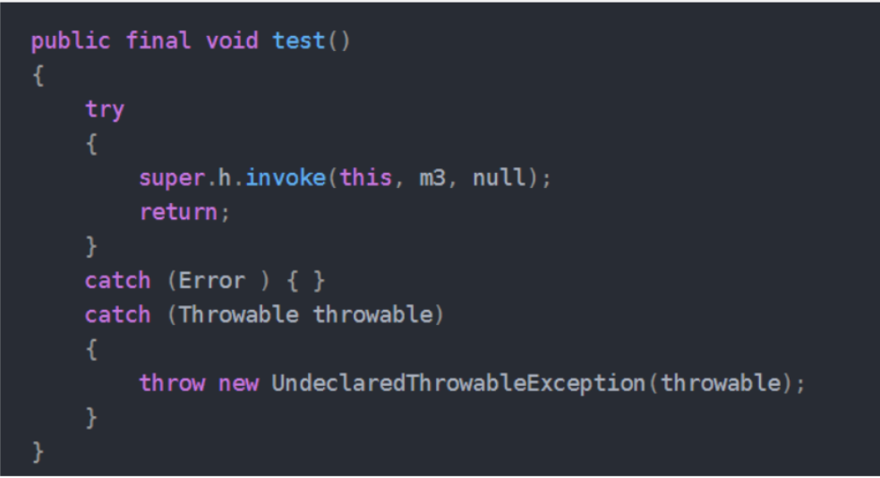
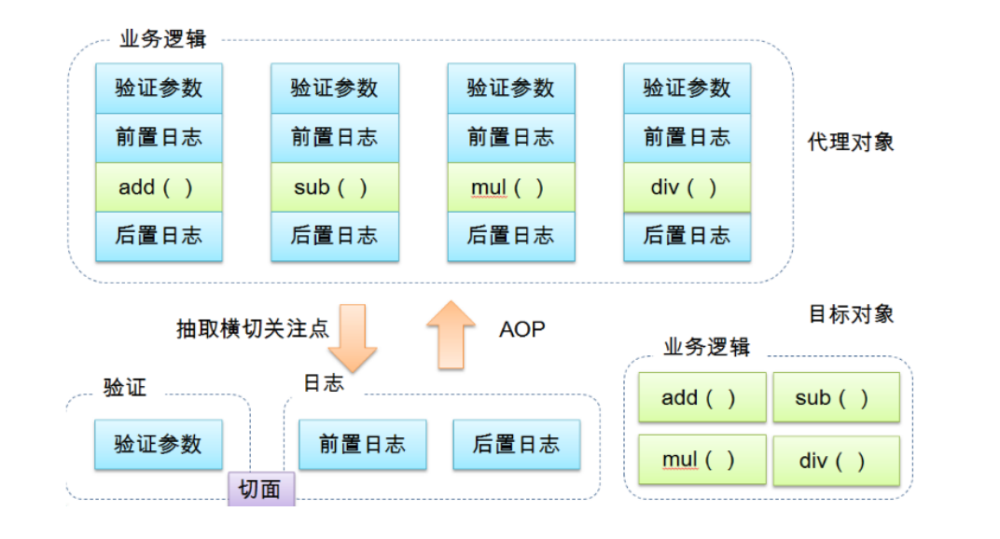
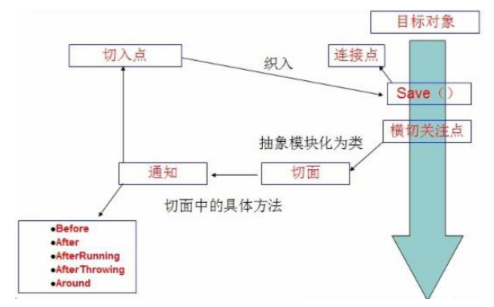
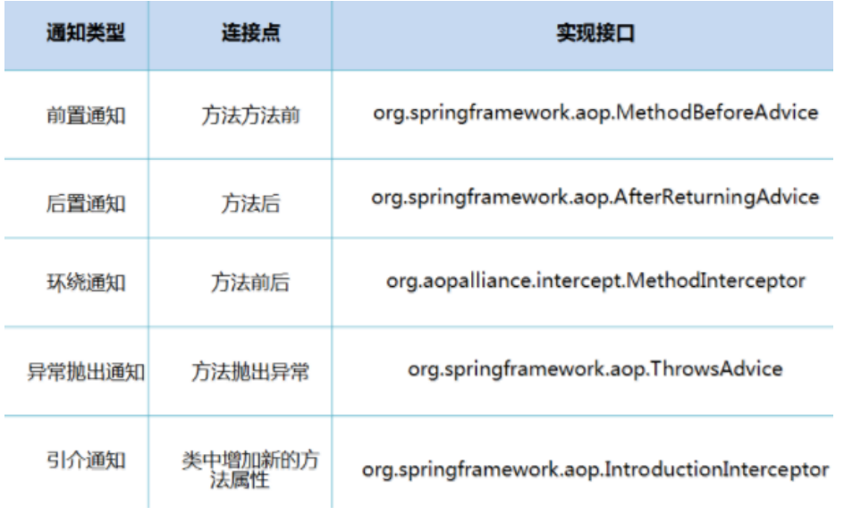

# SpringAOP
## 前言：
> 1.AOP定义？ 用来干啥的？ 怎么用？（怎么跑通它的思路）
> 


## 代理模式
> 为啥要学代理模式？   -- 因为是SpringAop的底层
> 
> 原有的代码不敢动，一动就是Bug，。所以使用代理可以做很多事，
> 
- 在原有的基础上，进行封装一层，客户使用的就我们这一层封装后的功能
> 




### 代理模式的分类：
- 静态代理
  
  
  - 角色分析：
     - 抽象角色：一般用接口或者抽象类来解决，
     - 真实角色：被代理的角色
     - 代理角色：代理真实角色，代理真实角色后，我们一般做一些附属操作
     - 客户：访问代理角色的人
  - 代理模式的好处：1.可以使真实角色的操作更加纯粹！不用去关注一些公共的业务
    - 2.公共的业务交给了代理角色--实现了业务的分工
    - 3.业务发送扩展的时候，方便集中管理
  - 缺点：
    - 一个真实角色就会产生一个代理角色，代码量翻倍---开发效率bian低
  - 操作步骤---1，接口-->真实角色--》代理角色--》客户端访问代理 
  - 静态代理这么麻烦，每次重写人家的很多方法？？？---怎么解决代码多---动态代理
- 个人理解代理：无非是在原有的基础上，进行一层封装，这样既能使用被代理人的方法，也能实现自我的灵活安排！

- 动态代理
  - 动态代理和静态**代理角色**一样 
  - 动态代理类是**动态生成**的，不是我们直接写好的，，，想想之前将被代理人的很多方法**都再次**复述
  - 动态代理分了两大类---1.基于接口的动态代理---2.基于类的动态代理
    - **基于接口**---JDK动态代理 --- 注意，，，基于接口的！！！
    - **基于类**：cglib
    - java字节码：javasist
  - 需要了解两个类：Proxy，代理--InvocationHandler 调用处理程序 ----使用时：
    - Proxy提供了创建动态代理类和实例的静态方法，它也是由这些方法创建的所有动态代理类的超类。
    - InvocationHandler接口提供的-newProxyInstance返回指定接口的代理类的实例，该接口将方法调用分派给指定的调用处理程序。
      Proxy.newProxyInstance因为与IlegalArgumentException相同的原因而Proxy.getProxyClass.
      
- 它两结合返回的proxyInstance---Proxy.newProxyInstance
- 至于被代理人方法，使用invoke操作  

-  目的：生成一个代理对象，并执行被代理人方法
-  交互--被代理人方法，以及生成代理对象，提供一个调用代理人对象的方法
  -  1.被代理人的方法的获取，必须要获取到被代理人的对象
  -  2.生成代理对象，必须要依托于代理人的方法（接口）以及它的加载器（要不jvm处理不了）
  
- 建立一个动态代理
  - 目的：生成一个代理对象，并执行被代理人方法
  - 交互--被代理人方法，以及生成代理对象，提供一个调用代理人对象的方法
    - 1.被代理人的方法的获取，必须要获取到被代理人的对象
    - 2.生成代理对象，必须要依托于代理人的方法（接口）以及它的加载器（要不jvm处理不了）

    ```
          package com.zjz.ProxyMethod;
          
          /*
          * 目的：生成一个代理对象，并执行被代理人方法
          * 交互--被代理人方法，以及生成代理对象，提供一个调用代理人对象的方法
          * 1.被代理人的方法的获取，必须要获取到被代理人的对象
          * 2.生成代理对象，必须要依托于代理人的方法（接口）以及它的加载器（要不jvm处理不了）
          *
          * */
    
          
          import java.lang.reflect.InvocationHandler;
          import java.lang.reflect.Method;
          import java.lang.reflect.Proxy;
          
          public class ProxyInvocationHandler implements InvocationHandler {
          
              private Object target; // 被代理的人-对象
          
              public void setTarget(Object target) {
                  this.target = target;
              }
          
          
              // 调用代理人对象的方法，以及生成代理对象
              public Object getProxy(){
          
                  Object proxyInstance = Proxy.newProxyInstance(target.getClass().getClassLoader(), target.getClass().getInterfaces(), this);
                  return proxyInstance;
              }
          
              // 被代理人方法
              @Override
              public Object invoke(Object proxy, Method method, Object[] args) throws Throwable {
              System.out.println("执行"+method.getName()+"方法---");
                  Object result = method.invoke(target, args); // 此时执行被代理人的方法
          
                  return result;
              }
          }
    
    
    
    ```
    
- 关于代理中为啥自动运行invoke，而且不可缺少
- Proxy.newProxyInstance 执行时会生成一个创建出一个类$Proxy0，此类中调用invoke
- 如果少了还会执行，但是咱们的代理对象没有方法了。。
  ` Object result = method.invoke(被代理对象的接口, args);  // 执行 被代理对象的接口方法，，invoke`




# AOP
> 每走一步，对照代理模式
>

## 介绍
- AOP（Aspect Oriented Programming）意为：面向切面编程，通过预编译方式和运行期动态代理实现
  程序功能的统一维护的一种技术。AOP是OOP的延续，是软件开发中的一个热点，也是Spring框架中的
  一个重要内容，是函数式编程的一种衍生范型。利用AOP可以对业务逻辑的各个部分进行隔离，从而使
  得业务逻辑各部分之间的耦合度降低，提高程序的可重用性，同时提高了开发的效率。
  



### Aop在Spring中的作用
> 提供声明式事务；允许用户自定义切面
> 
- 横切关注点：跨越应用程序多个模块的方法或功能。即是，与我们业务逻辑无关的，
  但是我们需要关注的部分，就是横切关注点。**如日志 , 安全 , 缓存 , 事务等等** ....
- 切面（ASPECT）：横切关注点 被模块化 的特殊对象。即，它是一个类。
- 通知（Advice）：切面必须要完成的工作。即，它是类中的一个方法。
- 目标（Target）：被通知对象。
- 代理（Proxy）：向目标对象应用通知之后创建的对象。
- 切入点（PointCut）：切面通知 执行的 “地点”的定义。
- 连接点（JointPoint）：与切入点匹配的执行点。




- SpringAOP中，通过Advice定义横切逻辑，Spring中支持5种类型的Advice:
- 



## 使用Spring实现Aop 
- 1.导包
- 【重点】使用AOP织入，需要导入一个依赖包！
  
  ```
  <!-- https://mvnrepository.com/artifact/org.aspectj/aspectjweaver --> 
    <dependency> 
      <groupId>org.aspectj</groupId> 
      <artifactId>aspectjweaver</artifactId>
     <version>1.9.4</version> 
   </dependency>
  
  ```
  
- 2.目的
  - 1.切入的配置
    - 切入的位置
      - 注意:execution(* com.zjz.serivce.UserServiceImpl.*(..))   
        - 第一个*表示所有...第二个切入的类,然后.之后应该是方法*(..)表示所有方法..
    - 切入方法的加入
  - 2.切入的编写
    - 三种方法...
  

### 使用Spring的API接口
> 目的：将日志，或者其它玩意，，切入到要**执行的接口**中
> 
> 使用代理模式：怎么用？ **你依据API**写好你要切的东西，然后交给ApplicationContext去做(定位！配置你写的)
> 
> 为啥交给间接管理员，服务者。。。你要在大的生态里整东西就是靠它。。
> 
> 关键：ApplicationContext怎么做，，，，要切的东西怎么写
> 

- 要切的东西怎么写；
  - 1.要实现org.springframework.aop.下的接口 ---对应的Xml中要加对应的资源
  - 2.直接使用它的方法（like-a） 扩展点就好了

- 配置：关键！！
  - 1.约束，资源导入 aop的
  - # 2.aop配置 `<aop:config>`中
    - 1.切入的位置  aop:pointcut
    - 2.将我们的东西配进去  aop:advisor
  
  ```
    <!--方式1，使用Spring API接口-->
        <!--配置AOP,需要导入AOP的约束-->
        <aop:config>
    <!--切入点 expression:表达式 execution(要执行的位置！* * * * *)-->
            <aop:pointcut id="pointcut" expression="execution(* com.zjz.serivce.UserServiceImpl.*(..))"/>
    
    <!-- 执行环绕增强！-->
        <aop:advisor advice-ref="log" pointcut-ref="pointcut"/>
    
        <aop:advisor advice-ref="afterLog" pointcut-ref="pointcut"/>
        </aop:config>
    
  
  ```


## 自定义类来实现Aop
> 目的：将日志，或者其它玩意，，切入到要**执行的接口**中
>
> 使用代理模式：怎么用？ 你写好你要切的东西（自己编的），然后交给ApplicationContext去做(定位！配置你写的)
>
> 为啥交给间接管理员，服务者。。。你要在大的生态里整东西就是靠它。。
>
> 关键：ApplicationContext怎么做，，，，要切的东西怎么写
>

- 要切的东西怎么写；
  - 1.自己写一个类，里面自己定义几个方法---
  
   ```
       public class DiyPointCut {
          public void before(){
              System.out.println("=======方法执行前=======");
          }
          public void after(){
              System.out.println("=======方法执行后=======");
          }
      }
   ```

- 配置
  - 1.约束，资源导入 aop的
  - 2.我们自己编写bean导入，
  - 3.aop配置 `<aop:config>`中
    - 导入我们的配置，让我们的写的东西进行赋予方法`<aop:aspect ref="diy">`
      - 1.切入的位置  aop:pointcut
      - 2.将我们的东西配进去   aop:before aop:after
  
    ```
    
        <!--方式2：自定义类-->
            <bean id="diy" class="com.zjz.diy.DiyPointCut"/>
                <aop:config>
                    <aop:aspect ref="diy">
        <!--切入点-->
                    <aop:pointcut id="point" expression="execution(* com.zjz.serivce.UserServiceImpl.*(..))"/>
        <!--通知-->
                        <aop:before method="before" pointcut-ref="point"/>
                        <aop:after method="after" pointcut-ref="point"/>        
                    </aop:aspect>
                </aop:config>
        
    
    
    ```


## 注解实现Aop
- 1.自己写一个加注解的类 
  
    ```
        // 使用注解方式实现AOP
        @Aspect  // 标注这个类是一个切面
        public class AnnotationPointCut {
        
            @Before("execution(* com.zjz.serivce.UserServiceImpl.*(..))")
            public void before(){
                System.out.println("======方法执行前=====");
            }
        
            @After("execution(* com.zjz.serivce.UserServiceImpl.*(..))")
            public void after(){
                System.out.println("=====方法执行后=====");
            }
        
            // 在环绕增强中,我们可以给定一个参数,代表我们要处理切入的点
            @Around("execution(* com.zjz.serivce.UserServiceImpl.*(..))")
            public void around(ProceedingJoinPoint pj) throws Throwable {
                System.out.println("环绕前---");
        
                // 获得签名
                Signature signature = pj.getSignature();
                System.out.println(signature);
        
                // 执行方法
                Object proceed = pj.proceed();
        
                System.out.println(proceed);
                System.out.println("环绕后---");
        
            }
    
    ```

-  配置
  - 1.约束，资源导入 aop的
  - 2.我们自己编写bean导入，
  - 3.开启注解支持

```

  <!--方式3 注解配置-->
      <bean id="annotationPointCut" class="com.zjz.diy.AnnotationPointCut"/>
  <!--开启注解支持-->
      <aop:aspectj-autoproxy/>
```


