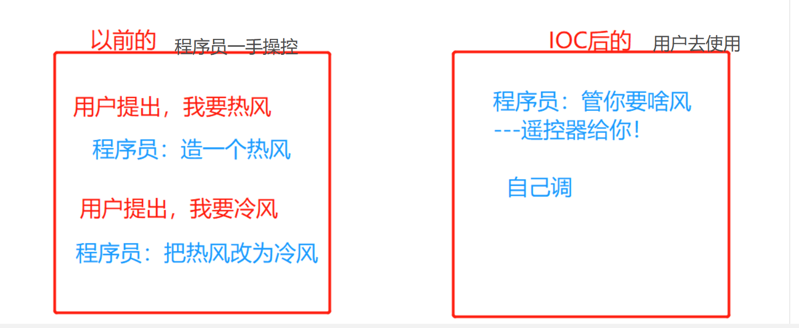

# Spring
## 一.前言
- Thinking is more important than learning
- 本文主要讲述spring 以及它的 IOC原理

## 带着这些去验证自己把！
> 定义？思想（重点）？
>
> 干啥的？作用于哪一方面？
>
> 基本配置，基本操作？
> 

## 二.个人理解
- spring作用?
 - 使现有技术更加容易使用，本身是一个大杂烩，整合了现有的技术框架
 - 从它的容器中可以拿出很多数据！

## 三.核心要素

- IOC 控制反转（**重点**）--面试高频
    - 依赖注入  ID - `@Autowired先byType，@Resource先 byName。`
- Spring的配置文件（**重点**，难点，要记）
- AOP 面向切面编程（重点，难点，面试高频）
  - 代理模式（**重点**，难点）
- 事务ACID，声明式的事务特性
- 整合Mybatis
- 使用注解开发（**重点**）
- 设计模式（13种）


## 四.优点
- Spring 一个开源的免费的框架（容器）
- Spring 一个轻量级的，非入侵式的框架。
- 控制反转（IOC），面向切面编程（AOP）
- 支持事务处理，对框架整合的支持。

- 总：spring 就是一个轻量级的控制反转（IOC）和面向切面编程（AOP）的框架


## 五.介绍


- 7大模块


- SpringBoot
  - 一个快速开发的脚手架
  - 基于SpringBoot可以快速的开发单个微服务
  - 约定大于配置
  
- SpringCloud
  - SpringCloud是属于SpringBoot实现的
  

- 现在大多数公司都在使用SpringBoot进行快速开发
  - 学习SpringBoot的前提，完全掌握Spring及SpringMVC
  

- 弊端：发展太久之后，违背了原来的理论。配置很繁琐，人称“配置地狱”


## 六.IOC---说白了，空调VS电热扇

### 六.1.IOC理论推导

- 1.UserDao 接口
- 2.UserDaoImpl 实现类
- 3.UserService 业务接口
- 4.UserServiceImpl 业务实现类

- 在我们之前的业务中，用户的需求可能会影响我们原来的代码，我们需要根据用户的需求去修改源代码！
  如果程序代码量特别大，修改一次的成本就会特别昂贵
  
- 我们使用set接口实现，已经发生了革命性的变化
  - 目的：将程序的控制权由程序（死值）变成了使用者（随用随调）

```
     // 程序主动创建对象，每次换东西都得这改
    private UserDao userDao1 = new UserDaoImpl();  // 调用时：：：每次都得换
    private UserDao userDao1 = new UserDaoMysqlImpl(); // 调用时：：：每次都得换
    
    
     // 程序被动创建，控制权封装为一个方法，由使用者调用方法进行
    private UserDao userDao;  // Like-a
    // 使用set进行动态实现值的注入
    public void setUserDao(UserDao userDao) {
        this.userDao = userDao;
    }

```

- 之前，程序是主动创建对象！控制权在程序猿（死代码中）手上！
- 使用set注入后，程序不再具有主动性，而是被动的接收对象。

### 六.2.思想：
  - 想不通的可以想想**设置**（手机等等）----可以根据自己的喜好设置的，就是控制权在使用者手上，，，而没有设置功能的就是程序主动性的创建对象
  - 或者空调（冷热一体，使用遥控器可调整。。） 而电热扇，电风扇---只能死死的使用热，冷
  - 说到底，还是提高了用户的体验，**用户可以依据自己的喜好来**，而不是按照装好的东西来使用
    
- 这种思想，从本质上解决了问题，我们程序员不用去管理对象的创建了，而是提供一个方法（遥控器），系统**耦合性大大降低**。
  可以更加的专注于业务上！---这是**IOC原型**
  




### 六.3.IOC本质（回归IT）
- 控制反转IOC(Inversion of Control) DI(依赖注入)是实现IOC的一种方法。 
  - 没有IOC的程序，我们使用的是面向对象的编程，对象的创建与对象间的依赖关系完全**硬编码**在程序中，对象的创建由程序自己控制，
    控制反转后将对象的创建转移到第三方。
  - IOC描述的是对象的事情，DI描述的是对象属性的事情  
    
- 采用XML方式配置Bean的时候，Bean的定义**信息**是和**实现**分离的，而采用注解的方式可以将两者结合在一体，Bean的定义信息直接以注解的形式定义在实现类中，
  从而达到了零配置的目的
  - 使用XML的时候，它所作的就是创对象，对象属性赋值---而类的信息还是由类完成（构造器，属性，方法的定义）
  


- 控制反转是一种通过描述（XML或注解）并通过第三方去生产或获取特定对象的方式。在Spring中实现控制反转的是IOC容器。其实现方法是依赖注入（DI）

  


# Spring code start
## 一.环境需求
- 1.mavern管理
- 2.导入Spring包就可以了


    ```
          <!-- https://mvnrepository.com/artifact/org.springframework/spring-webmvc -->
          <dependency>
              <groupId>org.springframework</groupId>
              <artifactId>spring-webmvc</artifactId>
              <version>5.3.9</version>
          </dependency>
          
          
          <dependency>
              <groupId>org.springframework</groupId>
              <artifactId>spring-jdbc</artifactId>
              <version>5.3.9</version>
          </dependency>
      
    ```

## 二.springBean
- spring 容器，就类似于婚介场，所有对象都在里面。  启动之前就注册了xml
> 三个Bean要用的标签
> 

- 1.Bean的配置

 ```
      <!--
      id :bean的唯一标识符
      class bean对象的全限定名：包名+类型
      name：别名,而且name更高级，可以取多个别名,使用空格，逗号等等都可以区分
      -->
  
      <bean id = "userT" class="com.zjz.pojo.UserT" name="userT2,userT3">
          <property name="name" value="zjz"/>
      </bean>
  
  ```

- 2.别名

  - 推荐使用bean里的name

    ```
        <!--
          id :bean的唯一标识符
          class bean对象的全限定名：包名+类型
         name：别名,而且name更高级，可以取多个别名,使用空格，逗号等等都可以区分
       -->
      <bean id = "userT" class="com.zjz.pojo.UserT" name="userT2,userT3">
      
      <!--如果添加了别名，我们也可以通过别名获取到这个对象-->
      <alias name="user" alias="adafadfafadf"/>    
    ```


- 3.import
  - 一般用于开发团队使用，它可以将多个配置文件，导入合并为一个
    

  - 假设，现在项目组有多个人开发，这三人负责不同的类，不同的类需要注册在不同的bean，我们可以利用import将所有人的beans.xml**合并为一个总的**
    - 张三
    - 李四
    - 王五
    - applicationContext.xml(核心)

  - 使用的时候，直接使用总的配置就好了


## 三. spring IOC
### 三.1.简单认识一下，构造器注入
- 1.pojo
  - 定义类的属性，以及方法
  
  ```
    
    public class Hello {
    private String str;

        public String getStr() {
            return str;
        }
    
        public void setStr(String str) {
            this.str = str;
        }
  
  
        @Override
        public String toString() {
            return "Hello{" +
                    "str='" + str + '\'' +
                    '}';
        }
    }

  ```
  
- 2.**beans.xml（核心！）**
  - 将对象的创建，对象属性的赋值，在xml中完成

  ```
        <?xml version="1.0" encoding="UTF-8"?>
      <beans xmlns="http://www.springframework.org/schema/beans"
      xmlns:xsi="http://www.w3.org/2001/XMLSchema-instance"
      xsi:schemaLocation="http://www.springframework.org/schema/beans
      http://www.springframework.org/schema/beans/spring-beans.xsd">
      <!--使用Spring来创建对象，在Spring这些都称为Bean-->
      <!--bean就是java对象 , 由Spring创建和管理-->
      <!--
                  类型   变量名 = new 类型();
        before:   Hello hello =  new Hello();
          now :  id = 变量名   class = new 的对象;   property 相当于给对象的属性set值
      -->
  
  
        <!--如果要使用其它对象的属性时：
            第一，要有本类调用其它类时的定义： private UserDao userDao;  // Like-a
            第二：配置 ---   <property name="userDao" ref="userDaoImpl"/>
            property中
            ref :引用spring 容器创建好的对象
            value： 具体的值，基本的数据类型
         -->
  
  
          <bean id="hello" class="com.zjz.pojo.Hello">
              <property name="str" value="Spring"/>
          </bean>
      </beans>
        
  ```

- 3.MyTest
  - 获取容器（上下文），然后取数据
  ```
  
    public class MyTest {
        public static void main(String[] args) {
    
            // 获取Spring的上下文对象！
            ClassPathXmlApplicationContext context = new ClassPathXmlApplicationContext("beans.xml");
            // 我们的对象，现在都在spring中管理，我们要使用，直接从里面取出来就行
    
            Hello hello = (Hello) context.getBean("hello");
    
            System.out.println(hello.toString());
        }
    }
  
  
  ```
  
### 三.2.注意：
> 怎么引用其它对象？？---目前手动的--
- 怎么引用一个其它的pojo或者service或者Dao---
> 
> 使用ref 首先得把ref要用到的Bean注册上！！要不报错
> 
> 注：**定义，声明**都还是在**类**中进行，IOC它负责的只是**创对象**

```
    <bean id="userDaoImpl" class="com.zjz.dao.UserDaoImpl">
    <bean id="userServiceImpl" class="com.zjz.service.UserServiceImpl">
        <!--ref :引用spring 容器创建好的对象
            value： 具体的值，基本的数据类型
         -->
        <property name="userDao" ref="userDaoImpl"/>
        // 它的功能就将其它类的属性||对象||其它--给引入到本类中
    </bean>
    
    
     
     private UserDao userDao;  // Like-a
     
```

### 三.3思考
- Hello 对象是谁创建的 ? 
    - 【 hello 对象是由Spring创建的 】
  
- Hello 对象的属性是怎么设置的 ? 
    - 【hello 对象的属性是由Spring容器设置的 】
  
- 这个过程就叫控制反转 :
    - 控制 : 谁来控制对象的创建, 传统应用程序的对象是由程序本身控制创建的, 使用Spring后, 对象是由Spring来创建的
    - 反转 : 程序本身不创建对象, 而变成被动的接收对象 .

  - 依赖注入 : 就是利用set方法来进行注入的.或者有参构造器的参数
  - IOC是一种编程思想，由主动的编程变成被动的接收
  
- 我们不需要去程序中去改动了，要实现不同的操作，只需要在xml中配置文件进行修改，所谓IOC，
  一句话搞定:对象由Spring来创建，管理，装配


## 四.IOC创建对象的方式
> 同java一样啊，构造器造对象
> 
> 构造器注入
> 
>
- IOC创建对象的几种方式 --- 所以接口没办法创建bean --这也是为啥要用接口来进行规范
  - 1）调用无参数构造器
  - 2）带参数构造器
  - 3）工厂创建对象
    - 工厂类：静态方法创建对象
    - 工厂类：非静态方法创建对象


- 1.使用无参构建对象，默认
  
- 2.假设要使用有参构造创建对象  - 此时对象是有属性的对象
 - 1.下标赋值
   
   ```
     <!-- 第一种，下标赋值-->
     <!--注意是构造器参数种的下标-->
     
        <bean id="user" class="com.zjz.pojo.User">
            <constructor-arg index="0" value="zjzHHH"/>
        </bean>

   ```
   
 - 2.类型赋值

    ```
        <!-- 第一种，下标赋值-->
        <!--
            <bean id="user" class="com.zjz.pojo.User">
                <constructor-arg index="0" value="zjzHHH"/>
            </bean>
        -->
        
        <!--第二种，通过类型创建，两个方法都是Sting就不行了，不建议使用！-->
        <!--
        <bean id="user" class="com.zjz.pojo.User">
            <constructor-arg type="java.lang.String" value="zjz"></constructor-arg>
        </bean>
        -->
    ```
   
 - 3.参数名-- 重点，使用
   
    ```
      <!--第三种，直接通过参数名来设置-->
      <bean id="user" class="com.zjz.pojo.User">
          <constructor-arg name="name" value="zjz"/>
      </bean>
    
    
    ```

- 总结
   - 在配置文件加载的时候，容器中的管理对象就已经初始化了


## 五  DI依赖注入
> 依赖注入 - 依赖：指Bean对象的创建依赖于容器 . Bean对象的依赖资源 .  
> 注入：指Bean对象所依赖的资源 , 由容器来设置和装配 .
>
> 
> 依赖注入主要有两种实现方式，分别是属性 setter 注入和构造方法注入。具体介绍如下。
- 1）属性 setter 注入
  - 指 IoC 容器使用 setter 方法注入被依赖的实例。通过调用无参构造器或无参 static 工厂方法实例化 bean 后，调用该 bean 的 setter 方法，即可实现基于 setter 的 DI。
- 2）构造方法注入  
  - 指 IoC 容器使用构造方法注入被依赖的实例。基于构造器的 DI 通过调用带参数的构造方法实现，每个参数代表一个依赖。

> 
 

- 五.1.构造器注入--
  - 特征，有参的话，直接将构造器的参数赋值。。无参你没的办法啊，只能依托property
  - 原理：构造器参数注入。
  - 缺点：只能对有参的构造器的参数进行操作，非常不方便
    
  ```
    
        <!--使用Spring来创建对象，在Spring这些都称为Bean-->
        <!--bean就是java对象 , 由Spring创建和管理-->
        <!--
                    类型   变量名 = new 类型();
          before:   Hello hello =  new Hello();
            now :  id = 变量名   class = new 的对象;   property 相当于给对象的属性set值
        -->
    
          // 无参的
            <bean id="user" class="com.zjz.pojo.User"/>
        // 有参的
        <!--第三种，直接通过参数名来设置-->
          <bean id="user" class="com.zjz.pojo.User">
              <constructor-arg name="name" value="zjz"/>
          </bean>
    
    
    
    ```  


- 五.2.set注入（重要）
  - 特征---各种property
  - 原理：实际上是在构造器注入的基础上（对象），对属性进行赋值操作  
  - 依赖注入 - 依赖：bean对象的创建依赖于容器！
        注入：bean对象的所有属性，由容器来注入！
  - 环境搭建--
    - 1.复杂类型
    - 2.真实测试对象
  
  ```
      <?xml version="1.0" encoding="UTF-8"?>
      <beans xmlns="http://www.springframework.org/schema/beans"
             xmlns:xsi="http://www.w3.org/2001/XMLSchema-instance"
             xsi:schemaLocation="http://www.springframework.org/schema/beans
             http://www.springframework.org/schema/beans/spring-beans.xsd">
      
          <bean id="address" class="com.zjz.pojo.Address"/>
          <bean id="student" class="com.zjz.pojo.Student">
      
              <!--第一种，普通值注入，直接使用value-->
              <property name="name" value="zjz"></property>
      
              <!--第二种，bean注入 ref-->
              <property name="address" ref="Address"/>
      
              <!-- 数组注入，-->
              <property name="books">
                  <array>
                      <value>博客</value>
                      <value>Gitee</value>
                      <value>DIY博客</value>
                  </array>
              </property>
      
      
              <!--list  -->
              <property name="hobbys">
                  <list>
                      <value>敲代码</value>
                      <value>做算法</value>
                      <value>学知识</value>
                  </list>
              </property>
      
              <!--Map-->
              <property name="card">
                  <map>
                      <entry key="身份证" value="HHH1"/>
                      <entry key="银行卡" value="HHH2"/>
                      <entry key="门禁卡" value="HHH3"/>
                  </map>
              </property>
      
              <!--Set-->
              <property name="game">
                  <set>
                      <value>LOL</value>
                      <value>CF</value>
                      <value>Study</value>
                  </set>
              </property>
      
            <!-- null-->
              <property name="wife">
                  <null></null>
              </property>
      
      
              <!--properties-->
              <property name="info">
                  <props>
                      <prop key="driver"></prop>
                      <prop key="url"></prop>
                      <prop key="username"></prop>
                      <prop key="password"></prop>
                  </props>
      
              </property>
      
      
          </bean>
      
      
      </beans>

  ```


- 五.3.拓展方式注入

- p命名  c命名
  - 作用：方便一些操作
  - 原理：在构造器的基础上，使用一些其它方式直接set值  
  - 使用注意：要导入约束--xmlns
  
  ```
      <?xml version="1.0" encoding="UTF-8"?>
      <beans xmlns="http://www.springframework.org/schema/beans"
             xmlns:xsi="http://www.w3.org/2001/XMLSchema-instance"
             xmlns:p="http://www.springframework.org/schema/p"
             xmlns:c="http://www.springframework.org/schema/c"
             xsi:schemaLocation="http://www.springframework.org/schema/beans
             http://www.springframework.org/schema/beans/spring-beans.xsd">
      
      
          <!-- p 命名空间注入，可以直接注入属性的值：property-->
          <bean id="user" class="com.zjz.pojo.User" p:name="user1" p:age="18"/>
      
      
          <!--c命名空间注入,通过构造器注入，construct-args -->
          <bean id="user2" class="com.zjz.pojo.User" c:name="user2" c:age="99"></bean>
      
      </beans>
  
  ```


## 六.Bean的作用域

 

- 六.1.单例模式（Spring默认机制）
  - 目的：减少资源浪费，多个操作从同一容器取值
  - 缺点：并发可能出事
  -  ` <bean id="user" class="com.zjz.pojo.User" p:name="user1" p:age="18" scope="singleton"/>`
  
  
- 六.2.原型模式
  - 目的：每次从容器get的时候都会产生一个新的对象！
  - 缺点：特别浪费资源
  - `<!-- scope 为prototype 原型模式 -->
    <bean id="user" class="com.zjz.pojo.User" p:name="user1" p:age="18" scope="prototype"/>`
    
- 六.3.其余的request，session，application，，，这些只能在web开发中使用到！


## 七.Bean的装配
> 三种装配方式
>
- 1.在XML中显示的配置（手动）
- 2.在java中显示配置
- 3.隐式的自动装配（自动）

- xml使用注意：
  - `ApplicationContext context = new ClassPathXmlApplicationContext("beans.xml");`
  - 这句话会**解析xml文件所有的东西**，包括不需要用到的---经Test：将其他bean放入进去，然后构造器out下
  - 如何避免，，，你可以将这个方法封装一层。。。

## 七.一.xml中装配
- 推荐不使用自动装配xml配置,而使用注解
> 1.手动装配，
> 
-  XML中每一个对象，每一个属性，，都手动配(property，或构造器参数)---之前练习中

> 2.自动装配 
> 依据：Bean的特性---
> 
> 实现方式---Spring满足bean依赖的一种方式
- Spring的自动装配需要从两个角度来实现，或者说是两个操作：
  - 1. 组件扫描(component scanning)：spring会自动发现应用上下文中所创建的bean；
    - 疑问？ 哪里的上下文？？？---已经在**bean容器**中的东西！！！
    - 所以，还是得把东西塞进去把~~
  - 2. 自动装配(autowiring)：spring自动满足bean之间的依赖，也就是我们说的IoC/DI；

> 基于set方法的自动装配：
> 
- 共同：都是要走set方法的，没set方法怎么弄数据。。。当然，之前也说了，构造器也可哈~
- byName
   - 依据：类中**set方法**  以及xml**Bean的id**
   - 操作：装配bean用id的方式。。。编写主要bean 使用autowire的byName  
   - 结果：成功使用上下文中含有 id 中的内容，映射到本身要输出的
   - 缺点：xml中id必须和类中set后的名字必须一致，否则失败
  
  ```
      <!--
        byName: 会自动在上下文中查找，和自己对象set方法后面值对应的beanId
       -->
        <!--手动装配，id的形式，cat，dog 都是构造器的形式-->
        <bean id="cat" class="com.zjz.pojo.Cat"/>
        <bean id="dog" class="com.zjz.pojo.Dog"/>
      
      <!--此时Test 会将cat dog 都打印出来-->
      <bean id="people" class="com.zjz.pojo.People" autowire="byName">
          <property name="name" value="zjz"/>
      </bean>
  
  ```
  
- byType
  - 依据：类中set前面的类型去查找  xml中配上class
  - 操作： 编写主要bean 使用autowire的byType
  - 缺点：只能针对类型返回，针对的类型只能有一个，多了失败
  
  ```
  
  
      <!--byType : 会自动在上下文中查找，和自己对象属性类型相同的bean-->
      <!--手动装配，cat，dog 都是构造器的形式--> 
       <bean class="com.zjz.pojo.Dog"/>
      <bean class="com.zjz.pojo.Cat"/>

       <!--此时Test 会将cat dog 都打印出来-->
      <bean id="people" class="com.zjz.pojo.People" autowire="byType">
          <property name="name" value="zjz"></property>
      </bean>

  
  ```

## 七.二.使用注解---实现自动装配
- jdk1.5支持的，Spring2.5就支持了
- 七.二.1.准备工作：
  - 1. 在spring配置文件中引入context文件头--三句话
    - 只需要在原有的基础上复制过来改下就好了
  - 2. 开启属性注解支持！（重要！）
  
  ```
    1. 在spring配置文件中引入context文件头
   <beans xmlns="http://www.springframework.org/schema/beans"
       xmlns:xsi="http://www.w3.org/2001/XMLSchema-instance"
       xmlns:context="http://www.springframework.org/schema/context"  // 第一句
       xsi:schemaLocation="http://www.springframework.org/schema/beans
       http://www.springframework.org/schema/beans/spring-beans.xsd
       http://www.springframework.org/schema/context     // 第二句
       http://www.springframework.org/schema/context/spring-context.xsd">  // 第三句
  
    2.开启属性注解支持！
    <context:annotation-config/> 
  
  ```

- 七.二.2. `@Autowired`
> 三个注解 都spring的---  `@Autowired @Qualifier @Nullable` 搭配解决各种问题
> 
> 用在主类导入子类的字段，方法上（Has-a）
  - 1.使用：：查看源码--
    ```
        @Target({ElementType.CONSTRUCTOR, ElementType.METHOD, ElementType.PARAMETER, ElementType.FIELD, ElementType.ANNOTATION_TYPE})
        @Retention(RetentionPolicy.RUNTIME)
        @Documented
        public @interface Autowired {
            boolean required() default true;
        }
    ```
    
  - 可以加的位置有字段，方法，参数（构造器使用）---括号内可以写required=true(default)||false
  - false 就是这里可以为null  同` @Nullable`
  
  - 2. 机制;
    - 1.优先 byType 其次 byName----可查看源码beans\factory\support\DefaultListableBeanFactory.class
      
      
    - 2.如果多个对象，多个类型怎么处理？？？
      - 使用`@Qualifier(value="value")`来指定bean的id值 -- Qualifier**不能单独使用**

  - 3.使用AutoWired我们就可以不用编写set方法了，前提是你这个自动装配的属性在IOC（spring）容器中存在
   - **前提**--你得确保是引入对应的bean 
    
- 使用`@Nullable` 标注一个字段，说明这个字段可以为null，不会null指针

- 特别的是java的注解 同样可以完成自动装配` @Resource`

## `@Autowired与@Resource异同`：
- 1. @Autowired与@Resource都可以用来装配bean。都可以写在字段上，或写在setter方法上。
- 2. @Autowired默认`按类型装配`（属于spring规范），默认情况下必须要求依赖对象必须存在，如果
   要允许null 值，可以设置它的required属性为false，如：@Autowired(required=false) ，如果我
   们想使用名称装配可以结合@Qualifier注解进行使用
- 3. @Resource（属于J2EE复返），`默认按照名称进行装配`，名称可以通过`name属性`进行指定。如果
   没有指定name属性，当注解写在字段上时，默认取字段名进行按照名称查找，如果注解写在
   setter方法上默认取属性名进行装配。 当找不到与名称匹配的bean时才按照类型进行装配。但是
   需要注意的是，如果name属性一旦指定，就只会按照名称进行装配。 
     
- 它们的作用相同都是用注解方式注入对象，但执行顺序不同。`@Autowired先byType，@Resource先 byName。`
  - 为啥@Autowired快，，因为名字肯定比类型多--
  - 思想，先判断少的再判断多的，提高速率  -- 两层for也是


总：


  


  
  


