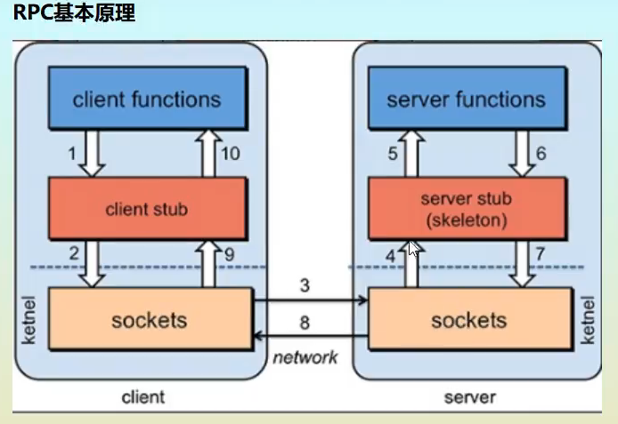
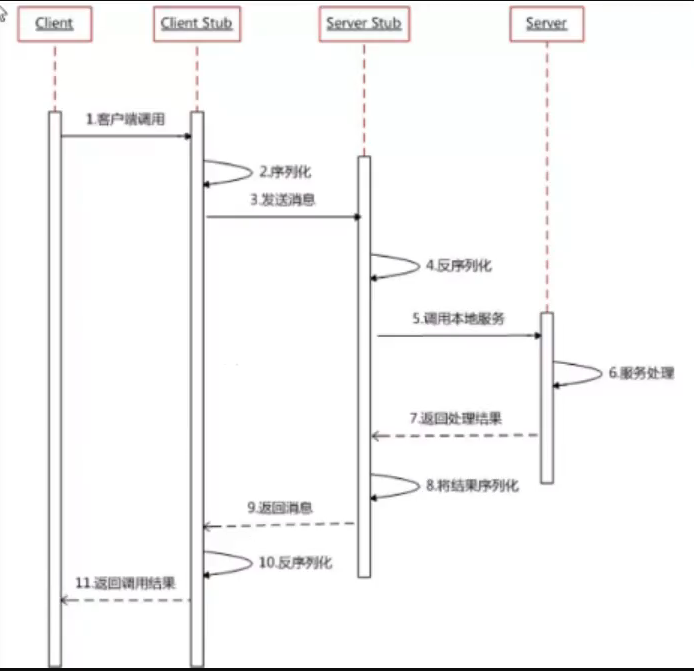

# 

## 分布式
- 1.定义:分布式系统是若干独立计算机的集合，
  这些计算机对于用户来说就像单个相关系统
- 2.目的:是利用更多的机器，处理更多的数据。  
- 3.使用:只有当单个节点的处理能力无法满足日益增长的计算、存储任务的时候，且硬件的
  提升（加内存、加磁盘、使用更好的CPU）高昂到得不偿失的时候，应用程序也不能进一步优化的时
  候，我们才需要考虑分布式系统。  
- Nginx -代理服务器

- 4.发展历程
- 单一应用架构(ORM)-->垂直应用架构(MVC)-->分布式服务架构(RPC)-->流动计算架构(SOA)
- 无论是微服务还是分布式服务（都是SOA，都是面向服务编程） 

### RPC(Remote Procedure Call)
> 通信:HTTP,RPC都是通信协议
- http其实是一种网络传输协议，基于TCP，规定了数据传输的格式。现在客户端浏览器与服务端通信基本都是采用Http协议。
- 相同点：底层通讯都是基于socket，都可以实现远程调用，都可以实现服务调用服务

> RPC -远程过程调用
- 本地过程调用: 一台电脑上a方法调用b方法
- 远程调用:a方法在A电脑,b方法在B电脑上---思考:A电脑的人如何调用b方法
- 为啥要用RPC,因为我们在一个进程内,或者在一个电脑上无法完成这种需求

> RPC两大核心:通讯,序列化

- 序列化:数据传输需要转换,(总不能传一个对象把..他要的是010100110二进制)

### Dubbo
- Spring Cloud(生态)
- Dubbo3.X(RPC)--专注RPC
- 介绍:
  - Apache Dubbo是一个高性能,轻量级的开源java RPC框架,
    它提供了三大核心能力:面向接口的远程方法调用,智能容错和负载均衡,以及服务自动注册和发现
    
- 非入侵式的,对应用没有任何的API入侵
- 注意:只有一个invoke同步,异步有多个

- zjz记:
  - (提供者运行)提供者登记-->消费者订购-->登记表通知-->RPC调用.
- 4.invoke,就是RPC去调用的

- zookeeper(zoo+keeper)--->管理:hadoop hive 
- 

- 3、修改zoo.cfg配置文件
 - 将conf文件夹下面的zoo_sample.cfg复制一份改名为zoo.cfg即可。
 - 注意几个重要位置：
  - dataDir=./ 临时数据存储的目录（可写相对路径）
  - clientPort=2181 zookeeper的端口号
  - 修改完成后再次启动zookeeper

- Cli命令
  - ls /：列出zookeeper根下保存的所有节点
  - create –e /zjz 123：创建一个zjz节点，值为123
  - get /zjz：获取/zjz节点的值
 
- 启动jar包 
  - 账号密码都是;root
    

## 步骤
- 前提:zookeeper已经开启!
- 1.提供者提供服务
  - 1.导入依赖
  - 2.配置注册中心的地址,以及服务发现名,和要扫描的包~(提供服务)
  - 3.在想要被注册的服务上面~增加一个注解
  
- 2.消费者如何消费
  - 1.导入依赖
  - 2.配置注册中心,以及自己的服务名
  - 3.从远程注入服务@Reference

