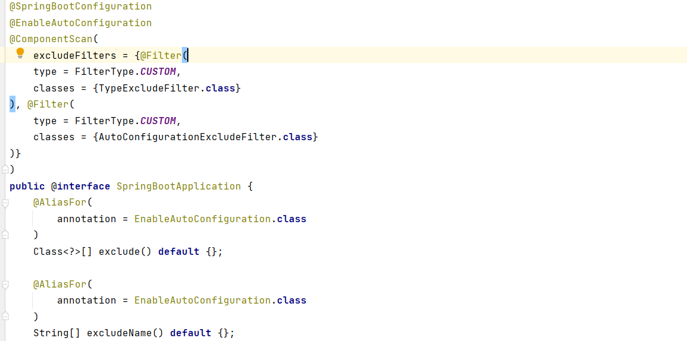
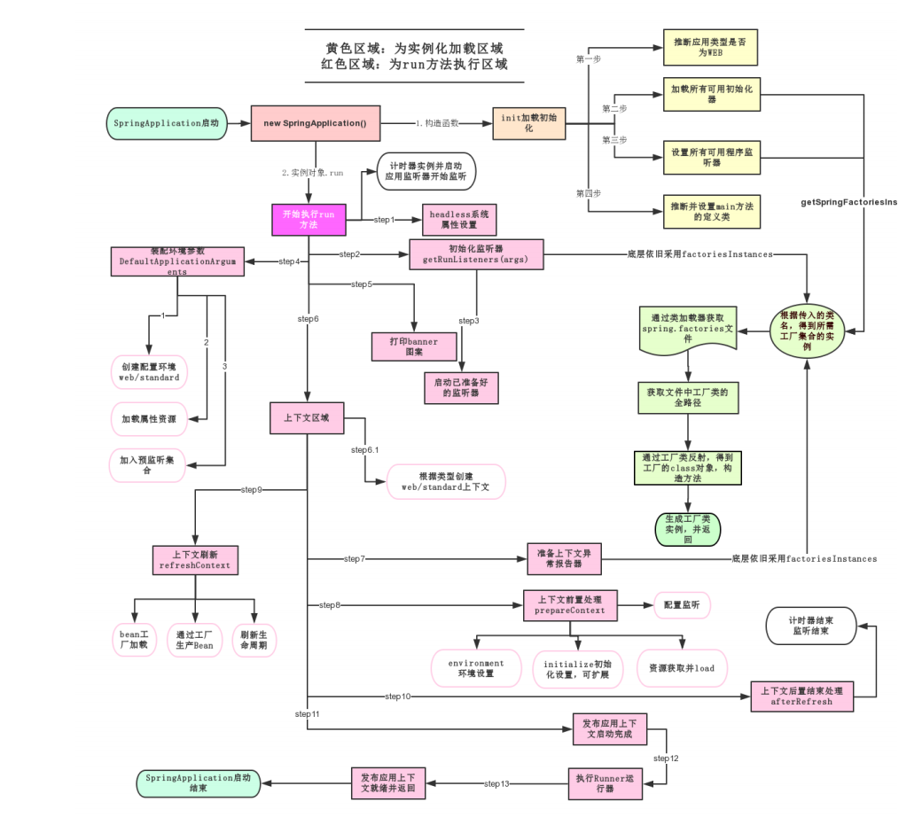
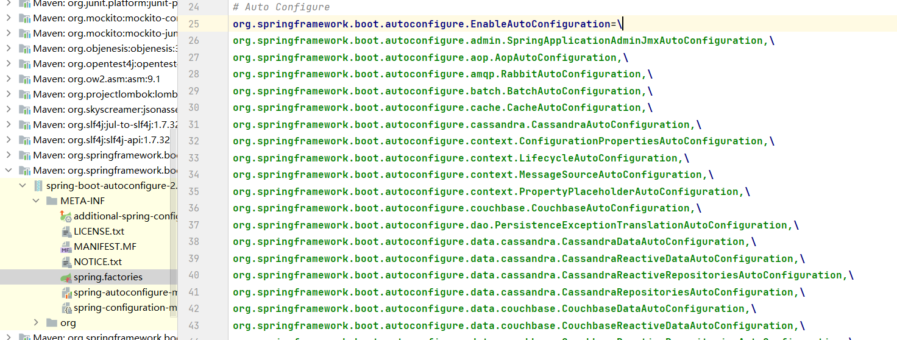
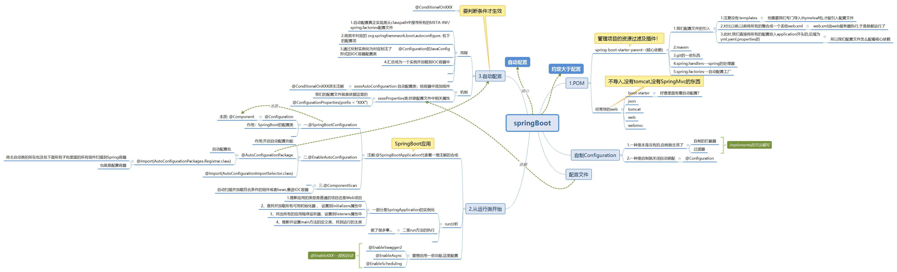

# SpringBoot

> Thinking is more important than learning
>
> Interaction is the principle
>
> 从简介--思想--基本操作--搭建,整合--

# 简介
- 1.所谓微服务
  - 就是把每个功能元素独立出来.把独立出来的元素动态组合,需要的功能元素才拿去组合,需要多一些时间去整合多个功能元素.
    所以微服务架构是对功能元素的复制,而没有对整个应用复制
    - 好处:1.节省了调用资源
    - 2.每个功能元素都是一个可替换的,可独立升级的软件代码
  
- 2.一个大型的微服务架构,就像一个复杂交织的神经网络.每一个神经网络就是一个功能元素,他们各自完成各自的功能.然后通过**http相互请求**调用
- 3.Spring Boot 基于 Spring 开发，Spirng Boot 本身并不提供 Spring 框架的核心特性以及扩展功能，
    - 只是用于快速、敏捷地开发新一代基于 Spring 框架的应用程序。
    - 也就是说，它并不是用来替代 Spring 的解决方案，而是和 Spring 框架紧密结合用于提升 Spring 开发者体验的工具。
    - Spring Boot 以**约定大于配置**的核心思想，**默认帮我们进行了很多设置**，多数 Spring Boot 应用只需要很少的 Spring 配置。
    - 同时它集成了大量常用的第三方库配置（例如 Redis、MongoDB、Jpa、RabbitMQ、Quartz 等等），SpringBoot 应用中这些第三方库几乎可以零配置的开箱即用。
- 4.Spring Boot的主要优点：
    - 为所有Spring开发者更快的入门
    - 开箱即用，提供各种默认配置来简化项目配置
    - 内嵌式容器简化Web项目
    - 没有冗余代码生成和XML配置的要求

- 简单来说就是SpringBoot其实不是什么新的框架，它**默认配置了很多框架**的使用方式，就像maven整合了所有的jar包，spring boot整合了所有的框架 。

- zjz解析:
- 1.他将继承Spring思想,提升用户体验
- 2.约定大于配置,,---默认帮我们配置了很多(我们需要了解一下,---这就原理)
- 3.第三方库的配置Redis、MongoDB、Jpa、RabbitMQ、Quartz---将来的学习!!!
- 4.默认配置了很多框架,省的我们再去配置

## 思想:

## 操作

- 1.环境准备
    - java version "1.8.0_181"
    - Maven-3.6.1
    - SpringBoot 2.x 最新版

- 2.非常快的生成一个Spring项目
    - Spring官方提供了非常方便的工具让我们快速构建应用
    - 项目创建方式一：使用Spring Initializr 的 Web页面创建项目
        - 1、打开 https://start.spring.io/
        - 2、填写项目信息
        - 3、点击”Generate Project“按钮生成项目；下载此项目
        - 4、解压项目包，并用IDEA以Maven项目导入，一路下一步即可，直到项目导入完毕。
        - 5、如果是第一次使用，可能速度会比较慢，包比较多、需要耐心等待一切就绪。
- 3.我使用的创建-
    - 项目创建方式二：使用 IDEA 直接创建项目
    - 1、创建一个新项目
    - 2、选择spring initalizr ， 可以看到默认就是去官网的快速构建工具那里实现
    - 3、填写项目信息
    - 4、选择初始化的组件（初学勾选 Web 即可）


- 4.完成创建
- 项目结构分析：
- 通过上面步骤完成了基础项目的创建。就会自动生成以下文件。
- 1、程序的主启动类
- 2、一个 application.properties 配置文件
- 3、一个 测试类
- 4、一个 pom.xml


- 查看pom
    - 父依赖---核心依赖spring-boot-starter-parent
    - web场景启动器
    - springboot单元测试
    - 打包插件 -- 将项目打成jar包，maven种的Lifecycle package 生成jar

- 跳过测试用例打包

  ```
    <!--在工作中,很多情况下我们打包是不想执行测试用例的 可能是测试用例不完事,或是测试用例会影响数据库数据 跳过测试用例执 --> 
    <plugin> 
        <groupId>org.apache.maven.plugins</groupId>
         <artifactId>maven-surefire-plugin</artifactId>
      <configuration>
        <!--跳过项目运行测试用例-->
          <skipTests>true</skipTests>
      </configuration> 
    </plugin>
  
  ```
  

- java 运行jar包 java -jar xxx.jar
- SpringBoot图案,可以到：https://www.bootschool.net/ascii 这个网站生成，然后拷贝到文件banner.txt中即可！


- pom的查看
- 父依赖-----其中它主要是依赖一个父项目，主要是管理项目的资源过滤及插件！
- 点进去，发现还有一个父依赖(重点!!)----这里才是真正管理SpringBoot应用里面所有依赖版本的地方，SpringBoot的版本控制中心；
  以后我们导入依赖默认是不需要写版本；但是如果导入的包没有在依赖中管理着就需要手动配置版本了；
  

- 启动器 spring-boot-starter
  - springboot-boot-starter-xxx：就是spring-boot的场景启动器
  - spring-boot-starter-web：帮我们导入了web模块正常运行所依赖的组件；
  
- SpringBoot将所有的功能场景都抽取出来，做成一个个的starter （启动器），
  - 只需要在项目中引入这些 starter即可，所有相关的依赖都会导入进来 ，
  - 我们要用什么功能就导入什么样的场景启动器即可；我们未来也可以自己自定义starter


- 主启动类SpringbootApplication
- @SpringBootApplication 来标注一个主程序类，说明这是一个SpringBoot应用
- 注意:里面启动的是一个服务
- 一个简单的启动类并不简单！我们来分析一下这些注解都干了什么
- 作用：标注在某个类上说明这个类是SpringBoot的**主配置类** ,SpringBoot就应该运行这个类的main方
  法来启动SpringBoot应用；作用：标注在某个类上说明这个类是SpringBoot的主配置类 ， 
  SpringBoot就应该运行这个类的main方法来启动SpringBoot应用；
  
- 进注解看看---


- 发现是注解大佬...
- 1.@ComponentScan
- 这个注解在Spring中很重要 ,它对应XML配置中的元素。
  - 作用：自动扫描并加载符合条件的组件或者bean ， 将这个bean定义加载到IOC容器中

- 2.@SpringBootConfiguration
  - 作用：SpringBoot的配置类 ，标注在某个类上 ， 表示这是一个SpringBoot的配置类；
  - 进去..
  - // 点进去得到下面的 @Component 
    @Configuration 
    public @interface SpringBootConfiguration {} 
    @Component 
    public @interface Configuration {}
    
  - 这里的 @Configuration，说明这是一个配置类 ，配置类就是对应Spring的xml 配置文件；
    - 对应原来的一个个bean,xml
  - 里面的 @Component 这就说明，启动类本身也是Spring中的一个组件而已，负责启动应用！
  
- 3.@EnableAutoConfiguration：开启自动配置功能
- 4.@AutoConfigurationPackage ： 自动配置包
   ```
    @Import({Registrar.class}) 
    public @interface AutoConfigurationPackage { }
   ```
  - @import ：Spring底层注解@import ， 给容器中导入一个组件----之前SpringMVC中用它导入其它xml
  - Registrar.class 作用：将主启动类的所在包及包下面所有子包里面的所有组件扫描到Spring容器 ；
  - AutoConfigurationImportSelector ： 自动配置导入选择器，那么它会导入哪些组件的选择器呢？
    - 自动配置真正实现是从classpath中搜寻所有的**META-INF/spring.factories配置文件** ，
    - 并将其中对应的 org.springframework.boot.autoconfigure. 包下的配置项，通过反射实例化为对应标注了
      @Configuration的JavaConfig形式的IOC容器配置类,然后将这些都汇总成为一个实例并加载到IOC容器中。

- 自动配置都在这里了....以前我们的一个个配置..


  ```
  
    @SpringBootApplication
    public class SomeThinkTestApplication {
    
        public static void main(String[] args) {
            SpringApplication.run(SomeThinkTestApplication.class, args);
        }
    
    }
  
  ```
### 结论
- SpringBoot所有自动配置都是在启动的时候扫描并加载的:Spring.factories所有自动配置类都在这里,
  但是不一定生效,要判断条件才生效,只要导入对应的start,就有对应的启动器了,有了启动器,我们的自动
  配置就会生效,然后配置成功
  - 1. SpringBoot在启动的时候从类路径下的META-INF/spring.factories中获取
       EnableAutoConfiguration指定的值
  - 2. 将这些值作为自动配置类导入容器,自动配置类就生效,帮我们进行自动配置工作；
  - 3. 整个J2EE的整体解决方案和自动配置都在springboot-autoconfigure的jar包中；
  - 4. 它会给容器中导入非常多的自动配置类 （xxxAutoConfiguration）, 就是给容器中导入这个场景需
      要的所有组件,并配置好这些组件 ； 
  - 5. 有了自动配置类,免去了我们手动编写配置注入功能组件等的工作;


- 5.SpringApplication.run分析
- 分析该方法主要分两部分，一部分是SpringApplication的实例化，二是run方法的执行；
  - 1.SpringApplication
   - 这个类主要做了以下四件事情：
    1、推断应用的类型是普通的项目还是Web项目
    2、查找并加载所有可用初始化器 ， 设置到initializers属性中
    3、找出所有的应用程序监听器，设置到listeners属性中
    4、推断并设置main方法的定义类，找到运行的主类
  - 2.run方法
  
  

### 开始我们的编写

- 编写HTTP接口
- 1、在主程序的同级目录下，新建一个controller包，一定要在同级目录下，否则识别不到
- 2、在包中新建一个HelloController类

### zjz的思考

- 发现tomcat都不用配了了,springBoot自己弄好了...
- 通过log发现dispatcherServlet---发现他还是SpringMVC的方式(web导入的)
- 自动配置是个关键点,从这里可以获取更多更多的原理 spring-boot-autoconfigure-2.5.5.jar


### yaml
- Yaml语法学习
  - SpringBoot使用一个全局的配置文件 ， 配置文件名称是固定的
   - application.properties
     - 语法结构 ： key=value
   - application.yml
     - 语法结构 ：key：空格 value
   - 配置文件的作用 ：修改SpringBoot自动配置的默认值，因为SpringBoot在底层都给我们自动配置好了；
  

- yaml基础语法
  - 说明：语法要求严格！
    - 1、空格不能省略
    - 2、以缩进来控制层级关系，只要是左边对齐的一列数据都是同一个层级的。
    - 3、属性和值的大小写都是十分敏感的。

  - 字面量：普通的值 [ 数字，布尔值，字符串 ]
    - 字面量直接写在后面就可以 ， 字符串默认不用加上双引号或者单引号；
  - 注意：
    - 1.“ ” 双引号，不会转义字符串里面的特殊字符 ， 特殊字符会作为本身想表示的意思；
       - 比如 ： name: "zjz \n shen" 输出 ： zjz 换行 shen
      - '' 单引号，会转义特殊字符 ， 特殊字符最终会变成和普通字符一样输出
       - 比如 ： name: ‘kuang \n shen’ 输出 ： kuang \n shen
    - 2.对象、Map（键值对）
      ```
        #对象、Map格式 
          k:
           v1: 
           v2: 
      ```
      - 在下一行来写对象的属性和值得关系，注意缩进；比如：
     
    ```
      student:
        name: zjz
        age: 3
     ```
    - 行内写法 --- student: {name: zjz,age: 3} 
  
- yarm 的使用:
  - pojo类配@ConfigurationProperties(prefix = "person")---手动参数推荐!!!
  - yaml里写参数....

- 加载指定的配置文件
  - @PropertySource(value = "classpath:zjz.properties")
   

- 开启大V校验 JSR-303
  - 1.主类上写@Validated  // 数据校验
  - 2.属性上写@Email(message="邮箱格式错误")
  - 3.@Pattern 正则表达式
  
  ```
  
      @Null 验证对象是否为null 
      @NotNull 验证对象是否不为null, 无法查检长度为0的字符串 
      @NotBlank 检查约束字符串是不是Null还有被Trim的长度是否大于0,只对字符串,且会去掉前后空 格. 
      @NotEmpty 检查约束元素是否为NULL或者是EMPTY. Booelan检查 @AssertTrue 验证 Boolean 对象是否为 true 
      @AssertFalse 验证 Boolean 对象是否为 false 长度检查 
      @Size(min=, max=) 验证对象（Array,Collection,Map,String）长度是否在给定的范围之内 
      @Length(min=, max=) string is between min and max included. 日期检查 
      @Past 验证 Date 和 Calendar 对象是否在当前时间之前 
      @Future 验证 Date 和 Calendar 对象是否在当前时间之后 
      @Pattern 验证 String 对象是否符合正则表达式的规则 
      .......等等 除此以外，我们还可以自定义一些数据校验规则
  
  ```
  

- 多环境切换
  - 在主配置文件编写的时候，文件名可以是 application-{profile}.properties/yml , 用来指定多个环境版本；
  - 例如：application-test.properties 代表测试环境配置 application-dev.properties 代表开发环境配置
    但是Springboot并不会直接启动这些配置文件，它默认使用application.properties主配置文件；
    我们需要通过一个配置来选择需要激活的环境：
    - ```
      #比如在配置文件中指定使用dev环境，我们可以通过设置不同的端口号进行测试； 
      #我们启动SpringBoot，就可以看到已经切换到dev下的配置了； 
      spring.profiles.active=dev
      
      ```
  - yml的多文档块
    和properties配置文件中一样，但是使用yml去实现不需要创建多个配置文件，更加方便了 !
    
    ```
      server:
        port: 8081 
      spring: 
        profiles: 
      active:prod #选择要激活那个环境块
      server:
        port: 8084
      spring:
        profiles: prod #配置环境的名称
    
    ``` 
    
  - 注意：如果yml和properties同时都配置了端口，并且没有激活其他环境 ， 默认会使用properties配
  置文件的！


### 分析自动配置原理
- 1.以HttpEncodingAutoConfiguration（Http编码自动配置）
- 2.一句话总结 ： 根据当前不同的条件判断，决定这个配置类是否生效！
  - 一但这个配置类生效；这个配置类就会给容器中添加各种组件；
  - 这些组件的属性是从对应的properties类中获取的，这些类里面的每一个属性又是和配置文件绑定的；
  - 所有在配置文件中能配置的属性都是在xxxxProperties类中封装着；
  - 配置文件能配置什么就可以参照某个功能对应的这个属性类
  
- 3.精髓
  - 1、SpringBoot启动会加载大量的自动配置类
  - 2、我们看我们需要的功能有没有在SpringBoot默认写好的自动配置类当中；
  - 3、我们再来看这个自动配置类中到底配置了哪些组件；（只要我们要用的组件存在在其中，我们就不需要再手动配置了）
  - 4、给容器中自动配置类添加组件的时候，会从properties类中获取某些属性。我们只需要在配置文件中
   指定这些属性的值即可；
    - xxxxAutoConfigurartion：自动配置类；给容器中添加组件
    - xxxxProperties类:封装配置文件中相关属性；--作用:和配置文件(.yml .properties)绑定
      - xxxxProperties类上有个固有的注解,@ConfigurationProperties(prefix = "XXX")---这样我们就能操作配置文件配置了!!!
      - 想想我们之前的pojo的类怎么加参数...
- @ConditionalOnXXX派生注解（Spring注解版原生的@Conditional作用）
- 作用：必须是@ConditionalOnXXX指定的条件成立，才给容器中添加组件，配置配里面的所有内容才生效


### 装配流程---
- **1.**启动器上的@SpringBootApplication 复合注解
  - @SpringBootConfiguration：这个注解的底层是一个@Configuration注解，意思被@Configuration注解修饰的类是一个IOC容器，支持JavaConfig的方式来进行配置；
  - @ComponentScan：这个就是扫描注解的意思，默认扫描当前类所在的包及其子包下包含的注解，将@Controller/@Service/@Component/@Repository等注解加载到IOC容器中；
  - **2.**@EnableAutoConfiguration：这个注解表明**启动自动装配**，
    - 里面包含连个比较重要的注解@AutoConfigurationPackage和**3.**@Import。
- 4.@Import(AutoConfigurationImportSelector.class)是自动装配的**核心注解**，AutoConfigurationImportSelector.class中有个selectImports方法
- 5.selectImports方法还调用了getCandidateConfigurations方法  
- 6.getCandidateConfigurations方法中，我们可以看下断言，说找不到META-INF/spring.factories，由此可见，这个方法是用来找META-INF/spring.factories文件的
- 7.spring.factories里书写要用的类
- 8.ServletWebServerFactoryAutoConfiguration类上面注解@EnableConfigurationProperties(ServerProperties.class)
  - 插一句:决定这个类生效不生效是依据@ConditionalOnXXXX---注解,他用来看你依赖是否够了
- 9.最终找到了ServerProperties类-上面@ConfigurationProperties(prefix = "XXX"),我们可以编写配置文件控制它

- 总结
  -总结：SpringBoot启动的时候通过@EnableAutoConfiguration注解找到META-INF/spring.factories文件中的所有自动配置类，并对其加载，
    - 这些自动配置类都是以AutoConfiguration结尾来命名的。
    - 它实际上就是一个JavaConfig形式的IOC容器配置类，通过以Properties结尾命名的类中取得在全局配置文件中配置的属性，如server.port。
      - *Properties类的含义：封装配置文件的相关属性。
      - *AutoConfiguration类的含义：自动配置类，添加到IOC容器中。

- zjz思考
  - 这层层经历的,,最终只是为了让咱们写的配置文件通过@ConfigurationProperties(prefix = "XXX"),将参数注入到XXXXProperties,最终达成配置进去的目的...
- 那么Springboot帮我们配置了什么?我们能不能修改?能修改哪些东西?能不能扩展?
  - XXXAutoConfiguration.(spring.factories).向容器中自动配置组件
  - XXXProperties  自定义的配置..
  




## SpringBoot web开发
- 没见--jar:webapp
- 怎么进行web开发
- 自动配置了,,,导入start就行了----SpringMVC都不用配了
### 编写前的问题
- web的
  - 1.导入静态资源
  - 2.首页
  - 3.JSP,模板引擎Thymeleaf
  - 4.装配扩展SpringMVC
  - 5.拦截器
  - 6.国际化
- 后端的
  - 增删改查


### webjars
- 在springboot，我们可以使用以下方式**处理静态资源**
  - webjars localhost:8080/webjars/
  - resource下：resource>static(默认)>public 优先级
  
- 在templates下的页面只能通过controller进行访问  
  - 这个需要模板引擎的支持 thymeleaf


### thymeleaf
- 模板引擎的作用：我们写一个页面模板，比如有些值是动态的，我们写一些表达式。
  - 值：我们组装一些数据，把这些数据找到，
  - 然后这个模板和这个数据交给我们的模板引擎，模板引擎按照我们这个数据帮你把这表达式解析，填充到我们指定的位置，
    然后这个数据最终生成一个我们想要的内容给我们写出去，这就是我们的模板引擎
  
- templates下写html，自动解析ThymeleafProperties中由视图解析器配置
  
- zjz理解
  - 值到模板，模板操作--送出数据
  - templates中写
  

- 导入
  
  ```
          <dependency>
              <groupId>org.thymeleaf.extras</groupId>
              <artifactId>thymeleaf-extras-java8time</artifactId>
          </dependency>
  
  ```


- 结论
  - 只要使用thymeleaf 只需要导入对应的依赖就可以了。我们将html放在我们的templates目录下即可
  

### MVC
- 如果你想DIY一些定制化的功能，只要写这个组件，然后将它交给springboot，spring boot就会自动装配
- 在springBoot 有非常多的configuration会帮助我们进行扩展配置，只要看见，就要注意


## 编写SprintBoot
- 可以使得两个界面都跳这里
- @RequestMapping({"/","/user/login"})


- 1.首页配置
  - 注意:所有页面的静态资源都要thymeleaf接管:  url使用@{}接管
- 2.页面国际化
  - 1.我们需要配置i18n文件
  - 2.我们如果需要在项目中进行按钮自动切换,我们需要定义一个组件`LocaleResolver`
  - 3.记得将自己写的组件配置到spring容器`@Bean`

- 3.编写员工展示列表
  - 只需要把传来的数据遍历输出就行，同SSM
  
- 4.添加员工
  - 1.按钮提交
  - 2.跳转页面
  - 3.添加员工页面，输入信息
  - 4.添加成功，返回首页
  
- 值得注意的是：springboot中时间默认格式是yyyy/MM/dd 输入时不遵守就报错
- application.properties中配置 --# 自定义时间日期格式化  spring.mvc.format.date=yyyy-MM-dd


- 我们以后可以将链接形式设为GetMapping。将action设为post
- 这样能跳转同一RequestMapping，，，然后对应两个方法

- boot中日期的转换：${#dates.format(emp.getBirth(),'yyyy-MM-dd')}


## 使用Druid
## 使用Mybatis+SpringBoot
## 使用SpringSecurity+Springboot(区分vip)
## 使用Swagger+Springboot





