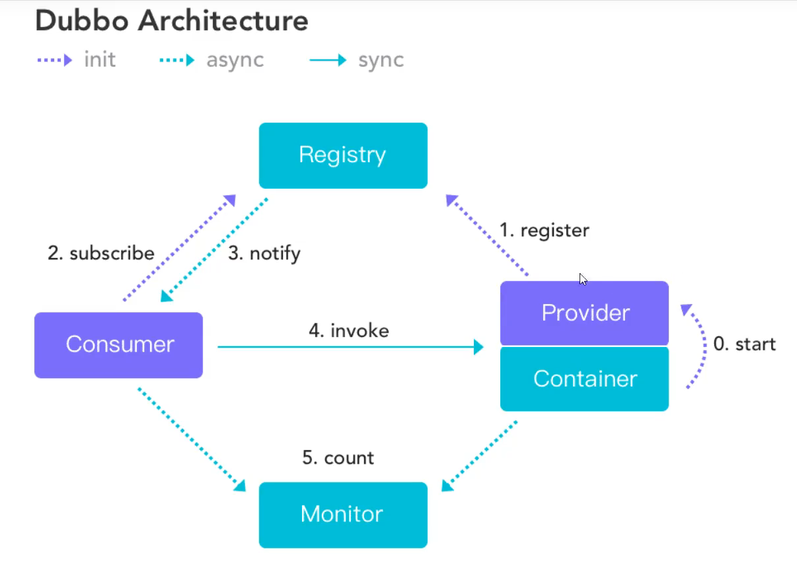

# 微服务
> 涉及分布式 SOA
>

## SOA
- **面向服务的架构**(SOA)是一个**组件模型**，
- 它将应用程序的**不同功能单元**(称为服务)进行拆分，
- 并通过这些服务之间定义良好的接口和协议联系起来。
  接口是采用中立的方式进行定义的， 它应该独立于实现服务的硬件平台、操作系统和编程语言。
  这使得构建在各种各样的系统中的服务可以以一种统一和通用的方式进行交互。
  
- zjz思考
    - 面向服务的架构,,服务也就是我们的一个个**功能模块**

## 分布式
- 1.定义:分布式系统是若干独立计算机的集合，
  这些计算机对于用户来说就像单个相关系统
- 2.目的:是利用更多的机器，处理更多的数据。
- 3.使用:只有当单个节点的处理能力无法满足日益增长的计算、存储任务的时候，且硬件的
  提升（加内存、加磁盘、使用更好的CPU）高昂到得不偿失的时候，应用程序也不能进一步优化的时
  候，我们才需要考虑分布式系统。
- Nginx -代理服务器

- 4.发展历程
- 单一应用架构(ORM)-->垂直应用架构(MVC)-->分布式服务架构(RPC)-->流动计算架构(SOA)
- 无论是微服务还是分布式服务（都是SOA，都是面向服务编程） 

### 出现RPC(Remote Procedure Call)
> RPC两大核心:通讯,序列化

### 出现Dubbo
- Spring Cloud(生态)
- Dubbo3.X(RPC)--专注RPC
- 介绍:
    - Apache Dubbo是一个高性能,轻量级的开源java RPC框架,
      它提供了三大核心能力:面向接口的远程方法调用,智能容错和负载均衡,以及服务自动注册和发现

- 非入侵式的,对应用没有任何的API入侵
- 注意:只有一个invoke同步,异步有多个
  

- zookeeper(zoo+keeper)--->管理:hadoop hive
- zjz记:
    - (提供者运行)提供者登记-->消费者订购-->登记表通知-->RPC调用.

### 微服务的一些知识
> 模块化,功能化

- 1.以前的单台服务器,访问人数过多,---一台解决不了--再加一台服务器! 横向添加
- 2.假如A服务器占用98%的资源,B服务器占用10%的资源  ---一旦A出事就完了...---出现负载均衡
- 3.将原来的整体项目,分成模块化,用户就是一个单独的项目,签到也是一个单独的项目,项目和项目之间需要通信,如何通信..

### 核心问题
- 微服务架构问题?
    - 分布式架构的四个问题--
        - 1.这么多服务,客户端如何去访问?(一个同一点的接口,,网关?)
        - 2.这么多服务,服务之间如何通信?(安全,事务,等等..)
        - 3.这么多服务,如何治理?(同一的服务管理--zookeeper?)
        - 4.服务挂了,怎么办?
    
- 解决方案:
    - springCloud 是一个**生态**,想使用它,必须会springboot,因为springCloud基于springBoot
    - 1.Spring Cloud NetFlix 出来了一套解决方案,一站式解决方案.我们都可以直接这里拿.
        - API网关 zuul组件 
        - 通信 Feign-->HTTPClient-->HTTP的通信方式,同步并阻塞-->反义词(异步非阻塞)
        - 服务注册与发现,Eureka组件
        - 熔断机制,Hystrix
    - 2018年底,,,NetFlix宣布无限期停止维护
    
    - 2.Apache Dubbo zookeeper 第二套解决系统
        - API网关 没有..要么找第三方,要么自己实现
        - Dubbo 是一个高性能的基于java实现的 RPC通信框架
        - 服务注册与发现 zookeeper:动物园管理者----Hadoop hive
        - 没有 借助了Hystrix
    
    - 3.SpringCloud Alibaba 一站式解决方案!
    - 目前:又一种方案,服务网格,,Server Mesh
        - 代表解决方案:istio
    
- 思想: -万变不离其宗,一通百通
    - 1.API网关,服务路由
    - 2.HTTP,RPC框架,异步调用
    - 3.服务注册与发现,高可用
    - 4.熔断机制,服务降级(服务崩了)
    

## 微服务,微服务架构
- 微服务:强调的是服务的大小，他关注的是**某一个点**，是具体解决某一个问题/提供落地对应服务的一个服务应
  用，狭义的看，可以看做是IDEA中的一个个微服务工程，或者Moudel
  
- 微服务架构:微服务架构是一种架构模式，它提倡将单一应用程序划分成一组小的服务，服务之间互相协调，互相配
  合，为用户提供最终价值。每个服务运行在其独立的进程中，服务于服务间采用轻量级的通信机制互相
  协作，每个服务都围绕着具体的业务进行构建，并且能够被独立的部署到生产环境中，另外，应尽量避
  免统一的，集中式的服务管理机制，对具体的一个服务而言，应根据业务上下文，选择合适的语言，工
  具对其进行构建。
  
- 优点:
  - 单一职责原则
  - 开发简单，开发效率提高，一个服务可能就是专一的只干一件事；
  - 微服务只是业务逻辑的代码，不会和 HTML ， CSS 或其他界面混合
  - 每个微服务都有自己的存储能力，可以有自己的数据库，也可以有统一数据库
    

