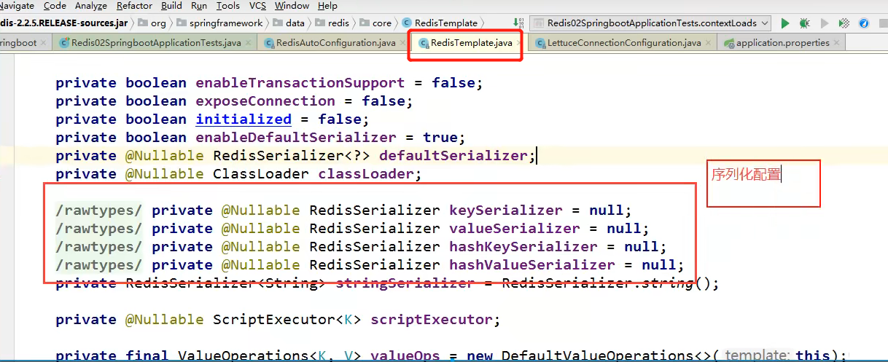
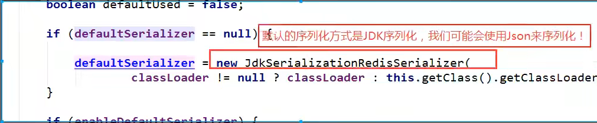

# SpringBoot整合
- SpringBoot操作数据库:Spring-data jpa,jdbc,mongodb,redis
- SpringData也是和SpringBoot齐名的项目


## 开始
- 新建时,加入所有工具,web,Nosql下的redis
- 点开start发现底层时spring-data-redis
- 在spring-boot2.X后,原来的jedis被替换为lettuce
    - jedis:采用的是直连的,多个线程操作是不安全的,为了避免不安全,使用jedis pool连接池 更像BIO模式
    - lettuce:采用netty,实例可以在多个线程中共享,不存在线程不安全的情况!可以减少线程数量了,更像NIO模式
  
- 2.配置连接
  
  ```
    # SpringBoot 所有配置类,都有一个自动配置类  RedisAutoConfiguration
    # 自动配置类都会绑定一个properties配置文件  RedisProperties
    
    # 配置redis
    spring.redis.host=127.0.0.1
    spring.redis.port=6379
    
    # 连接池配置 spring.redis.lettuce.pool它的,jedis的不会生效
  ```
- 3.测试:
- 先开启redis-service
- 运行测试代码
  
  ```
      @SpringBootTest
      class Redis02SpringbootApplicationTests {
      
          @Autowired
          private RedisTemplate redisTemplate;
      
          @Test
          void contextLoads() {
              // redisTemplate
              // ops 操作 opsForValue操作字符串,类似String类型
              // opsForList 操作list 类似list
              // opsForSet
              // opsForHash
              // opsForZSet
              // opsForHyperLogLog
      
              // 除了基本的操作,我么常用的方法都可以直接redisTemplate来操作,比如事务和基本的增删改查
      
      /*
            // 获取redis的连接对象
              RedisConnection connection = redisTemplate.getConnectionFactory().getConnection();
              connection.flushDb();
              connection.flushAll();
              */
      
      
      
      
              redisTemplate.opsForValue().set("myKey","zjz加油");
              System.out.println(redisTemplate.opsForValue().get("myKey"));
      
          }
      
      }
  
  ```






- 配置config
- ```
  
        @Configuration
      public class RedisConfig {
      // 编写我们自己的redisconfig
      
          @Bean
          public RedisTemplate<String, Object> redisTemplate(RedisConnectionFactory factory) {
              RedisTemplate<String, Object> template = new RedisTemplate<String, Object>();
              template.setConnectionFactory(factory);
              Jackson2JsonRedisSerializer jackson2JsonRedisSerializer = new Jackson2JsonRedisSerializer(Object.class);
              ObjectMapper om = new ObjectMapper();
              om.setVisibility(PropertyAccessor.ALL, JsonAutoDetect.Visibility.ANY);
              om.enableDefaultTyping(ObjectMapper.DefaultTyping.NON_FINAL);
              jackson2JsonRedisSerializer.setObjectMapper(om);
              StringRedisSerializer stringRedisSerializer = new StringRedisSerializer();
              // key采用String的序列化方式
              template.setKeySerializer(stringRedisSerializer);
              // hash的key也采用String的序列化方式
              template.setHashKeySerializer(stringRedisSerializer);
              // value序列化方式采用jackson
              template.setValueSerializer(jackson2JsonRedisSerializer);
              // hash的value序列化方式采用jackson
              template.setHashValueSerializer(jackson2JsonRedisSerializer);
              template.afterPropertiesSet();
              return template;
      
          }
      
      }
  
  
  ```
