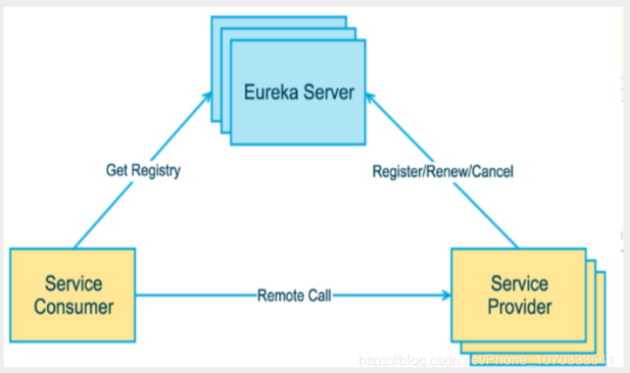
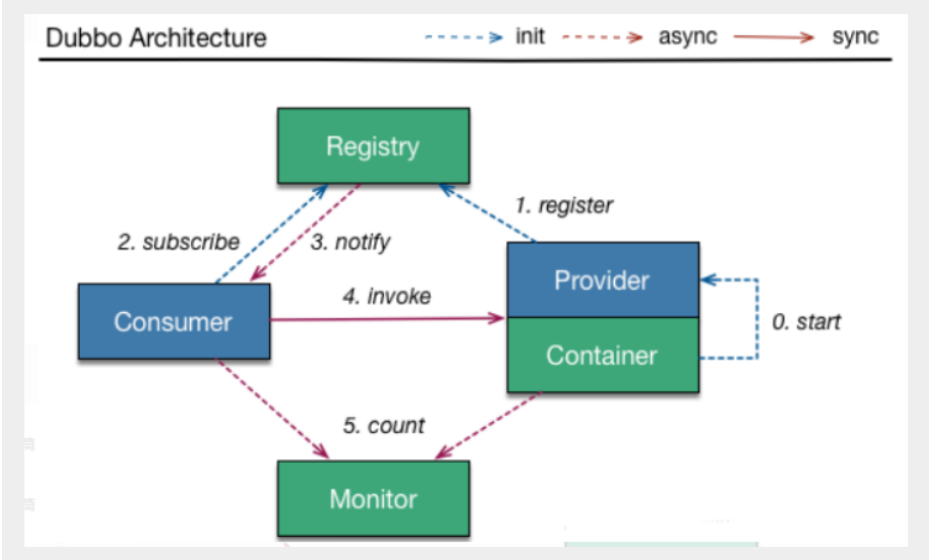

# Eureka
> 目标
- 了解它是干啥的?怎么干?

> 规范
- 首先明确:1.客户端如何去访问 2.服务端如何交互 3.如何治理 4.服务挂了,怎么办
- 对应的方法:1.API网关,服务路由 2.HTTP,RPC框架,异步调用 3.服务注册与发现,高可用 4.熔断机制,服务降级
- 还要明白Dubbo(RPC)的服务者,消费者的思想 --- 


>解


## 简介
- Netflix 在设计Eureka 时，遵循的就是AP原则
    ```
      CAP原则又称CAP定理，指的是在一个分布式系统中 
      一致性（Consistency） 
      可用性（Availability） 
      分区容错性（Partition tolerance） 
      CAP 原则指的是，这三个要素最多只能同时实现两点，不可能三者兼顾。
    ```
  
- Eureka是Netflix的一个子模块，也是核心模块之一。
  - Eureka是一个**基于REST的服务**，用于定位服务，以实现云端中间层服务发现和故障转移，
  - **服务注册与发现**对于微服务来说是非常重要的，有了服务发现与注册，
    只需要使用服务的标识符，就可以访问到服务，而不需要修改服务调用的配置文件了，
  - 功能类似于Dubbo的注册中心，比如Zookeeper；
  

- zjz说:
    - 以前的zookeeper变成了Eureka
    - 服务提供者--配置注册中心地址-->Eureka<--获得注册中心的数据--消费者
    - 消费者--restFul远程调用-->服务提供者  
    

- Eureka的基本架构：
  - SpringCloud 封装了NetFlix公司开发的Eureka模块来实现服务注册和发现
  - Eureka采用了C-S的架构设计，EurekaServer 作为服务注册功能的服务器，他是服务注册中心
  - 而系统中的其他微服务。使用Eureka的客户端连接到EurekaServer并维持心跳连接。这样系统的维护人
      员就可以通过EurekaServer来监控系统中各个微服务是否正常运行，SpringCloud的一些其他模块（比
      如Zuul）就可以通过EurekaServer来发现系统中的其他微服务，并执行相关的逻辑
    - 心跳连接:证明整个服务还活着
  





- Eureka 包含两个组件：Eureka Server 和 Eureka Client 。
- Eureka Server 提供服务注册服务，各个节点启动后，会在EurekaServer中进行注册，这样Eureka
  Server中的服务注册表中将会存储所有可用服务节点的信息，服务节点的信息可以在界面中直观的看
  到。
  Eureka Client是一个Java客户端，用于简化EurekaServer的交互，客户端同时也具备一个内置的，使用
  轮询负载算法的负载均衡器。在应用启动后，将会向EurekaServer发送心跳（默认周期为30秒）。如果
  Eureka Server在多个心跳周期内没有接收到某个节点的心跳，EurekaServer将会从服务注册表中把这
  个服务节点移除掉（默认周期为90秒）
  
- 三大角色
  - Eureka Server：提供服务的注册于发现。
  - Service Provider：将自身服务注册到Eureka中，从而使消费方能够找到。
  - Service Consumer：服务消费方从Eureka中获取注册服务列表，从而找到消费服务。

- eureka配置中: this.serviceUrl.put("defaultZone", "http://localhost:8761/eureka/");


- 自我保护机制：好死不如赖活着
  - 一句话总结：某时刻某一个微服务不可以用了，eureka不会立刻清理，依旧会对该微服务的信息进行保存！
  - 默认情况下，如果EurekaServer在一定时间内没有接收到某个微服务实例的心跳，EurekaServer将会注
  销该实例（默认90秒）。但是当网络分区故障发生时，微服务与Eureka之间无法正常通行，以上行为可
  能变得非常危险了--因为微服务本身其实是健康的，此时本不应该注销这个服务。Eureka通过 自我保护
  机制 来解决这个问题--当EurekaServer节点在短时间内丢失过多客户端时（可能发生了网络分区故
  障），那么这个节点就会进入自我保护模式。一旦进入该模式，EurekaServer就会保护服务注册表中的
  信息，不再删除服务注册表中的数据（也就是不会注销任何微服务）。当网络故障恢复后，该
  EurekaServer节点会自动退出自我保护模式。
  - 在自我保护模式中，EurekaServer会保护服务注册表中的信息，不再注销任何服务实例。当它收到的心
  跳数重新恢复到阈值以上时，该EurekaServer节点就会自动退出自我保护模式。它的设计哲学就是宁可
  保留错误的服务注册信息，也不盲目注销任何可能健康的服务实例。一句话：**好死不如赖活着**。
  - 综上，自我保护模式是一种应对网络异常的安全保护措施。它的架构哲学是宁可同时保留所有微服务
  （健康的微服务和不健康的微服务都会保留），也不盲目注销任何健康的微服务。使用自我保护模式，
  可以让Eureka集群更加的健壮和稳定。
  - 在SpringCloud中，可以使用 eureka.server.enable-self-preservation = false 禁用自我保护
  模式 【**不推荐关闭自我保护机制**】
    

- 集群模拟
  - 先配置host三个
  - 


## 回顾CAP原则
- RDBMS （Mysql、Oracle、sqlServer）===>ACID
- NoSQL（redis、mongdb）===> CAP
  
- ACID是什么？
  - A（Atomicity）原子性
  - C（Consistency） 一致性
  - I （Isolation）隔离性
  - D（Durability）持久性
- CAP是什么？
  - C（Consistency）强一致性
  - A（Availability）可用性
  - P（Partition tolerance）分区容错性
  
- CAP的三进二：CA、AP、CP
  
- CAP理论的核心
  - 一个分布式系统不可能同时很好的满足一致性，可用性和分区容错性这三个需求
  - 根据CAP原理，将NoSQL数据库分成了满足CA原则，满足CP原则和满足AP原则三大类：
    - CA：单点集群，满足一致性，可用性的系统，通常可扩展性较差
    - CP：满足一致性，分区容错性的系统，通常性能不是特别高
    - AP：满足可用性，分区容错性的系统，通常可能对一致性要求低一些


- 著名的CAP理论指出，一个分布式系统不可能同时满足C（一致性）、A（可用性）、P（容错性）。
- 由于**分区容错性P**在分布式系统中是必须要保证的，因此我们只能在A和C之间进行权衡。
  - Zookeeper保证的是CP；
  - Eureka保证的是AP；


- Zookeeper保证的是CP
  - 当向注册中心查询服务列表时，我们可以容忍注册中心返回的是几分钟以前的注册信息，但不能接受服
  务直接down掉不可用。也就是说，服务注册功能对可用性的要求要高于一致性。但是zk会出现这样一种
  情况，**当master节点因为网络故障与其他节点失去联系时，剩余节点会重新进行leader选举**。问题在
  于，选举leader的时间太长，30~120s，且选举期间整个zk集群都是不可用的，这就导致在选举期间注
  册服务瘫痪。在云部署的环境下，因为网络问题使得zk集群失去master节点是较大概率会发生的事件，
  虽然服务最终能够恢复，但是漫长的选举时间导致的注册长期不可用是不能容忍的。
- Eureka保证的是AP
  - Eureka看明白了这一点，因此在设计时就优先保证可用性。Eureka各个节点都是平等的，几个节点挂
  掉不会影响正常节点的工作，剩余的节点依然可以提供注册和查询服务。而Eureka的客户端在向某个
  Eureka注册时，如果发现连接失败，则会自动切换至其他节点，只要有一台Eureka还在，就能保住注册
  服务的可用性，只不过查到的信息可能不是最新的，除此之外，Eureka还有一种自我保护机制，如果在
  15分钟内超过85%的节点都没有正常的心跳，那么Eureka就认为客户端与注册中心出现了网络故障，此
  时会出现以下几种情况：
  - 1. Eureka不再从注册列表中移除因为长时间没收到心跳而应该过期的服务
  - 2. Eureka仍然能够接受新服务的注册和查询请求，但是不会被同步到其他节点上（即保证当前节点依然可用）
  - 3. 当网络稳定时，当前实例新的注册信息会被同步到其他节点中


- `因此，Eureka可以很好的应对因网络故障导致部分节点失去联系的情况，而不会像zookeeper那样使整个注册服务瘫痪`


