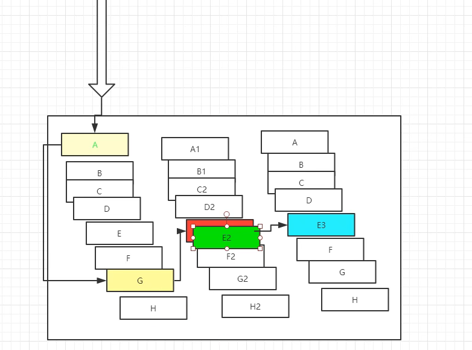
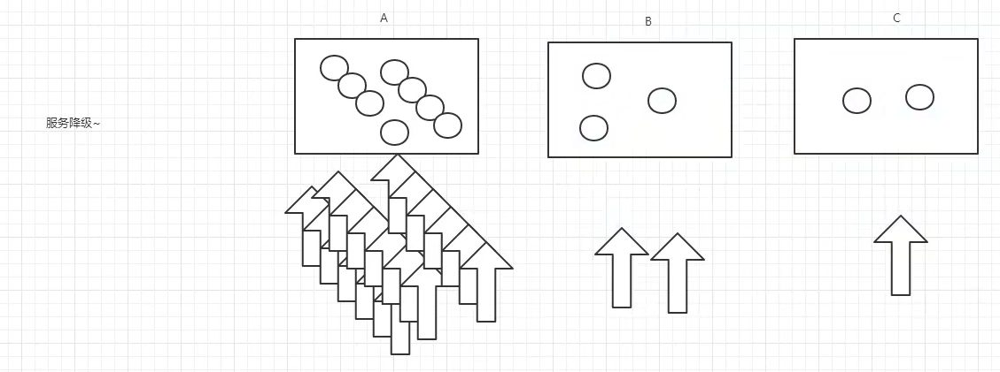

# Hystrix断路器
- 复杂分布式体系结构中的应用程序有数十个依赖关系，每个依赖关系在某些时候将不可避免的失败！
## 分布式系统面临的问题
- 服务雪崩
    - 多个微服务之间调用的时候，假设微服务A调用微服务B和微服务C，微服务B 和微服务C又调用其他的微
      服务，这就是所谓的 “**扇出**”、如果扇出的链路上某个微服务的调用响应时间过长或者不可用，对微服务A
      的调用就会占用越来越多的系统资源，进而引起系统崩溃，所谓的 **雪崩效应**
    - 对于高流量的应用来说，单一的后端依赖可能会导致所有服务器上的所有资源都在几秒中内饱和。比失
      败更糟糕的是，这些应用程序还可能导致服务之间的延迟增加，备份队列，线程和其他系统资源紧张，
      导致整个系统发生更多的级联故障，这些都表示需要对故障和延迟进行隔离和管理，以便单个依赖关系
      的失败，不能取消整个应用程序或系统。
    - 我们需要 ·弃车保帅·  
- zjz说:
    - 扇出:主服务扇形的出去一张图
    - 雪崩效应:扇出的图里联系出事了,影响到主服务
    

    
## 什么是Hystrix
- Hystrix是一个用于**处理分布式系统的延迟和容错的开源库**，在分布式系统里，许多依赖不可避免的会调
  用失败，比如超时，异常等，Hystrix能够保证在一个依赖出问题的情况下，不会导致整体服务失败，避
  免级联故障，以提高分布式系统的弹性。
- “**断路器**” 本身是一种开关装置，当某个服务单元发生故障之后，通过断路器的故障监控（类似熔断保险
  丝），**向调用方返回一个服务预期的，可处理的备选响应（FallBack），而不是长时间的等待或者抛出
  调用方法无法处理的异常，这样就可以保证了服务调用方的线程不会被长时间**，不必要的占用，从而避
  免了故障在分布式系统中的蔓延，乃至雪崩. 
  
- 能干嘛
  - 服务降级
  - 服务熔断
  - 服务限流
  - 接近实时的监控
  - .....

- - 也就是发现雪崩了,会启动备选方法
    

## 服务熔断
- 是什么
  - 熔断机制是对应雪崩效应的一种**微服务链路保护机制**。
  - 当扇出链路的某个微服务不可用或者响应时间太长时，会进行服务的**降级**，进而熔断该节点微服务的调用，
    快速返回错误的响应信息。当检测到该节点微服务调用响应正常后恢复调用链路。
  - 在SpringCloud框架里熔断机制通过Hystrix实现。Hystrix会**监控**微服务间调用的状况，当失败的调用到一定阈值，缺省
  是**5秒内20次调用失败就会启动熔断机制**。
- 熔断机制的注解是 @HystrixCommand。

## 服务降级
- 整体资源快不够了，**忍痛将某些服务先关掉**，待渡过难关，再开启回来。
- 服务降级处理是在客户端实现完成的，与服务端没有关系
- 客户端完成..

- 服务熔断:服务器~ 某个服务器超时或异常,引起熔断~,保险丝
  - zjz:服务异常,服务provider有一个备选的方案--springcloud-provider-dept-hystrix_8001--记得@EnableCircuitBreaker  // 添加对熔断的支持
- 服务降级:客户端~,从整体网站的请求负载考虑,当某个服务关闭或者熔断以后,服务不再被调用,
        客户端准备一个FallbackFactory,返回一个默认的值,整体服务水平下降了
  - zjz:服务器压力大,手动关闭一些provider,有一个良好的反馈springcloud-api和消费者加个注解
    

### dashBoard
- 除了隔离依赖服务的调用以外，Hystrix还提供了准实时的调用监控（Hystrix Dashboard），Hystrix会
  持续地记录所有通过Hystrix发起的请求的执行信息，并以统计报表和图形的形式展示给用户，包括每秒
  执行多少请求，多少成功，多少失败等等。
  Netflix通过hystrix-metrics-event-stream项目实现了对以上指标的监控，SpringCloud也提供了Hystrix
  Dashboard的整合，对监控内容转化成可视化界面！
  
- 操作
- pom
- consumer导包 Hystrix依赖 dashboard以及本身就有的
- provider有监控信息actuator Hystrix依赖
- 一个启动类

