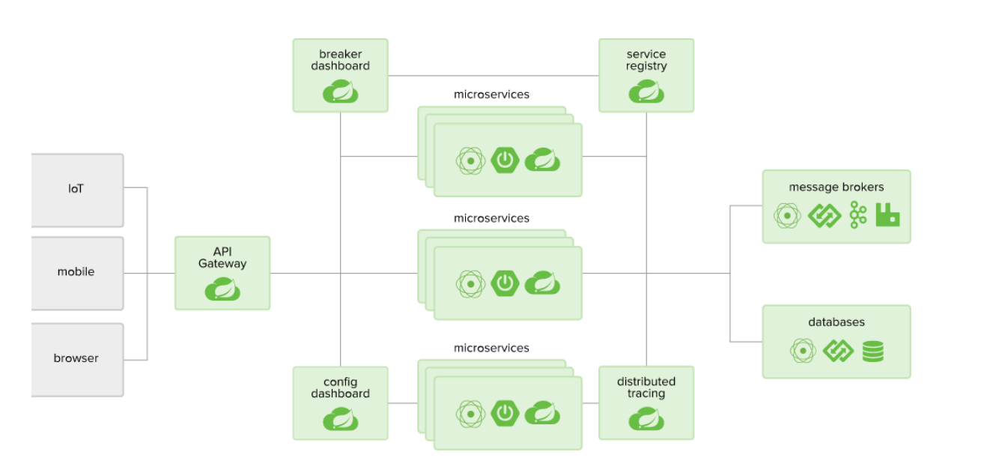
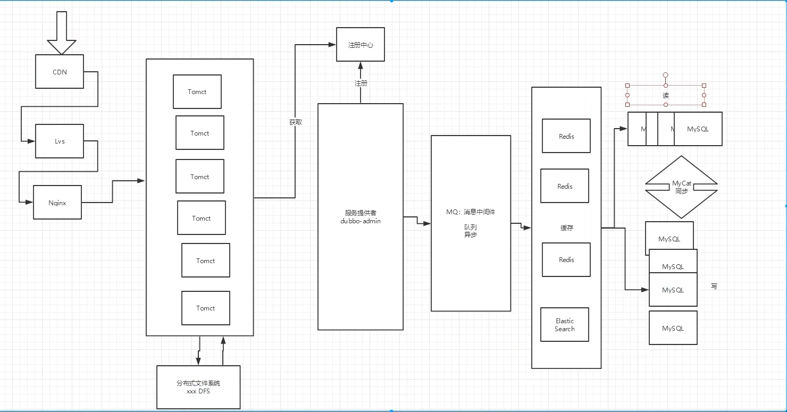

# springCloud 
> springCloud 是一个**生态**
> 
> 目的是解决四个问题:
- 1.这么多服务,客户端如何去访问?(一个统一的接口,,网关?)
- 2.这么多服务,服务之间如何通信?(安全,事务,等等..)
- 3.这么多服务,如何治理?(同一的服务管理--zookeeper?)
- 4.服务挂了,怎么办?

- 解决方案:
    - springCloud 是一个**生态**,想使用它,必须会springboot,因为springCloud基于springBoot
    - 1.Spring Cloud NetFlix 出来了一套解决方案,一站式解决方案.我们都可以直接这里拿.
        - API网关 zuul组件
        - 通信 Feign-->HTTPClient-->HTTP的通信方式,同步并阻塞-->反义词(异步非阻塞)
        - 服务注册与发现,Eureka组件
        - 熔断机制,Hystrix
    - 2018年底,,,NetFlix宣布无限期停止维护

    - 2.Apache Dubbo zookeeper 第二套解决系统 半自动,需要整合别人的框架
        - API网关 没有..要么找第三方,要么自己实现
        - Dubbo 是一个高性能的基于java实现的 RPC通信框架
        - 服务注册与发现 zookeeper:动物园管理者----Hadoop hive
        - 没有 借助了Hystrix

    - 3.SpringCloud Alibaba 一站式解决方案!
    - 目前:又一种方案,服务网格,,Server Mesh
        - 代表解决方案:istio

## SpringCloud介绍
> 是一个生态,应微服务问题而生

### 简介
- SpringCloud, 基于SpringBoot提供了一套微服务解决方案，包括服务注册与发现，配置中心，全链路监
  控，服务网关，负载均衡，熔断器等组件，除了基于NetFlix的开源组件做高度抽象封装之外，还有一些
  选型中立的开源组件。
  
- SpringCloud利用SpringBoot的开发便利性，巧妙地简化了分布式系统基础设施的开发，SpringCloud为
  开发人员提供了快速构建分布式系统的一些工具，包括**配置管理，服务发现，断路器，路由，微代理，
  事件总线，全局锁，决策竞选，分布式会话**等等，他们都可以用SpringBoot的开发风格做到一键启动和
  部署
  
- 它将目前各家公司开发的比较成熟，经得起实际考研的服务框架组合起来，
  通过SpringBoot风格进行再封装，屏蔽掉了复杂的配置和实现原理，
  最终给开发者留出了一套
  简单易懂，易部署和易维护的分布式系统开发工具包
  
- SpringCloud 是 分布式微服务架构下的一站式解决方案，是各个微服务架构落地技术的集合体，俗称微
  服务全家桶。
  
### SpringCloud和SpringBoot的关系
- [定义]SpringBoot专注于快速方便的开发单个**个体微服务**
- [定义]SpringCloud是关注全局的**微服务协调整理治理框架**
- [作用]SpringCloud将SpringBoot开发的一个个单体微服务**整合并管理起来**，为各个微服务之间提供：
  配置管理，服务发现，断路器，路由，微代理，事件总线，全局锁，决策竞选，分布式会话等等集成服务。
- [限制]SpringBoot可以离开SpringClooud独立使用，开发项目，但是SpringCloud离不开SpringBoot，属于依赖关系  
- [强调]SpringBoot专注于快速、方便的开发单个个体微服务，SpringCloud关注全局的服务治理框架

- zjz说,
  - SpringBoot提供的是微服务,而SpringCloud提供的是一系列的管理和服务
    - 一个是服务业务,一个是管理和服务自身
  - SpringBoot可以离开SpringCloud(之前编的就没依托..),,SpringCloud离不开Springboot
  -   

### 互联网架构

- 1.CDN:
    - 如果我们把某种网络资源，看成是某种路途遥远又曲折的，很多人都喜欢吃的美食，
      CDN就是把他们一次性的空降到我们面前（并且假设可以共享且取之不尽），让我们轻而易举的大快朵颐。
    - CDN的本质是缓存，而内核中支撑它的互联网精神则是共享
- 2.LVS（Linux Virtual Server）即Linux虚拟服务器，是由章文嵩博士主导的开源负载均衡项目，目前LVS已经被集成到Linux内核模块中。
- 3.Nginx:Nginx 是高性能的 **HTTP** 和**反向代理**的**web服务器**，处理高并发能力是十分强大的，能经受高负载的考验,有报告表明能支持高达 50,000 个并发连接数。
    - 其特点是占有内存少，并发能力强，事实上nginx的并发能力确实在同类型的网页服务器中表现较好，中国大陆使用nginx网站用户有：百度、京东、新浪、网易、腾讯、淘宝等。
    - Nginx 作为 **web 服务器**:可以作为静态页面的 web 服务器，同时还支持 CGI 协议的动态语言，比如 perl、php 等。但是**不支持 java**。
        - **Java 程序只能通过与 tomcat 配合完成**。Nginx**专为性能优化而开发**,性能是其最重要的考量,实现上非常注重效率 

- 设计模式+微服务拆分思想---活跃度
- 参考：
    - https://springcloud.cc/spring-cloud-netflix.html
    - 中文API文档：https://springcloud.cc/spring-cloud-dalston.html
    - SpringCloud中国社区 http://springcloud.cn/
    - SpringCloud中文网 https://springcloud.cc
    

## 项目开始
### 
- pom文件
  - 主pom,不加载依赖,提供依赖
    - 1.打包方式改为pom
    - 2.定义版本号的properties
    - 3.依赖管理dependencyManagement-->dependencies-->dependency
  - 子pom    
    - [编完其它Module]4.我们拿另一个子pom的东西..使用dependency拿取
    - 有的依赖-jetty --一个和tomcat差不多的web服务器,
    - 热部署工具spring-boot-devtools---每次改的,自动加载

- 新建Models
- 新建表
    - 注意:微服务--一个服务对应一个数据库,同一个信息可能存在不同的数据库

- 如果pom中导入其它子pom,那么就可以使用其它的pojo了

- 服务消费者一般是80窗口,因为我们一般就是作为消费者访问网页的

### 一些总结
- 首先明确:1.客户端如何去访问 2.服务端如何交互 3.如何治理 4.服务挂了,怎么办
- 对应的方法:1.API网关,服务路由 2.HTTP,RPC框架,异步调用 3.服务注册与发现,高可用 4.熔断机制,服务降级
- 还要明白Dubbo(RPC)的服务者,消费者的思想 --- 

- 1.针对客户端如何访问
    - 按照RPC思想,我们需要有三个东西,服务者,消费者,API网关
    - API网关:提供共同需要的方法,比如实体类
    - 服务路由:一些访问方法---一般写在消费者,消费者调用方法访问  
    - 服务者:提供服务操作,比如查看,提供增删改,但它本身是不能使用的
    - 消费者:只需要操作对应的方法即可
    
    - 举例:Rest的方式::1.API提供一个实体类,2.服务者引入API,提供一系列服务,3.消费者引入API,借助RestTemplate作为访问方法
        - 引入:通过pom的方式
        - 对于消费者怎么使用访问方法,1.配置Config,造访问方法Bean 2.调用即可
        - 因为没有网页,所以方式都是RestController

# config
## 介绍
- 将所有的配置文件放进一个Config Server中,,其它调用的时候直接拿,
    - 放在本地,放在远程
- SpringCloudConfig为微服务架构中的微服务**提供集中化的外部配置支持**,配置服务器为
  各个不同微服务应用的所有环节**提供一个中心化的外部配置**.
- SpringCloud 分为`服务端`和`客户端`两部分

## 想法:
- 服务端也称为**分布式配置中心**,它是一个独立的微服务应用,用来连接配置服务器并为客户端提供获取配置信息,加密,解密信息等访问接口.
- 客户端通过指定的配置中心来管理应用资源,以及与业务相关的配置内容,并在启动的时候从配置中心获取或加载配置信息.
    - 配置服务器默认采用**git**来存储配置信息,这样有助于对环境配置进行版本管理.并且可以通过git客户端工具来方便的管理和访问配置内容

