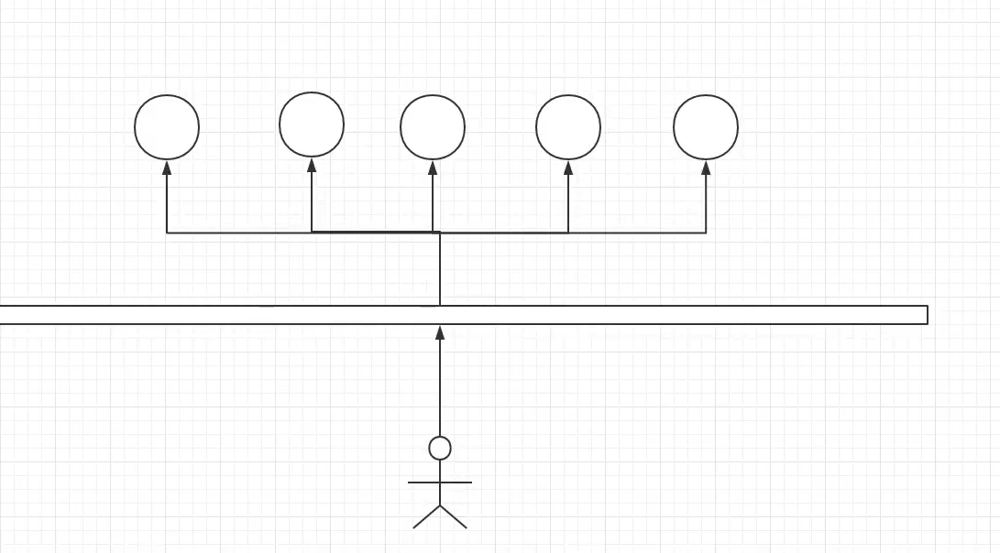
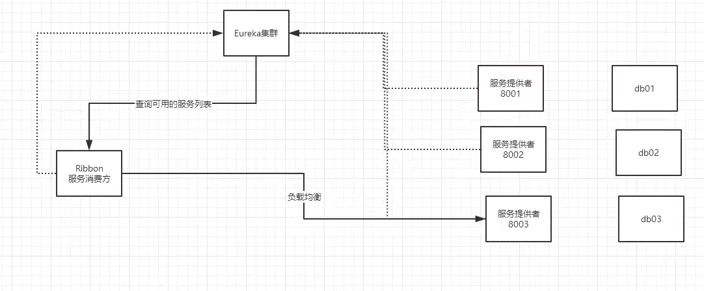

# Ribbon负载均衡

## 介绍
- Ribbon是什么？
  - Spring Cloud Ribbon是基于Netflix Ribbon实现的一套**客户端负载均衡的工具**。
  - 简单的说，Ribbon是Netflix发布的开源项目，主要功能是提供客户端的软件负载均衡算法，将NetFlix的
     中间层服务连接在一起。Ribbon的客户端组件提供一系列完整的配置项如：连接超时、重试等等。简单
     的说，就是在配置文件中列出LoadBalancer（简称LB：负载均衡）后面所有的机器，Ribbon会自动的
     帮助你基于某种规则（如简单轮询，随机连接等等）去连接这些机器。我们也很容易使用Ribbon实现自
     定义的负载均衡算法！
    

- 当一个用户要访问时,它应该去哪个服务器去访问???
    - 轮询(一个个用户挨个进,万一有服务器崩了,其它服务器压力太大)
    - 随机(利用哈希什么的随机进)

- zjz说:Ribbon,LoadBalancer负载均衡---也就是类似于在用户和服务器间加了一层中间件,
    - 这一层的作用时控制用户访问服务器的方式,当用户想要访问服务器时,这一层进行处理,发放到合适的服务器

### 核心
- 负载均衡简单的说就是将用户的请求平摊的分配到多个服务上，从而达到系统的HA（高可用）。
- 常见的负载均衡软件有 Nginx，Lvs 等等 ---Apache+Tomcat也能做到
- Dubbo、SpringCloud中均给我们提供了负载均衡，SpringCloud的负载均衡算法可以自定义

- 负载均衡简单分类：
  - 1.集中式LB--由一个中间的东西控制,如Nginx
    - 即在服务的消费方和提供方之间使用独立的LB设施
    - 如Nginx(反向代理服务器)，由该设施负责把访问请求通过某种策略转发至服务的提供方！
  - 2.进程式LB
    - 将LB逻辑集成到消费方，**消费方从服务注册中心**获知有哪些地址可用，然后自己再从这些地
      址中选出一个合适的服务器。
    - Ribbon就属于**进程内LB**，它只是一个类库，集成于消费方进程，消费方通过它来**获取到服务提供方的地址**！
      - 目前用的是springCloud的ribbon
    
- zjz说:    
    - 集中式,中间层控制访问.---进程式,用户客户端控制去访问.
    - 进程式:两点注意:1.客户端要去Eureka去找地址,借助ribbon的方式获取地址,访问还是通过RestTemplate拿的服务
    - ribbon的赛诺菲默认式轮询

# Feign负载均衡

## 介绍:
- feign是声明式的web service客户端，它让微服务之间的调用变得更简单了，类似controller调用service。
- Spring Cloud集成了Ribbon和Eureka，可在使用Feign时提供负载均衡的http客户端。
    
- 只需要创建一个接口，然后添加注解即可！

- feign ，主要是社区，大家都习惯面向接口编程。这个是很多开发人员的规范。调用微服务访问两种方法
    - 1. 微服务名字 【ribbon】 
    - 2. 接口和注解 【feign 】@FeignClient(value = "SPRINGCLOUD-PROVIDER-DEPT")

## 作用:
> Feign旨在使编写Java Http客户端变得更容易

- 前面在使用Ribbon + RestTemplate时，利用RestTemplate对Http请求的封装处理，形成了一套模板化的调用方法。

- 在实际开发中，由于对服务依赖的调用可能不止一处，往往**一个接口会被多处调用**，
  所以通常都会针对每个微服务自行封装一些客户端类来包装这些依赖服务的调用。
  所以,Feign在此基础上做了进一步封装,由他 来帮助我们定义和实现依赖服务接口的定义
  
- 在Feign的实现下，我们只需要创建一个接口并**使用注解的方式**来配置它（类似于以前Dao接口上标注Mapper
  注解，现在是一个微服务接口上面标注一个Feign注解即可。）即可完成对服务提供方的接口绑
  定，简化了使用Spring Cloud Ribbon时，自动封装服务调用客户端的开发量。
  
- Feign集成了Ribbon

