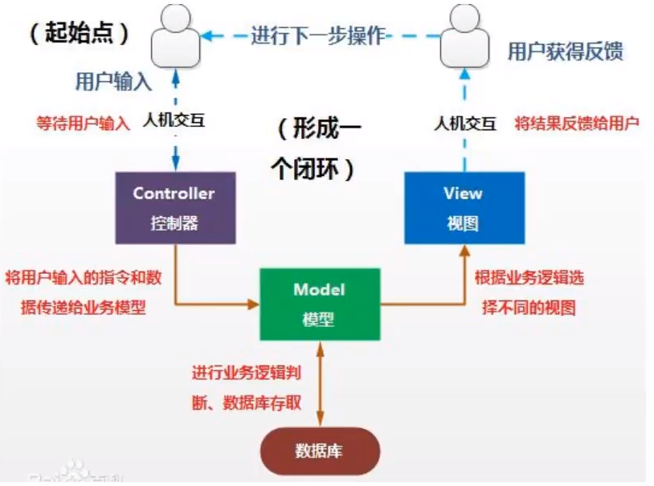

# SpringMVC
- Thinking is more important than learning
- Interaction is the principle
> 简介？
> 
> 用来干什么的？主要的作用？
> 
> 基本配置，基本操作
>

- 简介
- 如何配置（超级重点）---风格？ --restFul风格
- 结果跳转方式（转发，重定向：重点）
- 如何处理前端数据（重点）
- RestFul 风格
- 文件上传，下载
- Ajax和json（超级重点）
- 拦截器（重点）
- 注解开发      
- 整合SSM框架

# SpringMVC
- SSM:Spring + SpringMVC + Mybatis
- SSM = javaWeb做项目
- Spring：IOC和AOP
- SpringMVC：SpringMVC的执行流程
- SpringMVC：SSM框架整合


- MVC：模型（dao，service） 视图（jsp） 控制器（Servlet）
- servlet：转发，重定向

- 前端  数据传输 实体类
- 实体类：用户名，密码，生日，爱好，……
- 登录界面---前端只需要： 用户名 密码
- pojo：User
- vo：UserVo  --- 还是实体类，只是拆了，针对性使用

- View 视图层 客户想看到的东西
- Controller（控制器） 接收用户请求，委托给模型进行处理（状态改变），处理完毕后把返回的模型数据返回给视图，由视图负责展示。
- 最典型的就是JSP+servlet+javaBean



### 明确任务！
- controller -1.获取表单数据，2.调用业务逻辑 3.转向指定页面
- Model -1.业务逻辑 2.保存数据的状态 
- view - 显示视图，数据与controller交互

- MVC框架要做哪些事情
  - 1. 将url映射到java类或java类的方法 .
  - 2. 封装用户提交的数据 .
  - 3. 处理请求--调用相关的业务处理--封装响应数据 .
  - 4. 将响应的数据进行渲染 . jsp / html 等表示层数据 .

- 全栈：后台+前端+数据库+运维

- MVVM：M V VM（ViewModel）双向绑定
# SpringMVC
- 是Spring Framework的一部分，是基于java实现MVC的轻量级Web框架

## 我们为什么要学习SpringMVC呢?
> Spring MVC的特点：
  - 1. 轻量级，简单易学
  - 2. 高效 , 基于请求响应的MVC框架
  - 3. 与Spring兼容性好，无缝结合
  - 4. 约定优于配置
  - 5. 功能强大：RESTful、数据验证、格式化、本地化、主题等
  - 6. 简洁灵活

- Spring的web框架围绕DispatcherServlet [ 调度Servlet ] 设计。


## 中心控制器
- Spring的web框架围绕DispatcherServlet设计。 DispatcherServlet的作用是将请求分发到不同的处理器。
- 流程：--注：配置文件也就是类似于公共方法包，他帮我们处理一些事，我们干的事就是会变的
  - 1.用户请求--带着（url+数据）--》DispatcherServlet   --- 用户通过web服务器与DispatcherServlet取得交互 
  - 2.DispatcherServlet**拦截到**请求，依据配置文件中的`<handler.BeanNameUrlHandlerMapping>`处理器映射器根据
    请求url查找得到mapping，(中途要经过**处理器执行链**)获取Handler。
  - 3.DispatcherServlet拿到返回的handler，再根据配置文件中的`mvc.SimpleControllerHandlerAdapter`适配器去**选到**合适的controller
  - 4.controller开始就是我们要干的了，比如：里面的校验（要处什么功能），然后对应业务层进行（Spring+Mybatis），同时，我们要加上对应的视图名字---
  - 5.controller最终return一个数据包+视图名（返回不了真正的视图，因为它没把数据给映射上去）
  - 6.这两样东西给了DispatcherServlet，它也不干这事，根据视图名，直接交给配置文件中的`view.InternalResourceViewResolver`
  - 7.视图解析后返回一个视图，DispatcherServlet展示给用户


```
1. DispatcherServlet表示前置控制器，是整个SpringMVC的控制中心。用户发出请求，
   DispatcherServlet接收请求并拦截请求。
   我们假设请求的url为 : http://localhost:8080/SpringMVC/hello
   如上url拆分成三部分：
   http://localhost:8080服务器域名
   SpringMVC部署在服务器上的web站点
   hello表示控制器
   通过分析，如上url表示为：请求位于服务器localhost:8080上的SpringMVC站点的hello控制器。
2. HandlerMapping为处理器映射。DispatcherServlet调用HandlerMapping,HandlerMapping根据
   请求url查找得到mapping，(中途要经过**处理器执行链**)获取Handler。 
    
3. HandlerExecution表示具体的Handler,其主要作用是根据url查找控制器，如上url被查找控制器
   为：hello。 
    
4. HandlerExecution将解析后的信息传递给DispatcherServlet,如解析控制器映射等。
5. HandlerAdapter表示处理器适配器，其按照特定的规则去执行Handler。 
6. Handler让具体的Controller执行。
7. Controller将具体的执行信息返回给HandlerAdapter,如ModelAndView。 
8. HandlerAdapter将视图逻辑名或模型传递给DispatcherServlet。 
9. DispatcherServlet调用视图解析器(ViewResolver)来解析HandlerAdapter传递的逻辑视图名。
10. 视图解析器将解析的逻辑视图名传给DispatcherServlet。
11. DispatcherServlet根据视图解析器解析的视图结果，调用具体的视图。
12. 最终视图呈现给用户。


```


# 基本SpringMVC搭建
- 1.导pom
- 2.配web.xml 从DispatchServlet开始配置
  - servlet的配置，springmvc，启动，拦截
    ```
        <?xml version="1.0" encoding="UTF-8"?>
        <web-app xmlns="http://xmlns.jcp.org/xml/ns/javaee"
                 xmlns:xsi="http://www.w3.org/2001/XMLSchema-instance"
                 xsi:schemaLocation="http://xmlns.jcp.org/xml/ns/javaee http://xmlns.jcp.org/xml/ns/javaee/web-app_4_0.xsd"
                 version="4.0">
        
            <!--1.注册DispatcherServlet-->
            <servlet>
                <servlet-name>springmvc</servlet-name>
                <servlet-class>org.springframework.web.servlet.DispatcherServlet</servlet-class>
                <!--关联一个springmvc的配置文件:【servlet-name】-servlet.xml-->
                <!--要三个东西，mapping，控制器，视图解析器 -->
                <init-param>
                    <param-name>contextConfigLocation</param-name>
                    <param-value>classpath:springmvc-servlet.xml</param-value>
                </init-param>
                <!--启动级别-1-->
                <load-on-startup>1</load-on-startup>
            </servlet>
        
            <!--/ 匹配所有的请求；（不包括.jsp）--> <!--/* 匹配所有的请求；（包括.jsp）-->
            <servlet-mapping>
                <servlet-name>springmvc</servlet-name>
                <url-pattern>/</url-pattern>
            </servlet-mapping>
        
        </web-app>
    
    ```

- 3.配置springmvc-servlet.xml
  - 映射器，适配器，视图解析器
    ```
    
        <?xml version="1.0" encoding="UTF-8"?>
        <beans xmlns="http://www.springframework.org/schema/beans"
               xmlns:xsi="http://www.w3.org/2001/XMLSchema-instance"
               xsi:schemaLocation="http://www.springframework.org/schema/beans
               http://www.springframework.org/schema/beans/spring-beans.xsd">
            // 映射器
            <bean class="org.springframework.web.servlet.handler.BeanNameUrlHandlerMapping" />
            // 适配器
            <bean class="org.springframework.web.servlet.mvc.SimpleControllerHandlerAdapter "/>
        
            <!--视图解析器:DispatcherServlet给他ModelAndView，模板引擎：Thymeleaf Freemarker
                1.获取了ModelAndView的数据
                2.解析了ModelAndView的视图名字
                3.拼接视图名字，找到对应的视图
            -->
            <bean class="org.springframework.web.servlet.view.InternalResourceViewResolver" id="InternalResourceViewResolver">
                <!--前缀-->
                <property name="prefix" value="/WEB-INF/jsp/"/>
                <!--后缀-->
                <property name="suffix" value=".jsp"/>
            </bean>
        
        // 因为是这个BeanNameUrlHandlerMapping映射器，才需要配，正常不要配的。。。
            <!--Handler-->
            <bean id="/hello" class="com.zjz.controller.HelloController"/>
        
        
        </beans>
    
    
    ```


- 编写Controller
    - 要实现controller
    - 返回modelAndView
    
    - 返回的model： addObject(); 中是一个键值对  - 键是视图里的id 值是自己要弄的值
    - 返回的视图： serView(); 中是视图的名字
    
    ```
        //注意：这里我们先导入Controller接口
        public class HelloController implements Controller {
            public ModelAndView handleRequest(HttpServletRequest request, HttpServletResponse response) throws Exception {
                //ModelAndView 模型和视图
                ModelAndView mv = new ModelAndView(); //封装对象，放在ModelAndView中。Model
                 mv.addObject("msg","HelloSpringMVC!");
                 //封装要跳转的视图，放在ModelAndView中
                 mv.setViewName("hello"); // : /WEB-INF/jsp/hello.jsp
                 return mv;
                 }
            }

    ```

 

## 注解开发
- web.xml
  ```
      <?xml version="1.0" encoding="UTF-8"?>
      <web-app xmlns="http://xmlns.jcp.org/xml/ns/javaee"
               xmlns:xsi="http://www.w3.org/2001/XMLSchema-instance"
               xsi:schemaLocation="http://xmlns.jcp.org/xml/ns/javaee http://xmlns.jcp.org/xml/ns/javaee/web-app_4_0.xsd"
               version="4.0">
      
          <!--1.注册DispatcherServlet-->
          <servlet>
              <servlet-name>springmvc</servlet-name>
              <servlet-class>org.springframework.web.servlet.DispatcherServlet</servlet-class>
              <!--关联一个springmvc的配置文件:【servlet-name】-servlet.xml-->
              <!--要三个东西，mapping，控制器，视图解析器 -->
              <init-param>
                  <param-name>contextConfigLocation</param-name>
                  <param-value>classpath:springmvc-servlet.xml</param-value>
              </init-param>
              <!--启动级别-1-->
              <load-on-startup>1</load-on-startup>
          </servlet>
          <!--/ 匹配所有的请求；（不包括.jsp）--> <!--/* 匹配所有的请求；（包括.jsp）-->
          <servlet-mapping>
              <servlet-name>springmvc</servlet-name>
              <url-pattern>/</url-pattern>
          </servlet-mapping>
      
      </web-app>
  
  
  ```
  
- springmvc-servlet.xml

  ```
  
      <?xml version="1.0" encoding="UTF-8"?>
      <beans xmlns="http://www.springframework.org/schema/beans"
             xmlns:xsi="http://www.w3.org/2001/XMLSchema-instance"
             xmlns:context="http://www.springframework.org/schema/context"
             xmlns:mvn="http://www.springframework.org/schema/mvc" xmlns:mvc="http://www.springframework.org/schema/mvc"
             xsi:schemaLocation="http://www.springframework.org/schema/beans
             http://www.springframework.org/schema/beans/spring-beans.xsd
             http://www.springframework.org/schema/context
             https://www.springframework.org/schema/context/spring-context.xsd
             http://www.springframework.org/schema/mvc
             https://www.springframework.org/schema/mvc/spring-mvc.xsd">
      
          <context:component-scan base-package="com.zjz.controller"/>
          <mvc:default-servlet-handler/>
          <mvn:annotation-driven/>
      
          <!--视图解析器:DispatcherServlet给他ModelAndView，模板引擎：Thymeleaf Freemarker
              1.获取了ModelAndView的数据
              2.解析了ModelAndView的视图名字
              3.拼接视图名字，找到对应的视图
          -->
          <bean class="org.springframework.web.servlet.view.InternalResourceViewResolver" id="InternalResourceViewResolver">
              <!--前缀-->
              <property name="prefix" value="/WEB-INF/jsp/"/>
              <!--后缀-->
              <property name="suffix" value=".jsp"/>
          </bean>
      
      
          <bean name="/t1" class="com.zjz.controller.ControllerTest1"/>
      
      
      </beans>
  
  ```
  
- controller
    ```java
    
        import org.springframework.stereotype.Controller;
        import org.springframework.ui.Model;
        import org.springframework.web.bind.annotation.RequestMapping;
        @Controller
        public class Controllertest2 {
            @RequestMapping("/t2")
            public String test1(Model model){
                model.addAttribute("msg","Controller2");
                return "test";
            }
        
        }
      
    ```
 
- 关于 @RequestMapping()
  - 加在类上的话@RequestMapping("/l2") 方法@RequestMapping("/m2") 
  - 最好是直接方法上@RequestMapping("/l2/m2")
- 访问需要/l2/m2
- 还有就是return前可以加文件名 如admin/HHH-----访问admin下的HHH.jsp


 


# Resful 风格
- RestFul 风格---安全。。
- 概念
 - Restful就是一个资源定位及资源操作的风格。不是标准也不是协议，只是一种风格。基于这个风格设计的软件可以更简洁，更有层次，更易于实现缓存等机制。
- 功能
- 资源：互联网所有的事物都可以被抽象为资源
- 资源操作：使用POST、DELETE、PUT、GET，使用不同方法对资源进行操作。
- 分别对应 添加、 删除、修改、查询。
    - 传统方式操作资源 ：通过不同的参数来实现不同的效果！方法单一，post 和 get
      - http://127.0.0.1/item/queryItem.action?id=1 查询,GET
      - http://127.0.0.1/item/saveItem.action 新增,POST
      - http://127.0.0.1/item/updateItem.action 更新,POST
      - http://127.0.0.1/item/deleteItem.action?id=1 删除,GET或POST
    - 使用RESTful操作资源 ： 可以通过不同的请求方式来实现不同的效果！如下：请求地址一样，但是功能可以不同！
      - http://127.0.0.1/item/1 查询,GET
      - http://127.0.0.1/item 新增,POST
      - http://127.0.0.1/item 更新,PUT
      - http://127.0.0.1/item/1 删除,DELETE

         
        ```
                @Controller
                public class ControllerTest4 {
                
                    // 原来的方式；add?a=1&b=2
                    // RestFul方式：add/a/b
                
                    @RequestMapping("/add/{a}/{b}")
                    public String test1(@PathVariable int a, @PathVariable int b, Model model){
                        int res = a+b;
                        model.addAttribute("msg","结果为："+res);
                        return "test";
                    }
                }
                
        
        ```

 
- 走post请求，前面用value赋值，后面写方法
- @RequestMapping(value = "/hello",method = {RequestMethod.POST})
    - @RequestMapping("XX")  // 不管post。get都能拿
- 小结：Spring MVC 的 @RequestMapping 注解能够处理 HTTP 请求的方法, 比如 GET, PUT, POST, DELETE 以 及 PATCH。
    ```
        @GetMapping----@RequestMapping(method =RequestMethod.GET) 
        @PostMapping----  
        @PutMapping
        @DeleteMapping 
        @PatchMapping
    
    ```
  
- 常用：请求体@GetMapping    @PostMapping  @RequestMapping
- 浏览器地址栏走的就是Get

## 结果跳转方式

- ModelAndView
  - 1.需要视图解析器，加前缀，后缀，
    
    ```
    
            @Controller
            public class Controllertest2 {
            
                @RequestMapping("/t2")
                public String test1(Model model){
                    model.addAttribute("msg","Controller2");
            
                    return "test";
                }
            }
    
    ```


  - 2.可以转发，重定向 return 时的操作
    - return "XXX";  // 此时就是一个转发的过程
    - return "redirect:/XXX.jsp";  // 重定向
    - return "redirect:hello.do"; // 重定向 hello.do为另一个请求
    -   //重定向 return "redirect:/index.jsp"; 
       
- 注意：在restFul下不能测重定向。。

- 参数 @RequestParam("XXX")  ---最好加上，防止出错，，，，多个必须加！！！

    ```
    
            @Controller
            @RequestMapping("/user")
            public class UserController {
            
            //    @GetMapping("/t1")
                @RequestMapping(value = "/t1",method = {RequestMethod.GET})
                public String test(@RequestParam("username") String name, Model model){
            
                    // 1.接收前端参数
                    System.out.println("接收到前端的参数为："+name);
                    
                    // 2.将返回的结果传递给前端
                    model.addAttribute("msg",name);
                    return "test";
                }
            }

    ```


- 表单提交一个对象  `localhost:8080/user/t1?username=88&id=5&age=18`  使用&连接
  
    ```
    
               @RequestMapping(value = "/t2",method = {RequestMethod.GET})
            public String test1(User user,Model model){
                // 1.接收前端参数
  
                    /*
                    *1.接收前端参数，判断前端参数的名字，假设名字直接在方法上，可以直接使用
                    * 2.假设传递的是一个User对象，它会匹配User中的字段名，名字一致则OK，否则匹配不到，为null
                    *
                    * */
                System.out.println("接收到前端的参数为："+user.toString());
        
               // 2.将返回的结果传递给前端
                model.addAttribute("msg",user);
        
                return "test";
            }
        
        }
        
    
    
    ```
  

## Model ModelMap ModelAndView
- Model 精简版 大部分时候都在用（99%使用）
- ModelMap 继承了 LinkedMap ，除了实现了自身的一些方法，同样的继承 LinkedMap 的方法和特 性；
- ModelAndView 可以在储存数据的同时，可以进行设置返回的逻辑视图，进行控制展示层的跳转。


# 乱码问题
- 自己写的无法解决
- 只能解决Get请求的，post的解决不了
- 使用SpringMVC提供的
    ```
        <!--SpringMVC解决了乱码问题-->
            <filter>
                <filter-name>encoding</filter-name>
                <filter-class>org.springframework.web.filter.CharacterEncodingFilter</filter-class>
                <init-param>
                    <param-name>encoding</param-name>
                    <param-value>utf-8</param-value>
                </init-param>
            </filter>
        
            <filter-mapping>
                <filter-name>encoding</filter-name>
                <url-pattern>/*</url-pattern>
            </filter-mapping>
        
    ```


