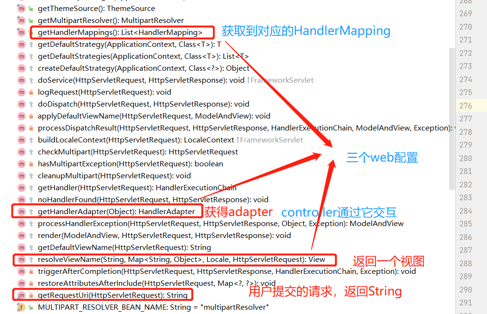
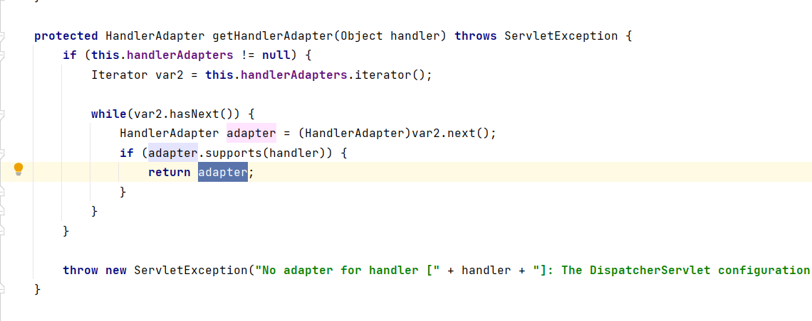

# 个人理解，总结

# SpringMVC机制
> 前提Spring基础，servlet基础，javaWeb基础
>
> 依托于Spring的一个操作！
> 

## 1.了解DispatchServlet
- 本质是一个Servlet
- 作用：
  - 1.与用户交互，利用web容器，参数之间的交互，视图的呈现
  - 2.与后端交互，利用Spring机制，万物皆容器，要什么？容器里拿！！
    
## 2.交互流程
> 与DispatchServlet之间有交互的是：前端的url，后端的handleMapping，handleAdapter，viewResolver
- 查看源码：
- 1.初始化的过程

 
- 2.get方法 

- 3.拿值的过程

- 4.DispatchServlet拿到的是ModelAndView，controller时将视图解析器要解析的内容set进去
    

- 5.ModelAndView的操作

- 6.视图解析器的操作

- buildView操作  

## Adapter的handler
- 本身是一个mapping，经过HandlerExecutionChain(处理器执行链)变成handler

## 在Spring系列中
- 你可能每一个见到的东西，每一个流程都是对应的容器中的一小部分

## 常见操作：
- SpringMVC中 /只匹配所有请求，不会去匹配jsp页面   /* 匹配所有请求，包括匹配jsp页面