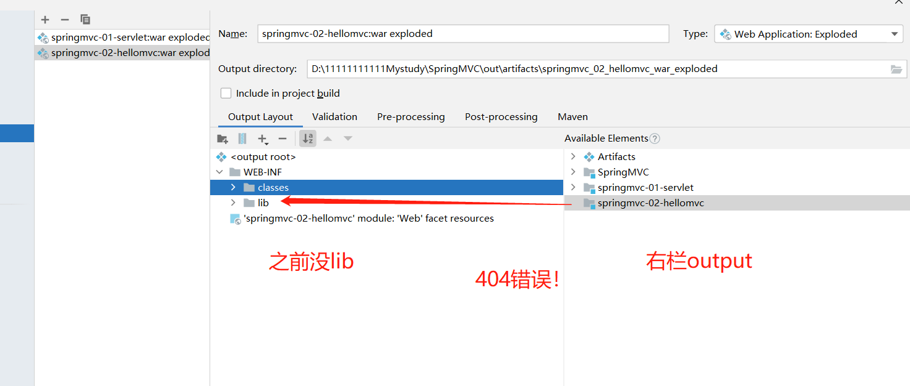
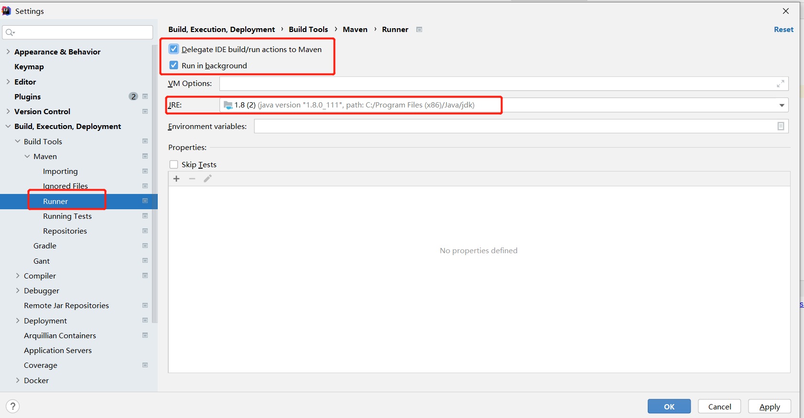

- 404
- web打包问题！！！

### 包不存在

- 2.打开IDEA底部的终端Terminal，输入"mvn idea:idea"
如果
报错未找到命令，需要先配置下
修改File->setting>Terminal >>将shell path 修改为系统cmd.exe命令位置
如果这个是正确的还是报错，要添加下电脑的环境变量，是你安装的目录下\plugins\maven\lib\maven3\bin

- 3. 使用mvn idea：module
   解决步骤：
   打开cmd ，进入到项目路径下（使用集成开发工具可以直接打开下面的控制台）
   执行命令 mvn idea:module 生成iml文件。