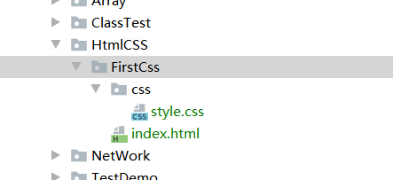
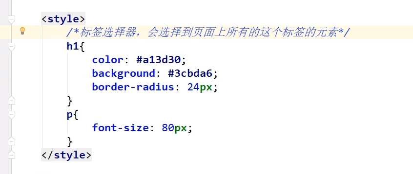
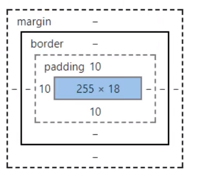
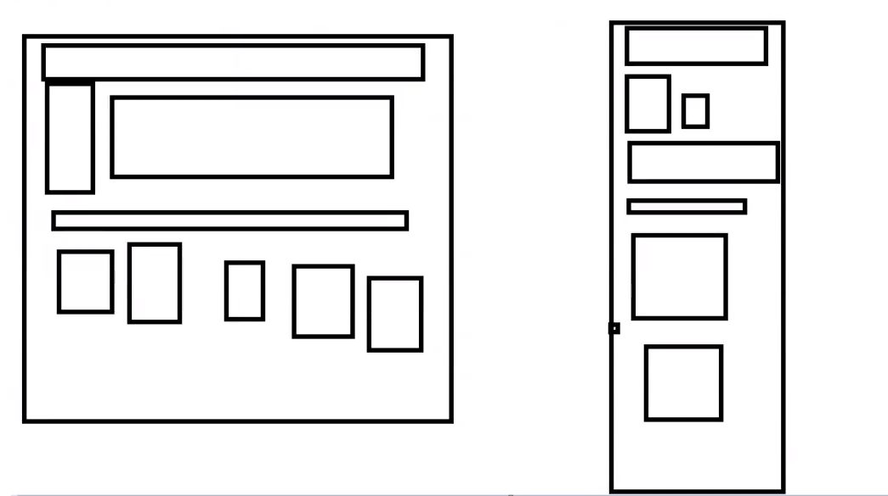
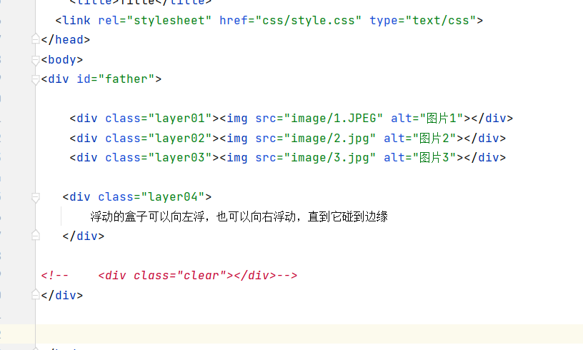

# CSS
## 简单使用
- 目录架构
- link引入CSS样式   
  - ` <link rel="stylesheet" href="css/style.css" type="text/css">  `



###
- 行内元素
      - 行内元素不可以设置宽（width）和高（height【但是可以通过line-height设置】），
      - 但可以与其他行内元素位于同一行，**行内元素内一般不可以包含块级元素**。
      - 行内元素的高度一般由元素内部的字体大小决定，宽度由内容的长度控制。
      - 常见的行内元素有:em,font,b,span,a,strong
- 块级元素
      - 块级元素**排斥**其他元素与其位于同一行，可以设定元素的宽（width）和高（height），
      - 块级元素一般是其他元素的**容器**，可容纳块级元素和行内元素。常见的块级元素有div, p ,h1~h6等

## 配置方法
### （标签）优先级 就近原则，谁离那个语句近，就用谁----- 总优先级 ID>class>标签
### 内部样式
  - 直接html中的**head**配置
    ```html
        <!--规范，<style>可以编写CSS代码，每一个声明，最好使用封号结尾
        语法：
          <style>
              选择器{
                声明1；
                声明2；
                声明3；
            }
          </style>
        -->
    ```
### 行内样式body语句直接加
    ```
        <h2 style="color: blue">HHH</h2>
    ```
### 外部样式

- 在style.css中配置
    ```
         h1{
                    color:red;
          }
    ```

- 在html中配置，head中，link
    ```
         <link rel="stylesheet" href="css/style.css">
    ```
  
- 导入式
```
    @import CSS2.1特有的
    <style>
        @import url("css/style.css")
    </style>
    
```

### CSS的优势
- 1.内容和表现分离
- 2.网页结构统一，可以实现复用
- 3.样式十分的丰富
- 4.建议使用独立于html的css文件
- 5.利用SEO，容易被搜索引擎收录。

### 选择器
- 作用：选择网页上的某一个或者某一类元素
- 1.基本选择器  定义： 标签{} 使用： <标签>
    - a.标签选择器：选择一类标签 标签名{}
    - b.类选择器: 选择所有class属性一致的标签，跨标签       .class名{}
    - c.Id选择器: 全局唯一。 #id名{}
    - 优先级 ID>class>标签
- a.标签选择器---针对一类型的标签


- b.类选择器 定义：.XXX{}  body里的使用： <标签 class="XXX">
```
    <head>
        <meta charset="UTF-8">
        <title>Title</title>
        
        <style>
            /* 类选择器的格式，.class的名称{}
                好处，可以多个标签归类，是同一个class，可以复用（不管你是h还是p）
    
             */
            .class1{
                color:#3748ff;
            }
            .class2{
                color:#a24fff;
            }
            .class3{
                color:#98a4ff;
            }
        </style>
    
    </head>
    <body>
        <h1 class="class1">标题1</h1>
        <h1 class="class2">标题2</h1>
        <h1 class="class3">标题3</h1>
    
        <p class="class1">P标签</p>
    </body>
```

- c.Id选择器 
  - 目前使用 标签名 [id=”“]{} 的格式 可以只有id，也可以id选，前面要有标签类型
  - 定义： #XX{}  body里的使用：<标签 id="XX">
  - ID选择器 必须保证全局唯一，只出现一次id=”“
  - 不遵循就近原则

```
<head>
    <meta charset="UTF-8">
    <title>Title</title>

    <style>
        /*
        ID选择器 必须保证全局唯一，只出现一次id=”“
         #id名称{}
        */
    #xx{
        color:red;
    }
    </style>

</head>
<body>
    <h1 id="xx">标题1</h1>
    <h1>标题2</h1>
    <h1>标题3</h1>
    <h1>标题4</h1>
    <h1>标题5</h1>

</body>
```

## 层次选择器
- 1.后代选择器：在某个元素的后面   祖爷爷  爷爷 爸爸 你  -------空格 
  - 可以使用.class名 标签{} 来进行操作class=”“ 后面的子代
  ```
     /*后代选择器*/
         body p{
            background:#02ff00;
        }
  ```
- 2.子选择器  后面的一代  ------------大于
  ```
     /*子选择器*/
         body>p{
            background:red;
        }
  ```
- 3.相邻兄弟选择器（只对下，不对上和本身） ----------加号
  
```
     /*相邻兄弟选择器*/
        .active + p{
            background:yellow;
        }
```
- 4.通用选择器（当前选择的向下的所有兄弟元素）
```
    /*通用选择器*/
        .active1~p{
             background:blue;
        }

```
### ul li 经常配套使用，也可以分开使用，分开时，li不管你是ol，ul都会变
- ul li{}

## 结构伪列选择器
### 带：冒号的就是伪类
- 结构伪列就是要带定位的--首个，末个，选择 --
- 1.带不带子元素----要不要**核对类型**  2.子元素是否被空格取代--- 空格可以理解为全部（通配）3.没空格的
  - 1.first-child
    - 父元素 子元素:first-child{ //表示满足父元素类型下的第一个子元素(总排序)}
        - 符合子元素的类型就显示，没有就不显示
    - 父元素  空格 :first-child{ //表示满足父元素类型的下的第一个子元素(总排序的第一个)}
  - 2.last-child      
    - 父元素 子元素:last-child{ //表示满足父元素类型下的最后一个子元素(总排序)}
        - 符合子元素的类型就显示，如果没有，，则不显示---
    - 父元素  空格 :last-child{ //表示满足父元素类型下的最后一个子元素(总排序的最后一个)}）
  - 3.nth-child(n) ---n指的是总共的第n个
    - ①父元素 子元素:nth-child(n){//表示父元素下的第n个元素(**不分类型**的排序)。}
         - 核实第n个是不是子元素类型，不是就不显示  一个个挨着排号
         - 比如div p:nth-child(2)表示div下的第二个p元素、如果不是p元素则没有匹配的元素(就没表现)
    - ②父元素 空格 :nth-child(n){//表示父元素下的第n个元素(**不分类型**的排序,就是第n个)。}
         - 只要第n个元素存在就会表现   
    - ③XX元素:nth-child(n){//表示每一层（包括body）的第n个XX元素} 
        - 每一层总排序后的第n个如果是XX元素，则显示  
  - 4.nth-of-type(n)---n指的是类型的第n个---所以可能很多个
    - nth-of-type(n) ---**肯定分类型**的指定
    - ①父元素 子元素:nth-of-type(n) {//表示父元素下的子类型的第ｎ个元素，没的话不显示(**分类型**的指定)}
        - 比如div p:nth-of-type(2)表示div下ｐ类型的第二个元素 --依据类型进行排号选择
    - ②父元素  空格 :nth-of-type(n) --表示父元素下的每个类型的第n个元素，
        - div :nth-of-type(n) **分类型**
        - 每个类型的第n个都被选中
    - ③XX元素:nth-of-type(n) --表示XX元素下XX类型的第n个元素---**分类型**
  - 5.child和type 的最大区别
    - 总的来说 child 是总排序，第n个存在（指定的就得复核）就显示 type是类型排序，类排序的第n个存在就显示
    
- 选择提示（主要）
```
  /*选择提示*/
  a:hover{
    background: brown;
    color: #e58f4a;
    font-size: 50px;
  }
```

## **属性选择器**（常用）
- 标签名[id,class（包括href，等属性）=""]{}
- =绝对等于
- *= 是包含
- ^= 是以什么什么开头
- $= 以什么什么结尾


```
    <style>
        .demo a{      /* .class的方式 */
            float: left;    /*    */
            display: block; /*    */
            height: 50px;   /*    */
            width: 50px;        /*    */
            border-radius: 10px;    /*    */
            background: #149ddb;    /*    */
            text-align: center;     /*    */
            color: #b5cec9;             /*    */
            text-decoration: none;   /* 下划线   */
            margin-right: 5px;
            font:bold 20px/50px Arial;
        }

    /*  存在id属性的  */
        a[id]{        /* All id */
            background: darkseagreen;
        }

        a[id = first]{        /* id is first */
            background: #e58f4a;
        }


        a[class *= links]{         /* *= 是包含 ----------class包含links */
            background: #a24fff;
        }

        a[href ^= 属性]{     /* ^= 是以什么什么开头---------以属性开头*/
            background: red;
        }

        a[href $= doc]{     /* $= 以什么什么结尾   ---------  以doc结尾   */
            background: black;
        }

    </style>
  - body
    <p class="demo">
    <a href="属性选择器Demo1.html0" class="links item first" id="first">1</a>
    <a href="" class="links item active" target="_blank" title="test">2</a>
    <a href="images/123.html" class="links item">3</a>
    <a href="images/123.png" class="links item">4</a>
    <a href="images/123.jpg" class="links item">5</a>
    <a href="abc"  class="links item">6</a>
    <a href="/a.pdf"  class="links item">7</a>
    <a href="/abc.pdf"  class="links item">8</a>
    <a href="abc.doc"  class="links item">9</a>
    <a href="abcd.doc" class="links item last" id="last">10</a>   
  </p>
```


# 美化网页的核心
- 为什么要美化网页
  - 1.有效的传递页面信息
  - 2.美化网页，页面漂亮，才能吸引用户
  - 3.凸显页面的主题
  - 4.提高用户体验
  
- span 重点要突出的字，用span套起来
```
<!DOCTYPE html>
<html lang="en">
<head>
    <meta charset="UTF-8">
    <title>Title</title>
  <style>
  #title1{
    font-size: 50px;
  }
  </style>
</head>
<body>
欢迎学习
      <span id="title1">java</span>
</body>
</html>
```

## 1.字体样式
```
  <style>
    /*
    字体：font-family
    字体大小：font-size
    字体的粗细：font-weight
    字体颜色：color
    */
    body{
      font-family: 楷体;
      color: #690ce0;
    }
    h{
      font-size: 50px;
    }
    .p1{
      font-weight: bold;
    }
  </style>
  
  或者
  <!--字体风格-->
  <style>
    p{
      font: oblique bolder 12px "楷体";
    }
  </style>
```

- em 表示一个字
- text-decoration: none;   /* 没有下划线*/
- text-align: center;     /*  文字居中  */
- font:bold 20px/50px Arial; /*  文字去中心  */
## 2.文本样式
- 1.颜色
- 2.文本对齐方式
- 3.首行缩进
- 4.行高
- 5.装饰

## 3.超链接伪类
- a:hover

## 4.列表
```
    <head>
        <meta charset="UTF-8">
        <title>Title</title>
        <link rel="stylesheet" href="css/style.css" type="text/css">
    </head>
    <body>
    <div id="nav" >
        <h1 class="format">全部商品</h1>
        <ul >
            <li><a href="#">阿斯顿2</a>&nbsp;&nbsp;<a href="#">固态</a>&nbsp;&nbsp;<a href="#">桃花运</a></li>
            <li><a href="#">达芬奇</a>&nbsp;&nbsp;<a href="#">t日月潭</a>&nbsp;&nbsp;<a href="#">无关他人</a></li>
            <li><a href="#">爱国</a>&nbsp;&nbsp;<a href="#">肉体和</a></li>
            <li><a href="#">范围广</a>&nbsp;&nbsp;<a href="#">奥古斯</a>&nbsp;&nbsp;<a href="#">热沟通</a></li>
            <li><a href="#">福娃二</a>&nbsp;&nbsp;<a href="#">刚踏入婚姻</a>&nbsp;&nbsp;<a href="#">本身</a></li>
            <li><a href="#">法尔</a>&nbsp;&nbsp;<a href="#">二锅头</a>&nbsp;&nbsp;<a href="#">太阳能</a></li>
            <li><a href="#">外国人</a>&nbsp;&nbsp;<a href="#">热沟通</a></li>
            <li><a href="#">阿萨v</a>&nbsp;&nbsp;<a href="#">是v吧</a>&nbsp;&nbsp;<a href="#">十八日</a></li>
        </ul>
    </div>
    
    </body>
     div{
        width:300px;
        background: #b5cec9;
    }
    
    .format{
        font-size: 18px;
        font-weight: bold;
        text-decoration: none;
        text-indent: 1em;
        line-height: 30px;
        /* 颜色，图片，位置（x,y），平铺方式 */
        background: blueviolet url("../../../背景/images/picture.jpg") 240px 10px no-repeat;
    
    }
    /*
        列表：
        list-style：none  --- 没有原点或者标号
        circle 空心圆
        decimal 数字
        square 正方形
    */
    ul li{
        height: 30px;
        list-style: none;
        text-indent: 1em;
        background-image: url("../../../背景/images/picture.jpg");
        background-repeat: no-repeat;
        background-position:240px 2px;
    
    }
    a{
        text-decoration: none;
        font-size: 14px;
        color: #000000;
    }
    
    a:hover{
        color: cadetblue;
        font-size: 50px;
        text-decoration: underline;
    
    }
```
## 5.背景图片
- 背景颜色
- 背景图片 -background-repeat----
-     /* 颜色，图片，位置（x,y），平铺方式 */
-  `background: blueviolet url("../../../背景/images/picture.jpg") 240px 10px no-repeat; ` 
    ```html
      div{
      width: 1000px;
      height: 700px;
      border: 1px solid red;  /*宽度，风格（样式），颜色*/
      background-image: url("images/picture.jpg");
      /*默认全部平铺，铺满。。*/
      }
  
        .div1{
          background-repeat: repeat-x; /*水平平铺，铺满一行*/
        }
        .div2{
          background-repeat: repeat-y;/*垂直平铺，铺满一列*/
        }
        .div3{
          background-repeat: no-repeat;/*不平铺*/
        }
        
    ```
### 渐变
- https://www.grabient.com/

## 盒子模型


- margin 外边距
- padding 内边距
- border 边框
### 边框-边距 
- 边框 border
    - border: 1px solid red;  /*宽度，风格（样式），颜色*/
        - 1.边框的粗细   第一个参数  ？px
        - 2.边框的样式   solid 实线 dashed 虚线 ---不写就是木有线
        - 3.边框的颜色
- 边距 margin 外  padding 内  
    - 居中 margin:0 auto  ---要求块元素，块元素有固定的宽度
    - 顺时针旋转
        - margin:0  --上下左右
        - margin:0 1px -- 上下 左右
        - margin:0 1px 2px 2 px --上 右 下 左


- 盒子的计算方式
    - margin+border+padding+内容宽度
    
- 圆角边框
    - border-radius:----
    - 4个角
        - 左上，右上，右下，左下
    
- 盒子阴影
    - box-shadow:----
```
  <style>
    div{
      width: 100px;
      height: 100px;
      border: 10px solid red;
      box-shadow: 10px 10px 100px #eace42;
    }
  </style>
```

## 浮动
- 1.标准文档流---自上而下的一个布局


  
- 块级元素：每个内容都独占一行
`h1~h6 p div 列表：`
- 行内元素：不独占一行
`span a img strong ...`
  
- 行内元素可以被包含在块级元素中，反之，不可以

- 2.display --style中写的
    -  去广告操作 -----display: none;
    - display: inline-block; 竖着的成为一行
    - 也是一种实现行内元素排列的方式，但是我们很多情况都使用float
```
 display的使用：
 display:inline;
    block 块元素（上下）
    inline 行内元素
    inline-block 是块元素，但是可以内联，在一行！（应用：都在顶部）
    none 谁用谁消失
```

- 3.float -- float: right; --style中写的
    - 1）.左右浮动 float
- 清除浮动
- clear: both; 两侧都不允许有浮动，自己沉下去
- clear: right;清除右侧浮动,右侧不允许有浮动元素
- clear: left;清除左侧浮动


## 父级边框塌陷的问题
- 1.增加父级元素的高度~
- 2.增加一个空的div
    - `  <div class="clear"></div>` --在大的div（塌陷的）中加，在其它内部子元素后加
    - `.clear{
      margin: 0;
      padding: 0;
      clear: both;
      }`

      
- 3. 在父级元素中加一个 overflow: hidden;   加的话，本身框的高度，宽度会被自动调整
    
- 4.父级增加一个伪类：after
```
#father:after{
    content: '';
    display: block;
    clear: both;    
}
```

- 小结：
    - 1.浮动元素后面增加空的div
        - 代码中尽量避免空div
    - 2.设置父元素的高度
        - 简单，元素假设有了固定的高度，就会被限制
    - 3.overflow --- 父级元素加
        - 简单，下拉的场景避免去使用
    - 4.父类元素中添加伪类--（推荐使用）
        - 写法稍微复杂一点，但是没有副作用，推荐使用 

- 5.display和float对比
  - 都是style中写的
    - display
        - 方向不能控制
        - 但是边框不会塌陷
    - float
        - 方向可以控制
        - 浮动起来的话，会脱离标准
        - 所以的解决父级边框塌陷的问题
    

## 定位
- 1.相对定位（对应本身位置的改变） -- 原来的位置会被保留
  - 1.开启定位： position: relative; /*相对定位：上下左右*/
      - top: -20px; /*上边距-20*/
      - left: 20px; /*左边距+20*/
      - bottom: 20px; /*下边距+20*/ 
      - right: -20px; /*右边距-20*/
    - 思考：是不是只要知道top left 就可以+-的方式全方位调整----Test可以,-因为他是对于自身的操作--
    - 冲突：加完左再加右 ---- 答案是只采取左的，右的失效。。。。
- 2.绝对定位（对应父元素位置的改变） --- 位置不会保留 ---上下滚动会动
  - 1.没有父元素的情况下，对于浏览器定位
  - 2.父级元素中加 position: relative;  然后子元素就会按父级元素定位---position: absolute;  不能超过父元素的边界
  - 3. 在父级元素范围中移动，相对于父级或者浏览器的位置，进行指定的偏移，绝对定位的话，他不在标准文档流中，位置不会保留
- 3.固定定位---上下滚动也不会动
  - position:fixed;
- 4.z-index
  - 层次定位  ---最底层是0----最高……