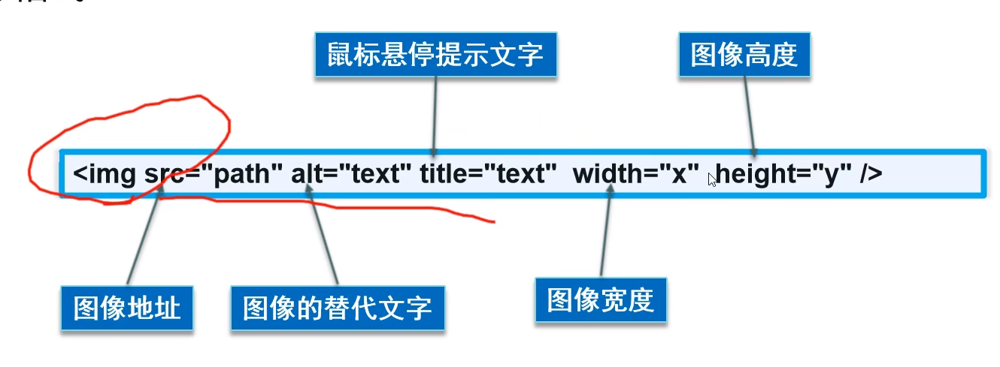
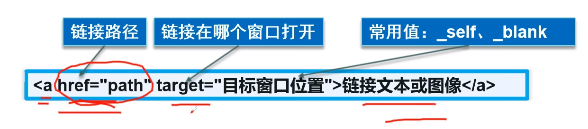
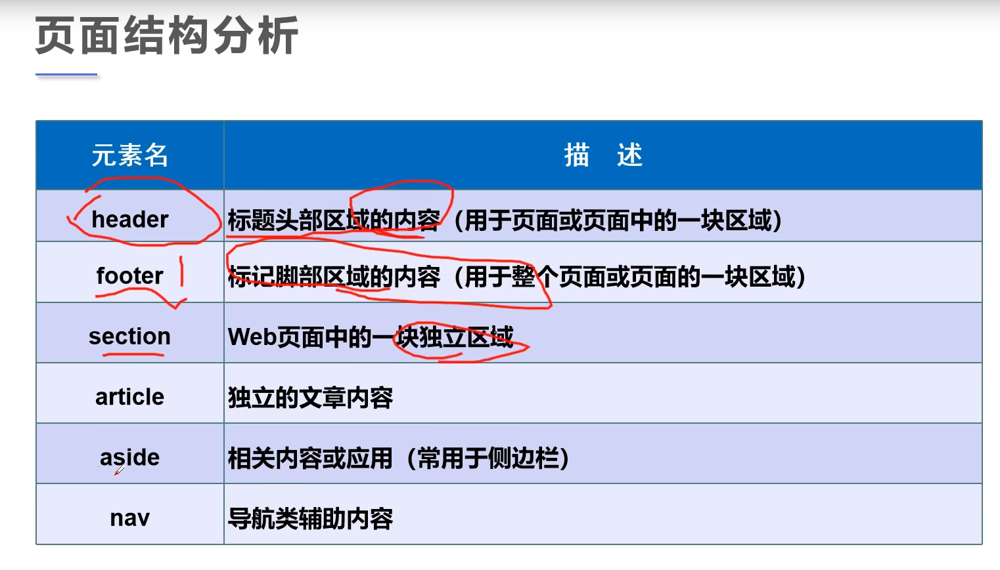
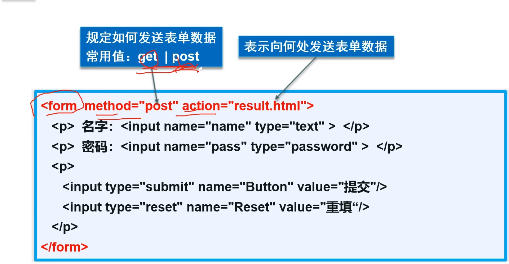
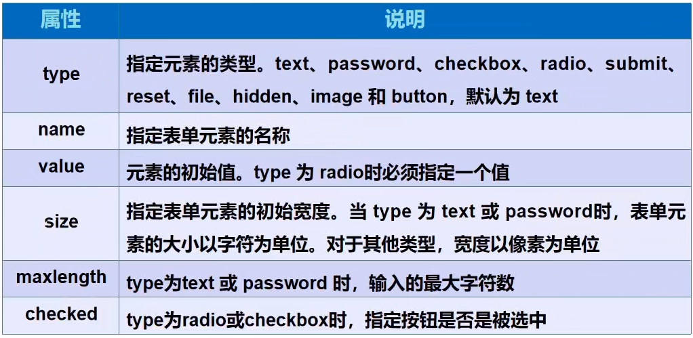

# HTML
## W3C
- World Wide Web Consortium(万维网联盟)
    - 1994年，中立性技术标准机构
    
- W3C标准
  - 结构化标准语言（HTML，XML）
  - 表现标准语言（CSS）
  - 行为标准语言（DOM，ECMAScript） 
     - DOM 文档对象模型 ECMAScript javaScript
    
## 结构
- DOCTYPE：告诉浏览器，我们要使用什么规范
- head 网页头部
  - title 网页标题
     - meta 
        - 描述性标签，描述网站的一些信息。
        - 一般用来做SEO（搜索引擎优化）
      ```
        <meta name = "keyword" content = "关键字描述">
        <meta name = "description" content = "描述">
      ```
- 网页主体


- 基本标签
- `<h1>`  标题标签
- `<p>`  以后会大量用到
- `<br>` 换行
- `<hr> `水平线标签
- 粗体，斜体
    - `<strong>粗体</strong>`
    - `<em>斜体</em>`
    
- 特殊符号 & ; 要用的时候通过& 加一个字母找，或者百度
    - 空格 `&nbsp;`
    - 大于号 `&gt;`
    - 小于号 `&lt;`
    - 版权所有 `&copy;`
                                     
- 图片标签``


  
### 链接标签--a标签
- 有普通链接，锚链接，功能链接  -- 改href内容
- `<a href="跳转，必输">点我跳转</a>`
  - 把图片放在两个a之间，图片跳转
  - target 使用_blank 在新的网页打开 _self 自己网页打开

    
- 锚链接
  - 使用a name 作为标记
  - 使用#name 进行跳转
  - 可以从其他页面跳得这个带name的页面 XXX.html#name名
 ```
  <a name="top">顶部</a>
  <a href="#top">回到顶部</a>
  <a href = "XXXX.html#top">跳转</a>
 ```
- 功能链接
  - mailto:  邮件链接
  - qq扩展 百度
  
## 行内元素与块元素
- 块元素
  - 无论内容多少，该元素独占一行
  - （p，h-）
  
- 行内元素
  - 内容撑开宽度，左右都是行内元素的可以排在一行
  - (a,strong,em……)
  


## 列表
- 有序列表
  - `<ol> <li></li> </ol>`
  - 应用范围 ---书卷，问答
- 无序列表
  - `<ul> <li></li> </ul>`
  - 应用---导航，侧边栏。。。
- 自定义列表
  - dl；标签  dt：列表名称 dd：列表内容
  - 应用：网址底部
```
 <dl>
    <dt>study</dt>
    <dd>java</dd>
    <dd>python</dd>
    <dd>linux</dd>
    <dt>lession time</dt>
    <dd>1</dd>
    <dd>2</dd>
    <dd>3</dd>
</dl>
```

## 表格
- 基本结构
  - 单元格
  - 行
  - 列
  - 跨行
  - 跨列
  
```
<table border="1px">
  <tr>
    <td>1-1</td>
    <td>1-2</td>
    <td>1-3</td>
  </tr>
  <tr>
    <td>2-1</td>
    <td>2-2</td>
    <td>2-3</td>
  </tr>
  <tr>
    <td>3-1</td>
    <td>3-2</td>
    <td>3-3</td>
  </tr>
</table>
```

## 页面结构



- header网页头部
- section网页独立区域
- footer网页脚部
- nav 导航类辅助内容

## iframe内联框架
- `<!--<iframe src = "path(引用页面地址)" name ="mainFrame(框架标识名)"></iframe>-->`
-可以使用锚链接进行跳转
  ```
  //常规操作
  <!--<iframe src="https://www.bilibili.com/read/cv5702420" frameborder="0" width="1000px" height="800"></iframe>-->
   //锚链接
    <iframe src="" name="XXX" frameborder="0" width="1000px" height="800"></iframe>

    <a href="https://zhangjzm.gitee.io/self_study" target="XXX">跳转</a>
  ```
  

# **表单**（重点）
- 必填 method action

  
- 表单的action ，可以是网站，可以是请求处理地址
- method post，get提交方式
  - get 我们可以在url中看到我们提交的信息，不安全，高效
  - post 安全，传输大文件
  
### input中
- type ：text password  
  - radio 单选框 必须有value  同一类型要name一致
    ```html
      <p>SEX:
      <input type="radio" value="boy" name="sex">boy
      <input type="radio" value="girl" name="sex">girl
       </p>
    ```  
  - checkbox  多选框 返回一个数组
    ```
       <P>HOBBY:
        <input type="checkbox" name="hobby" value="sleep">sleep
        <input type="checkbox" name="hobby" value="code">code
        <input type="checkbox" name="hobby" value="chat">chat
        <input type="checkbox" name="hobby" value="game">game
    </P>
    ```
    
- button 按钮
  - 普通按钮  input type="button"
  - 图片按钮  input type="image"
  - 提交按钮 input type="submit"
  - 重置按钮 input type="reset"
    ```
      <p>按钮:
        <input type="button" name="but1" value="点击变长">
        <input type="image" src="../../../resource/image/receive.jpg">
      </p>
    ```

- value 默认值
- maxlength= "8" 最长能写几个字符
- max = "" 最大值  
- size = ”30“ 文本框的长度
- readonly 只读
- disabled 禁用
- hidden 隐藏（不只是input，p也可以用）



- 下拉框
````html
    <p>下拉框:
          <select name="列表名字">
              <option value="选项的值">A</option>
              <option value="选项的值">B</option>
              <option value="选项的值" selected>C</option>
              <option value="选项的值">D</option>
         </select>
      </p>

````

- 文本域
```
<p>反馈:
        <textarea name="textarea" cols="30" rows="10">文本内容</textarea>
    </p>
```

- 文件域

```
 <p>文件域:
        <input type="file" name="files">
        <input type="button" value="上传" name="upload">
     </p> 
```


- 邮件验证
- URL
- 数字
- 滑块
- 搜索
```
  <!--邮件验证-->
      <p>email:
          <input type="email" name="email">
      </p>
  <!--  URL  -->
      <p>url:
          <input type="url" name="url">
      </p>
  <!--数字-->
      <p>number:
          <input type="number" name="num" max="100" min="0" step="10">
      </p>
  <!--滑块-->
  <p>滑块:
      <input type="range" max="100" min="0" step="5" name="voice">
  
  </p>
  <!--搜索-->
  <p>搜索:
      <input type="search" name="search">
  </p>
```
- 增强鼠标可用性，点击文字跳到框里(常用)
```
  <!--增强鼠标可用性-->
  <p>
      <label for="mark">可用</label>
      <input type="text" id="mark">
  </p>
```

## 表单初级验证
- 为啥要验证：减轻服务器压力，相应提示，安全性
  - placeholder（input的）  --- 提示消息
  - required  --- 不能为null
  - pattern  --- 正则表达式 https://www.jb51.net/tools/regex.htm
  


