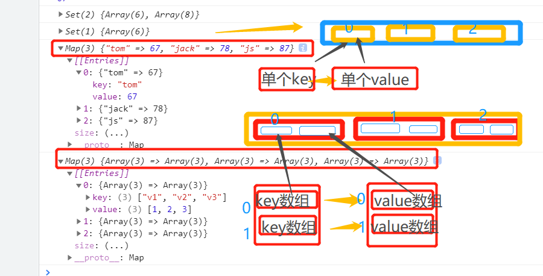

# JavaScript
## 描述
- DOM 文档对象模型
- 一个合格的后端人员，必须要精通javaScript
- javaScript 中，所有的键都是字符串，值是任意对象！
## 快速入门
- 1.引入JavaScript,注意不要子闭合，要</script>的形式**结束**
    - 外部引入
        - <script src="js/firstJS.js"></script>
    - 内部引入
        - <!--body和head都可以放，script标签内写javaScript代码  -->
        ```
              <script>
                    alert('hello,world');
              </script>
        ```
      
- 2.基本语法
    - 一切变量皆是var
    - console.log(message) 浏览器控制台打印变量！-->sout
    - alert('hello,world'); 弹窗  

    - 断点调试

    
- 3.数据类型
    - 数值，文本，图形，音频，视频…………
    - 1）.数值
      - js不区分小数和整数，统一number
        - ```
          123//整数型
          132.01//浮点数
          1.123e3 //科学计数法
          -99 //负数
          Nan //not a number
          Infinity//表示无穷大
          ```
    - 2).字符串
      - 'abc' "abc"
        
    - 3).布尔值
      - true false
        
    - 4).逻辑运算
        - &&与 ---两个都为真，结果为真
        - ||或 ---一个为真结果为真
        - !非 ---真即假，假即真
        
    - 5).比较运算符
        -   =
        - == 等于（类型不一样，值一样就是true） ex：1=”1“ 为true
        - === 绝对等于（类型一样，值一样）**常用**
        - JS缺陷，要记得=== 来进行比较 
        - 须知 - NaN===NaN--》false NAN 与所有数值都不相等---》只能通过isNaN(NaN)来判断
        
    - 6).浮点数问题
        - console.log((1/3)===(1-2/3)) 答案false
        - 尽量避免使用浮点数进行运算，存在精度问题
        - Math.abs(1/3)-(1-2/3))<0.000001 答案：true
        
    - 7).null和undefined
        - null  空
        - undefined  未定义
        
    - 8).数组
        - Java中的数值必须相同类型的元素，JS不需要这些
        - 定义，使用中括号括起来，var arr=[1,2,3,4,5,'hello ',null,true];
        - 取数组下标，如果越界了，就会 undefined
        
    - 9).对象
        - var 定义 使用大括号括起来 var person = {}
        - 每个属性用逗号隔开，最后一个不需要添加
        - ```
              <script>
              //java 的写法 Person person = new Person(1,2,3,4,5);
              var person = {
              name: "zjz",
              age:3,
              tags:['js','java','web','……']
              }
              </script>
          
           结果：
            person.age
            3
            person.name
            "zjz"
            person.tags[0]
            "js"
          ```
          
## 严格检查格式-'use strict';
- 前提IDEA需要设置支持SE6语法
- 'use strict';  必须写在第一行
- 严格检查模式，预防javaScript的随意性出现问题
- 局部变量，建议使用let去定义

## 数据类型详细
- 一，字符串
    - 1.正常字符串使用单引号，或者双引号包裹
    - 2.注意转义字符\
    `字符串包裹内：\' 
      \n
      \t
      \u4e2d Unicode编码 \u####
      \x41 Ascll字符
      `
    - 3.多行字符串编写
      - 使用~~（```） -这个建 tab上面那个
    - 5.字符串长度，，，可以使用str[n]的方式打印，java中不可的
        - str.length
    - 6.字符串可变性-不可变
    - 7.大小写转换 注意是方法（要加（）），不是属性
    ```
        student.toUpperCase();
        student.toLowerCase();
    ```
    - 8.str.indexOf('X');
    - 9. substring(**重要**)
        - [) ---包头不包尾
        - str.substring(1) //从第一个截取到最后一个字符串
        - str.substring(1,3) //[1,3)---没有3，只有12---
    
## 数组
- 1.Array可以包含任意的数据类型
    - var arr = [1,2,3,4,5]
    - 赋值：arr[0] = 1;  //同java
- 2.长度 
    - arr.length
    - 注意，给arr.length赋值，数组大小会发生变化---arr.length = 10;(可大，可小，直接截断丢失)
- 3.输出，不需要遍历了，，，直接输出    
- 4.获得下标索引indexOf('X');
    - 字符串的1和数字的1是不同的1,'1'---
    
- 5.slice(start,end) 截取数组的一部分（类似substring），返回一个新的数组[)
  - arr.splice(0, n);        // 从第一个元素起删除n个
    - 第一个参数（0）定义新元素应该被添加（接入）的位置。
    - 第二个参数（n）定义应该删除n个元素。
- 6.push()  压入元素到尾部  pop() 弹尾部元素  unshift() 头部加元素  shift() 头部去元素
    - arr.push('a','b',1,2);  可以push好多个  返回数组的长度
    - arr.pop();   只能弹一个 返回弹出得元素
    - arr.unshift();  arr.unshift('a','b',2,3,4);
    - arr.shift();
  

    
- 7.排序sort() --字符，数组，字符串（首位）
    - 默认按字符排序来排的---arr1.sort(); (10) [0, 1, 110, 2, 220, 3, 330, 5, 66, 9]
    
- 8.元素反转 reverse();
    - arr.reverse();
    
- 9.concat()
  - arr1.concat([1,2,3,"byte",'V']);
  - ["world", "hello", "bob", "ascall", 1, 2, 3, "byte", "V"]
  - 注意：concat并没有修改数组，只是返回一个新的数组
    
- 10.连接符join()  -- 返回字符串
    - 打印拼接字符，使用特定的字符串连接
    - arr1.join('-');
    - "world-hello-bob-ascall"
    
- 11.多维数组
  - var arrtwo = [[1,2,3],[2,4,6],[1,3,5],["1","2","3"]];
  - 取值arrtwo[i][j]  
    
- 数组（存储数据），如何存，如何取
- 和java的不同
    - 1.length可以赋值，扩容，截断
    - 2.slice() **常用** 类似（substring）
    - 3.输出，不需要for了  
    - 4.加元素，java得遍历加 push(X) pop() unshift(X) shift()
    - 5.拼接数组 concat([])


## 对象（大括号） var person = {}
- 1.若干个键值对在大括号里组成
    - 查看--直接对象名，或者 对象名.属性 
- 2.要用到一些@，%什么的就得”“，毕竟是**特殊字符**
 
    ```
        模式 var 对象名{
            属性名:属性值,
            属性名:属性值,
            属性名:属性值
        } 
  
  
  
        var person = {
       name: "zhangjz",
       age: 15,
       email: "163@qq.com"
       }
    ```  
  
- 3.JS中对象，{…………}表现一个对象，键值对描述属性XXXX: XXX,多个属性之间使用逗号隔开，最后一个属性不加逗号！

- 4.对象赋值---person.name="zjz";
- 5.使用一个不存在的对象属性，**不会报错**
    - person.aaaaaaaaaaaaa
    - undefined
- 6.动态的删减属性，通过delete删除对象的属性
    - delete person.name
    - true
- 7.动态的添加，直接给新的属性添加值
    - person.newProperty = "15";
    
- 8.判断属性值是否在这个对象中 键 in 属性名
    - 键都是字符串，值是任意对象！    
    
- 9.判断一个属性是否是这个对象自身拥有的hasOwnProperty()
    ```
        person.hasOwnProperty("age");
        true
        person.hasOwnProperty("newProperty");
        true
        person.hasOwnProperty("toString");
        false
    ```
## 流程控制
- if 判断 同java
- while do{}while()循环  同java  ---**避免死循环**，唯一不同就是java死循环会，而它只能关浏览器了
- for循环 
    - 快捷键 fori
- forEach循环 
   ```
          //函数
        newArray.forEach(function (value){
            console.log(value)
        })
   ```
- for……in和java不同，这里是给index（而且有bug，推荐用for of）
```
  /*
  * JAVA 中 for(type XX: element){}
  * */
  // 这里num给的是索引--->index
  for (var num in newArray){
  console.log(newArray[num])
  }
```

## Map&&Set
- ES6新特性
- 都是([[Entrie],[Entries],[Entries]……])模式
- Map  二维数组的方式[[Entries，Entries，Entries]]
    - var map = new Map([['tom',67],['jack',78],['js',87]]); //此时是个二维数组
    - 方法:set(k,v) get(k) delete(k) 
    - 扩展，三维数组的时候---简单记忆就是把二维的key，value变为数组
   ```
       // 三维数组,一个里面专门放key，一个里面放value,
        var map2 = new Map([[["v1","v2","v3"],[1,2,3]],[["vv1","vv2","vv3"],[1,2,3]],[["vvv1","vvv2","vvv3"],[1,2,3]]]);
        console.log(map2);
   ```
  


- Set  一组的时候一维数组([Entries])---一般使用--- 去重复
    - 可二维数组 var set = new Set([[3,1,"1",3,"2",1],[1,2,3,4,5,9,7,8]]);
      - 此时不会去重（即便一样）,一维数组时去重
    - 无序不重复的集合
    - 方法 add(XX) // 增 delete(XXX) //删  has(XX) //是否包含
  
  
## iterator
- 都一个方式，map只能使用它遍历
- 遍历数组
    -  `for(let x of arr){
       console.log(x);
       }`
       
- 遍历集合
    - `for(let x of set){
      console.log(x);
      }`

- 遍历map
    - `for(let x of map){
      console.log(x);
      }`


# 函数
## 函数 - function
- 方法：对象（属性，方法）
- 函数：function XXX(参数){}

- 定义函数
    - ```
        java中
        public 返回值类型 方法名(){
            return 返回值;
        }

      ```
      
    - 定义方式1---绝对值函数
        - ```
            function abs(X){
                if(x>=0){
                    return x;
                }else{
                    return -x;
                }         
            }
          ```
        - 一旦执行到return，代表方法结束
        - 如果没执行到return，函数执行完也会返回结果，结果就是undefined
    - 定义方式2
        - function(x){……}这是一个匿名内部类，可以把结果赋值给abs，通过abs就可以调用函数。
          ```
                var abs1 = function (x){
                  if(x>=0){
                    return x;
                  }else{
                     return -x;
                 }
               }
          ```
          
    - 调用函数  abs(-1)  abs1(-2)
    - 参数问题，javaScript可以传任意个参数，也可以不传递参数
    - 参数进来是否存在问题？
    - 假设不存在参数，如何规避？
    ```
            function abs(x){
        // 手动抛出异常
        if(typeof x!=="number"){
            throw "not a number";
         }
          if(x>=0){
            return x;
          }else{
            return -x;
          }
        }
    ```
> arguments
- `arguments`是一个JS免费赠送的关键字
- 代表传递进来的所有参数，是一个数组-
- 可以arguments[i]的方式，拿到其它参数
    - 问题，arguments 会包含所有的参数，我们有时候想使用多余的参数来进行附加操作，需要排除已有的参数。
    
>rest   （para,para,...rest）{}
- ES6引入的新特性，获取除了已经定义的参数之外的所有参数----
- 它会将所有没用到的集中到一个数组中  
- rest只能写在最后面，并且使用...标识
```
   function aaa(a,b,...rest){
      console.log("a-> " + a + "b-> " + b);
      console.log(rest);
      }
```


## 变量作用域
- 在JavaScript中，var定义变量实际是有作用域的
- 假设在函数体中声明，则函数体外不可用---（非要想实现的话，后面研究`闭包`）
- 如果两个函数使用了相同的变量名，只要在函数内部定义的，就不冲突（for（里面的i））
### 内部函数可以访问外部函数的成员，外部的不可访问内部的
- 内部函数变量和外部函数变量重名
- javaScript中，函数查找变量从自身函数开始--由”内“向”外“查找。
- 假设外部存在同名的函数变量，则内部函数会屏蔽外部函数变量。

```
   function zjz(){
      var x = 1;
      x = x + 1;
      function zjz2(){
        var x = 'A';
        console.log("inner:"+ x);  // inner:A
      }
      zjz2()
      console.log("outer:" + x); // outer:2
    }
```

- 提升变量的作用域
    - ```
       function zjz(){
          var x = "x" + y;  // xundefined
          console.log(x);
          var y = 'y';
        }
      ```
      
    - 结果：xundefined
    - 说明：js执行引擎自动提升了y的声明，但是不会提升y的赋值（所以，规范：变量定义要在开始就定义）

- 全局变量
    - 直接在script里定义就行，函数都可以用
    - alert(window.c); //所有全局变量，都会绑定window对象下
    - alert() 这个函数本身也是`window`下的变量，，，方法也是一个变量（之前 var xx = function（para..））
    ```
            var c = 888;
            var old_alert = window.alert;
            alert(c);
            alert(window.c); //所有全局变量，都会绑定window对象下
            window.alert = function (){
            };
            // alert失效了
            alert("xxxxxxxxxxxxxxxxxxx");
            window.alert = old_alert;
            alert("我又复活了！");
    ```
    - javaScript实际上只有一个全局作域，任何变量（函数也可以视为变量），假设没有在函数作用范围内找到
    - 就会去外面查找，如果在全局作用域都没找到，就会报异常`ReferenceError`   
    - 规范---
    - 由于我们所有的全局变量都会绑定在window上，如果不同的js文件使用了相同的全局变量，就会冲突--如果能减少冲突--
    - ```
          // 唯一全局变量
          var zjzAPP = {};
        
          // 定义全局变量
          zjzAPP.name = "zhangjzm";
          zjzAPP.add = function (a,b){
          return a+b;
          }
      
      ```
    - 把自己的代码全部放在自己定义的唯一命名空间名字中，降低全局命名冲突的问题
    - JQuery

> 局部作用域 let
 - ES6 let关键字，解决局部作用域冲突问题~
 - 建议使用let 局部作用域的的变量
> 常量const
 - 只读变量，不可改


## 方法
- 方法就是把函数放在对象的里面，对象只有两个东西：方法，属性
```
    'use strict';
    var zjzAPP = {
      name: "zjz",
      birth: 1999,
      // 方法
      age: function (){
        //今年-出生的年
        var nowDate = new Date().getFullYear();
        return nowDate-this.birth;
      }
    };

    console.log(zjzAPP.age());// 方法一定要带()
```

- 如果拆开
- 直接调用getAge，此时找不到，原因是，this指向的是当前的对象
- this是无法指向的，是默认指向调用它的那个对象
```
   function getAge(){
      //今年-出生的年
      var nowDate = new Date().getFullYear();
      return nowDate-this.birth;
    }

    var zjzAPP = {
      name: "zjz",
      birth: 1999,
      // 方法
      age:getAge
    };

```

> apply
- 在js中可以控制指向
-     getAge.apply(zjzAPP,[]);// this指向了zjzAPP，参数为空


## 内部对象
> 标准对象
```
typeof 123
"number"
typeof "123"
"string"
typeof true
"boolean"
typeof NaN
"number"
typeof []
"object"
typeof {}
"object"
typeof Math.abs
"function"
typeof undefined
"undefined"
```

- Date 日期类型
> 基本使用 --一般要么展示，要么计算
```html
      var now = new Date();
       now.getFullYear(); // 年
       now.getMonth(); // 月 0-11
       now.getDate();// 日
       now.getDay(); // 星期几 1-0
       now.getHours();// 时
       now.getMinutes(); // 分
       now.getSeconds(); // 秒

       now.getTime(); // 时间戳 全世界统一 1970.01.01  0:00开始的
       new Date(now.getTime()); // 获取当前时间

```
- 转换
```
now.toLocaleDateString()
"2021/9/5"
now.toLocaleString();
"2021/9/5下午9:46:07"
now.toGMTString();
"Sun, 05 Sep 2021 13:46:07 GMT"
``` 

# **JSON（重点）**
> JSON，全称是 JavaScript Object Notation，即 JavaScript 对象标记法。
> 这是一种 轻量级 （Light-Weight）、 基于文本的 （Text-Based）、 可读的 （Human-Readable）格式。
> 总之：JSON 是轻量级的文本数据交换格式
- 早期，所有数据传输习惯使用XML文件！
- BSON（mongoDB）和JSON的格式类似
### 在JavaScript中一切皆为对象，任何js支持的类型都可以用JSON来表示；
- **格式** 
  - 对象,map都用{}
  - 数组,list都用[]
  - 所有键值对都用key:value
    - 花括弧，方括弧，冒号和逗号
    - 花括弧表示一个“容器”
    - 方括号装载数组
    - 名称和值用冒号隔开
    - 数组元素通过逗号隔开
  
  - JSON**字符串**和JS**对象**之间的转换
    - stringify和parse
    ```
            var user = {
              name: "zjz",
              age: 22,
              sex: "男"
         };

        // 对象转换为json字符串
      var jsonUser =  JSON.stringify(user);
      // jso字符串转换为对象
      var obj = JSON.parse(jsonUser);
      var obj1 = JSON.parse("{\"name\":\"zjz\",\"age\":22,\"sex\":\"男\"}");
      var obj2 = JSON.parse('{"name":"zjz","age":22,"sex":"男"}');

    ```
    
  - 很多人搞不清，JSON字符串和JS对象的区别：
    - var obj = {a: 'hello',b: 'hellob'}; // key-value形式的对象
    - var json = '{"a": "hello","b": "hellob" }'; // {}外面明显’‘括住，还能不是字符串？

## Ajax
- 原生的js写法 xhr 异步请求
- jQuery封装好的方法 $("#name").ajax("")
- axios请求


## 面向对象编程
- 什么是面向对象
- javaScript，java，C#……面向对象，，JavaScript有些区别。
- 类：模板 对象：具体的实例
- 在javaScript中需要换一下思考方式
- 原型 -- 父类
    - xiaoming.__proto__  = student;

### class继承
- ES6引入
- 定义一个类，属性，方法
```
    class student{
      constructor(name) {
        this.name = name;
      }
      hello(){
        alert("hello");
      }
    } 
```
- 可以继承这个类extends
```
    class pupil extends student{
      constructor(name,grade) {
        super(name);

        this.grade= grade;
      }
      myGrade(){
        alert("我是小学生！");
      }
    };
```

- 原型链
- 点不完的。。。

  

## 操作BOM对象（重点）
- javaScript和浏览器的关系？ javaScript的诞生就是让他在浏览器中运行
- BOM：浏览器对象模型
- 内核- IE 6-11 Chrome Safari FireFox 三方：QQ浏览器 360浏览器
- window 代表浏览器窗口（重要）
    - window.XXX
- Navigator
    - Navigator 封装了浏览器的信息
    - navigator.appName
    
- screen 屏幕
    - screen.width    screen.height

- location 定位（重要）
    - 代表当前页面的URL信息
        - loaction.reload(); // 刷新网页
        - loaction.assign('www.baidu.com') // 跳转到--

- Document(重要)
    - document代表当前页面，HTMl，DOM文档树
    - var dl = document.getElementById('app'); // 获取具体的文档树节点
     ```
      <dl id="app">
        <dt>java</dt>
        <dd>javaSE</dd>
        <dd>javaEE</dd>
      </dl>

      <script>
        var dl = document.getElementById('app');
      </script>
     ```
    - document.cookie  // 获取cookie
    - 劫持cookie<恶意人员，获取你的cookie上传到其它服务器>
    - 服务器端设置httpOnly，保证cookie的安全
- history
    - history.back(); //后退
    - history.forward(); //前进
    

## 操作DOM对象（重点）
- DOM：文档对象模型 --- 节点———> 每个元素都是<p h ul div>
- 浏览器网页就是一个DOM树形结构
    - 更新，更新DOM节点
    - 遍历dom节点，得到DOM节点
    - 删除，删除一个ODM节点
    - 添加：添加一个新的节点
> 1.获取节点    document.
- 要操作一个DOM节点，就必须**先获得**这个dom节点 --- document.
- 获取父之下的子：
  - var childrens = father.children; // 获取父节点下的所有子节点
  - var ch1 = father.children[0]; //获取父节点下的第一个字节点
    
```
    <div id="father">
        <h1>h1</h1>
        <p id="p1">p1</p>
        <p class="p2">p2</p>
    </div>
    <script>
        'use strict';
        // 对应CSS选择器
        var h1 = document.getElementsByTagName("h1");
        var p1 = document.getElementById("p1");
        var p2 = document.getElementsByClassName("p2");
        var father = document.getElementById("father");
    
        var childrens = father.children; // 获取父节点下的所有子节点
        var ch1 = father.children[0]; //获取父节点下的第一个字节点
        
    /*
        father.firstChild
        father.lastChild
    
       */
        console.log(h1);
        console.log(p1);
        console.log(p2);
        console.log(father);
    </script>
```

> 2.更新节点  
- `a获取var id1 = document.getElementById("id1");`   
- `b...id1.innerText = '123456'; ` // 修改文本的值
- `  id1.innerHTML='<strong>strong</strong>';` // 解析html文本标签

- 操作CSS
  - 改的值**使用字符串包裹**
- ```
  id1.style.color="red";  // 改的值**使用字符串包裹**
  id1.style.padding="10px";  // 
  id1.style.fontSize='50px'; // -会转驼峰
  ```

> 3.删除节点
- 删除节点的步骤：先获取自己，再通过自己获取父节点，再通过父节点删除自己
- 注意：删除是一个动态的过程，总共三个，删第一个，此时没有[2]了，children属性时刻变化的
```html
    <div id="father">
      <h1>h1</h1>
      <p id="p1">p1</p>
      <p class="p2">p2</p>
    </div>
    <script>
      'use strict';
      // 先获取自己。。
      var p1 = document.getElementById("p1");
      // 获取父节点
      var father = p1.parentElement;
    
      father.removeChild(p1); // 通过父亲删除自己
        
      // 删除是一个动态过程
      father.removeChild(father.children[0]); // 删这个，后面的节点前进，children变化  
      father.removeChild(father.children[0]);  
      father.removeChild(father.children[0]);  
    </script>
```


> 4.插入节点
- 我们获取某个DOM节点，假设这个DON节点是空的，我们通过innerHTML就可以增加一个元素了。
- 但是如果DOM节点已经有元素，那么就会覆盖
- 追加 --已存在的节点-父亲.appendChild(节点);
- 插到前面，  list.insertBefore(js,ee); // 将js插到ee之前
```
    <p id="js">javaScript</p>
    <div id="list">
      <p id="se">javaSe</p>
      <p id="ee">javaEE</p>
      <p id="me">javaME</p>
    </div>
    
    <script>
      'use strict';
      var js = document.getElementById("js"); // 已存在的节点
      var list = document.getElementById("list");
      list.appendChild(js); // 追加
    </script>
```

```
  var ee = document.getElementById('ee');
  var js = document.getElementById('js');
  var list = document.getElementById('list');

  list.insertBefore(js,ee); // 将js插到ee之前
```


- 手动创建节点，并插入节点
- 常用 
    - 节点创建 document.createAttribute(X)  
    - 节点属性赋值  .setAttribute(X,'newP');
    - 节点插入 .appendChild(X);
```html
     // 通过js 创建一个新的节点
    var newP = document.createElement('p'); // 创建一个p标签 ---》<p></>p>
    /* newP.setAttribute(id,'newP'); // 公用的写法，等价于<p id = "newP"></p> */
    newP.id = 'newP';                   // ---》 <p id = "newP"></p>
    newP.innerText = 'Hello,zjz';    // ---》 <p id = "newP">Hello,zjz</p>

    var list = document.getElementById("list");
    list.appendChild(newP);
    
    // 创建script，并赋属性值
    var myScript = document.createElement('script');
    myScript.setAttribute('type','text/javascript');
```


### 利用节点修改网页
````html
// 创建script，并赋属性值
  var myScript = document.createElement('script');
  myScript.setAttribute('type','text/javascript');


// 创建style， 并赋值
var myStyle = document.createElement('style');
myStyle.setAttribute('type','text/css');
myStyle.innerHTML = 'body{background-color:chartreuse;}';

document.getElementsByTagName('head')[0].appendChild(myStyle);
````

## 操作表单（验证）
> 表单是什么？ form input 他也是一个DOM树
- 文本框  text
- 下拉框  <select>
- 单选框  radio
- 多选框   checkbox
- 隐藏框   hidden
- 密码框   password
- ……

- 表单的目的：提交信息
> 获得要提交的信息 
```
    <form action="xx.do" method="post">
      <p>
      <span>用户名：</span><input type="text" id="username">
      </p>
    
    <!--  单选框，多选框的值，都是已经定义好的value-->
      <p>
        <span>性别：</span>
        <input type="radio" name="sex" value="man" id="boy"> 男
        <input type="radio" name="sex" value="women" id="girl"> 女
      </p>
      <input type="submit">
    </form>
    
    <script>
      var in_username = document.getElementById("username");
    
      var boy_radio = document.getElementById("boy");
      var girl_radio = document.getElementById("girl");
      // 得到输入框的值
      in_username.value;
    
      // 对于单选框，多选框等固定的值，boy_radio.value只能取到当前的值
      boy_radio.checked; // 查看返回的结果是否为true，如果为true，则被选中
      boy_radio.checked = true; //赋值按钮
    </script>
```


## md5加密算法，优化版的---通过隐藏域提交
- head 中加`<script src="https://cdn.bootcss.com/blueimp-md5/2.10.0/js/md5.min.js"></script>`
```
      <script src="https://cdn.bootcss.com/blueimp-md5/2.10.0/js/md5.min.js"></script>
    <body>
    
    <!--
    表单提交事件，通过onsubmit绑定一个提交检测的函数，true，false
    将这个结果返回给表单，使用onsubmit接收！
    -->
    
    <form action="XX" method="post" onsubmit="return check()">
      <p>
    <!--required 作用：不能为null--为了提示用户输入对点，减轻服务器压力-->
        <span>用户名：</span><input type="text" id="username">
      </p>
      <p>
        <span>密码：</span><input type="password" id="input-password">
      </p>
      <input type="hidden" id = "md5-password" name="password">
        <!--绑定事件  anclick 被点击事件-->
      <button type="submit">提交</button>
    </form>
    
    <script>
      'use strict';
    
      function check(){
        var uname = document.getElementById("username");
        var pwd = document.getElementById("input-password");
        var md5Pwd = document.getElementById('md5-password');
    
        // md5算法
        md5Pwd.value=md5(pwd.value);
        // 可以校验判断表单内容：true就是通过提交，false阻止提交
        return true;  
      }
    </script>
```


