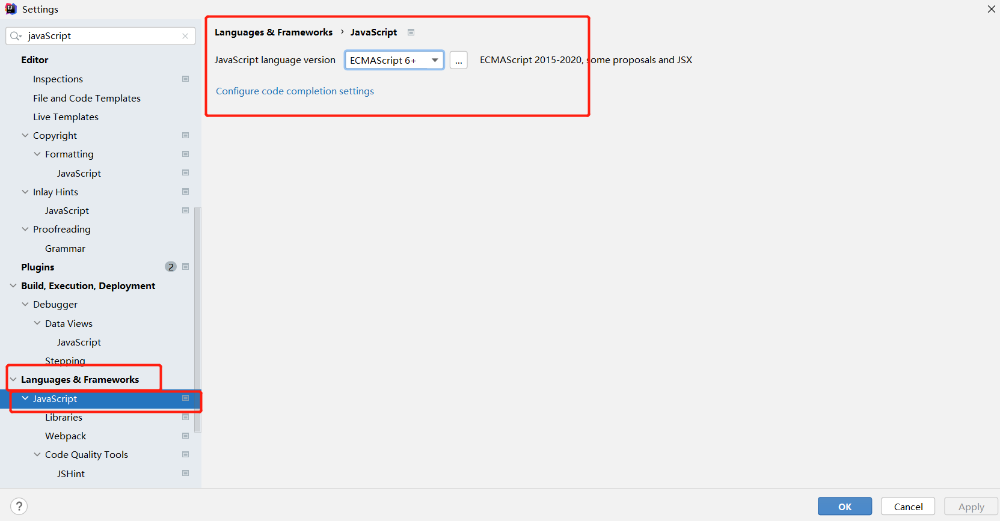

# JS
### 

## 严格检查格式-'use strict';
- 前提IDEA需要设置支持SE6语法 ---Setting languages javaScript
  
- 'use strict';  必须写在第一行 --严格检查模式，预防javaScript的随意性出现问题
- 局部变量，建议使用let去定义
- 外部引入
  - `<script src="js/firstJS.js"></script>`
- 内部引入
  - `<!--body和head都可以放，script标签内写javaScript代码  -->`
 
## 语法： 
- `console.log(message) 浏览器控制台打印变量！-->sout`
- `alert('hello,world');` 弹窗
- == 等于（类型不一样，值一样就是true） ex：1=”1“
- === 绝对等于（类型一样，值一样）**常用**
- `Math.abs(1/3)-(1-2/3))<0.000001 `答案：true
- `null  空 和 undefined ` 未定义
- `typeof XXX` 返回对象类型
### 字符串  
- 多行字符串编写
  - 使用~~（```） -这个建 tab上面那个
- `substring(s,e);`    
    
  
### 数组【】
- `slice(start,end)` 截取数组的一部分（类似substring），返回一个新的数组[)
- `arr.splice(0, n); `       // 从第一个元素起删除n个
    - 1.length可以赋值，扩容，截断
    - 2.slice() **常用** 类似（substring）
    - 3.输出，不需要for了
    - 4.加元素，java得遍历加 push(X) pop() unshift(X) shift()
    - 5.拼接数组 concat([])
    
## 对象var person = {}
- 查看--直接对象名，或者 对象名.属性 
- 动态的删减属性，通过delete删除对象的属性
    - `delete person.name`

## Map&&Set
- -都是([[Entrie],[Entries],[Entries]……])模式
- `var map = new Map([['tom',67],['jack',78],['js',87]]);` //此时是个二维数组
  - 方法:set(k,v) get(k) delete(k)
- Set  一组的时候一维数组([Entries])---一般使用--- 去重复
  - 方法 add(XX) // 增 delete(XXX) //删  has(XX) //是否包含
  

##  遍历专用，map只能for of
 - 遍历数组
  -  `for(let x of arr){
     console.log(x);
     }`

- 遍历集合
  - `for(let x of set){
    console.log(x);
    }`

- 遍历map
  - `for(let x of map){
    console.log(x);
    }`

## 函数- function
- `function XXX(参数){}`


## 没用的参数获取---rest   （para,para,...rest）{}


### 内部函数可以访问外部函数的成员，外部的不可访问内部的
- 内部函数变量和外部函数变量重名
- javaScript中，函数查找变量从自身函数开始--由”内“向”外“查找。
- 假设外部存在同名的函数变量，则内部函数会屏蔽外部函数变量。

## 定义全局作用域
- javaScript实际上只有一个全局作用域，任何变量（函数也可以视为变量），假设没有在函数作用范围内找到
    - 就会去外面查找，如果在全局作用域都没找到，就会报异常`ReferenceError`   
    - 规范---
    - 由于我们所有的全局变量都会绑定在window上，如果不同的js文件使用了相同的全局变量，就会冲突--如果能减少冲突--
    - ```
          // 唯一全局变量
          var zjzAPP = {};
        
          // 定义全局变量
          zjzAPP.name = "zhangjzm";
          zjzAPP.add = function (a,b){
          return a+b;
          }
      
      ```

## class的使用
- 定义一个类，属性，方法
```
    class student{
      constructor(name) {
        this.name = name;
      }
      hello(){
        alert("hello");
      }
    } 
```

- 可以继承这个类extends

```
    class pupil extends student{
      constructor(name,grade) {
        super(name);

        this.grade= grade;
      }
      myGrade(){
        alert("我是小学生！");
      }
    };
```

## 操作BOM对象（重点）
- window 代表浏览器窗口（重要）
  - window.XXX- screen 屏幕
- screen.width    screen.height
- location 定位（重要）
  - 代表当前页面的URL信息
    - loaction.reload(); // 刷新网页
    - loaction.assign('www.baidu.com') // 跳转到--
- Document(重要)
  - document代表当前页面，HTMl，DOM文档树
  - var dl = document.getElementById('app'); // 获取具体的文档树节点
  - document.cookie  // 获取cookie

## 操作DOM对象（重点）
- DOM：文档对象模型   --- 节点———> 每个元素都是<p h ul div>
- 浏览器网页就是一个DOM树形结构
- var childrens = father.children; // 获取父节点下的所有子节点  
- 增删操作节点都不需要加”“---它们属于节点  
  - 1.遍历dom节点，得到DOM节点 
    - 要操作一个DOM节点，就必须**先获得**这个dom节点 --- document. 或者 父节点.
  - 2.更新，更新DOM节点
    - `a获取var id1 = document.getElementById("id1");`
    - 1.`b...id1.innerText = '123456'; ` // 修改文本的值
    - 2.`  id1.innerHTML='<strong>strong</strong>';` // 修改（同时解析）html文本标签
    - 3.操作CSS
      - 改的值**使用字符串包裹**
  - 3.删除，删除一个ODM节点
    - 删除节点的步骤：先获取自己，再通过自己获取父节点，再通过父节点删除自己
    - 删除是一个动态的过程，总共三个，删第一个，此时没有[2]了，children属性时刻变化的  
      ```
        // 先获取自己。。
          var p1 = document.getElementById("p1");
          // 获取父节点
          var father = p1.parentElement;
        
          father.removeChild(p1); // 通过父亲删除自己
      
          // 删除是一个动态过程
          father.removeChild(father.children[0]); // 删这个，后面的节点前进，children变化  
          father.removeChild(father.children[0]);  
          father.removeChild(father.children[0]); 
      ```
  - 4.添加：添加一个新的节点
    
 - 手动创建节点，并插入节点
  - **常用**
    - 节点创建 var jie = document.createElement(X)
    - 节点属性赋值  .setAttribute(X,'newP');
    - 节点插入 .appendChild(jie);
  - 我们获取某个DOM节点，假设这个DON节点是空的，我们通过innerHTML就可以增加一个元素了。
  - 但是如果DOM节点已经有元素，那么就会覆盖
  - 追加 --已存在的节点-父亲.appendChild(节点);
  ```
      <p id="js">javaScript</p>
      <div id="list">
        <p id="se">javaSe</p>
        <p id="ee">javaEE</p>
        <p id="me">javaME</p>
      </div>
      
      <script>
        'use strict';
        var js = document.getElementById("js"); // 已存在的节点
        var list = document.getElementById("list");
        list.appendChild(js); // 追加
      </script>
  ```
  - 手动创建节点，并插入节点
  ```html
   // 通过js 创建一个新的节点
    var newP = document.createElement('p'); // 创建一个p标签 ---》<p></>p>
    newP.setAttribute(id,'newP');           // ---》 <p id = "newP"></p>
    newP.innerText = 'Hello,zjz';    // ---》 <p id = "newP">Hello,zjz</p>
    
    var list = document.getElementById("list");
    list.appendChild(newP); // list节点加入一个孩子：p节点
  
  ```

### 利用节点修改网页
````html
// 创建script，并赋属性值
  var myScript = document.createElement('script');
  myScript.setAttribute('type','text/javascript');


// 创建style， 并赋值
var myStyle = document.createElement('style');
myStyle.setAttribute('type','text/css');
myStyle.innerHTML = 'body{background-color:chartreuse;}';

document.getElementsByTagName('head')[0].appendChild(myStyle);
````

## 操作表单（验证）
```
  <script>
      var in_username = document.getElementById("username");
    
      var boy_radio = document.getElementById("boy");
      var girl_radio = document.getElementById("girl");
      // 得到输入框的值
      in_username.value;
    
      // 对于单选框，多选框等固定的值，boy_radio.value只能取到当前的值
      boy_radio.checked; // 查看返回的结果是否为true，如果为true，则被选中
      boy_radio.checked = true; //赋值按钮
    </script>
```

## md5加密算法，优化版的---通过隐藏域提交
- head 中加`<script src="https://cdn.bootcss.com/blueimp-md5/2.10.0/js/md5.min.js"></script>`


