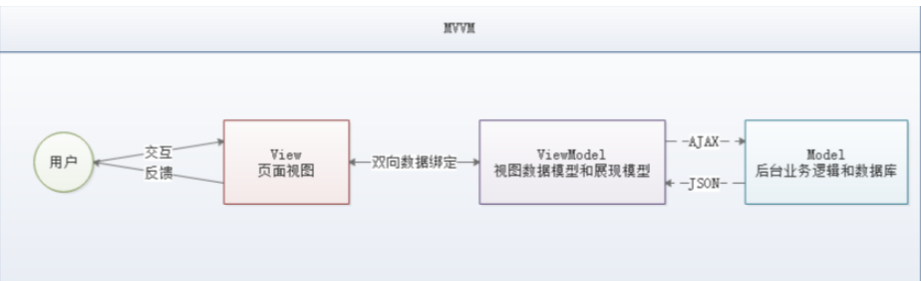
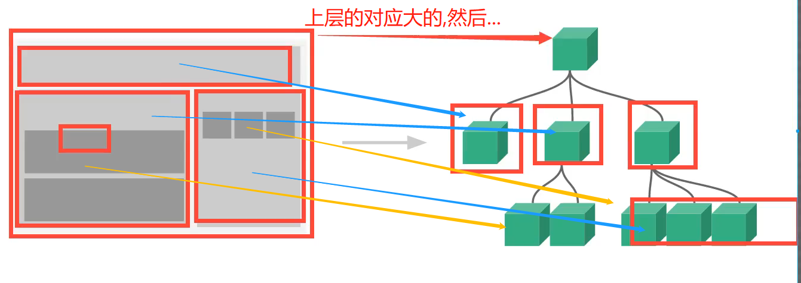

# VUE
> SOC 关注点分离原则
> 
> 视图层:HTML+CSS+JS
> 
> 
 
## 一些知识
- 网络通信:axios
- 页面跳转:vue-router

- npm install ---...

- CSS预处理器
 - CSS 预处理器定义了一种新的语言，其基本思想是，用一种专门的编程语言，为 CSS 增加了一些编程的
  特性，将 CSS 作为目标生成文件，然后开发者就只要使用这种语言进行 CSS 的编码工作。转化成通俗易
  懂的话来说就是“**用一种专门的编程语言，进行 Web 页面样式设计**，再通过编译器**转化**为正常的 CSS 文
  件，以供项目使用”。
   
- 常用的 CSS 预处理器有哪些：
 - SASS：基于 Ruby，通过服务端处理，功能强大。解析效率高。需要学习 Ruby 语言，上手难度高于LESS。
   - 和软件即服务(SAAS)不是一个东西哈
 - LESS：基于 NodeJS，通过客户端处理，使用简单。功能比 SASS 简单，解析效率也低于 SASS，但
  在实际开发中足够了，所以我们**后台人员如果需要的话，建议使用 LESS**。


- webpack 打包

- VUE
    - 一款渐进式的JavaScript框架,所谓渐进式就是逐步实现新特性的意思,如:实现模块化开发,路由,状态管理等新特性.
    

- ElementUI 
  - [官网地址] http://element-cn.eleme.io/#/zh-CN
  - [Github] https://github.com/ElementUI/element-starter
  - [vue-element-admin] https://github.com/PanJiaChen/vue-element-admin
  

- 大前端时代:后端:轻松
  - 了解分布式,微服务,大数据

- 裁员: 1  1.8  3  ---一个人干3个人的事,,拿1.8的工资


- 前端为主的MV*模式
  - MVC(同步通信为主) Model View Controller -- 同步不行了..
  - MVP(异步通信为主) Model View Presenter
  - MVVM(异步通信为主) Model View ViewModel ---目前;;;;

- AngularJS, React,Vue.js


- 前后分离的开发思想主要是基于 SoC （关注度分离原则），上面种种模式，都是让前后端的职责更清晰，分工更合理高效。


- MVVM（Model-View-ViewModel）是一种软件架构设计模式
- MVVM 的核心是 ViewModel 层，负责转换 Model 中的数据对象来让数据变得更容易管理和使用，其作用如下：
  - 该层向上与视图层进行双向数据绑定
  - 向下与 Model 层通过接口请求进行数据交互




## Vue程序
- 1.Vue 的核心库只关注视图层，不仅易于上手，还便于与第三方库（如：vue-router，vue-resource，vuex）或既有项目整合。

- 2.MVVM 模式的实现者
  - Model：模型层，在这里表示 JavaScript 对象
  - View：视图层，在这里表示 DOM（HTML 操作的元素）
  - ViewModel：连接视图和数据的中间件，Vue.js 就是 MVVM 中的 ViewModel 层的实现者
  
- 3.在 MVVM 架构中，是不允许 数据 和 视图 直接通信的，只能通过 ViewModel 来通信，而 ViewModel就是定义了一个 Observer 观察者。
  - ViewModel 能够观察到数据的变化，并对视图对应的内容进行更新
  - ViewModel 能够监听到视图的变化，并能够通知数据发生改变


- 4.第一个Vue程序准备
  - 注意：Vue 不支持 IE8 及以下版本，因为 Vue 使用了 IE8 无法模拟的 ECMAScript 5 特性。但它支持所有兼容 ECMAScript 5 的浏览器。
- 开发版本
  - 包含完整的警告和调试模式：https://vuejs.org/js/vue.js
  - 删除了警告，30.96KB min + gzip：https://vuejs.org/js/vue.min.js


- 5.CDN
  - <script src="https://cdn.jsdelivr.net/npm/vue@2.5.21/dist/vue.js"></script>
  - <script src="https://cdn.jsdelivr.net/npm/vue@2.5.21/dist/vue.min.js"> </script>

  
###   开始

- 1、v-bind
  我们已经成功创建了第一个 Vue 应用！看起来这跟渲染一个字符串模板非常类似，但是 Vue 在背后做了
  大量工作。现在数据和 DOM 已经被建立了关联，所有东西都是响应式的。我们在控制台操作对象属
  性，界面可以实时更新！
  我们还可以使用 v-bind 来绑定元素特性!
  
### 使用
- 1.定义:
  - 1.首先导入script,cdn
  - 2.编写script
    - el表示选择的元素, data表示要导入的数据 数组用items:[]  普通直接写就行  
    
    ```
          <script>
          var vm = new Vue({
              el:"#APP",
              // model :数据
              data:{
                  items:[
                      {message:"zjz1"},
                      {message:"zjz1"},
                      {message:"fasd"},
                  ]      
              }
      
            });
        </script>
    

    
    ```

- 2.指令:v-XXX
  
- 用 v-bind 来绑定元素特性
  - `<h1 v-bind:title="message">鼠标悬停几秒钟查看此处动态绑定的提示信息！</h1>`
- 判断,循环
  - if for 
  - 操作:v-XXX
    -  `<h1 v-if="ok">ok</h1>`
    - ` <h1 v-else>no</h1>`
  ```
   <h1 v-for="(item,index) in items">
        {{item.message}}---{{index}}
    </h1>
  
  
  var vm = new Vue({
        el:"#APP",
        // model :数据
        data:{
            items:[
                {message:"zjz1"},
                {message:"zjz1"},
                {message:"fasd"},
            ]
        }
    });
  ```

- 事件
  - v-on
  -  methods:
  -  `<button v-on:click="sayHi">click</button>`

## VUE双向绑定
- Vue.js 是一个 MVVM 框架，即**数据双向绑定**，
  - 当数据发生变化的时候，视图也就发生变化，
  - 当视图发 生变化的时候，数据也会跟着同步变化。
    这也算是 Vue.js 的精髓之处了。
    

- 用 v-model 指令在表单 < input>、< textarea> 及 < select> 元元素上创建双向数据绑定。它
  会根据控件类型自动选取正确的方法来更新元素。
  
-  v-model 表达式的初始值未能匹配任何选项，< select> 元素将被渲染为“未选中”状态。
   在 iOS 中，这会使用户无法选择第一个选项。因为这样的情况下，iOS 不会触发 change 事件
   

### 组件 


- `Vue.Component("component名字",{填东西})` -- 一般填两个东西:props,参数的导入 template:html代码
- `<component名字 >`
- `</component名字>`

- 传参---
- zjz的思考
  - 组件中拿取script中的值
  - 1.肯定需要一个中间的东西,将数据传给它,然后它再将数据传给组件 之前的v-for传参
  - 2.数据传输---v-for="item in items"
  - 3.component传值:v-bind:bang="item"
  - 4.script中的Component接收值:需要一个Props:['bang]  ---接收绑定的值
  - 5.template -- 打印出来


