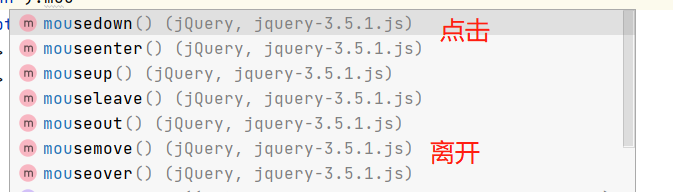

# jQuery
- javaScript和jQuery 工具类
- jQuery库，里面存在大量的javaScript函数
> 获取jQuery
- 公式：$(selector).action() -- css的选择器

```html
    <!--
        公式：$(selector).action()
    -->
    
    <a href="" id="test-jQuert">点我</a>
    
    <script>
        document.getElementById('id');
        // 选择器就是CSS的选择器
        $('#test-jQuert').click(function (){
            alert('hello,jQuery'); 
        })
    </script>
```


- 选择器selector

```html
    <script>
      // 原生的js，选择器少，麻烦不好记
    
      document.getElementsByName();   // 标签
    
      document.getElementById();  // id
    
      document.getElementsByClassName();   // 类
    
      // jQuery  CSS中选择器
      $('p').click(); // 标签
      $('#id').click(); // id选择器
      $('.class').click(); // 类选择器
    
    </script>

```


## jQuery事件action()
> 事件 
- 鼠标事件，键盘事件，其它事件


  
  ```
      /*  $(document).ready(function (){
        });
        // 两个是一样的意思
        $(function (){    
        });
        */
  ```
  
- 鼠标移动

```
      <script src="lib/jquery-3.5.1.js"></script>
      <style>
        #divMove{
          width: 500px;
          height: 501px; 
          border: 1px solid #a24fff;
        }
      </style>
    </head>
    <body>
    
    <!--要求：获取鼠标当前的一个坐标-->
    mouse:<span id="mouseMove"></span>
    <div id="divMove">
     在这里移动鼠标试试
    </div>
    
    <script>
      'use strict';
      // 当网页元素加载完毕后，响应事件
    /*  $(document).ready(function (){
      });
      // 两个是一样的意思
      $(function (){
      });
      */
      $(function (){
        $('#divMove').mousemove(function (e){
          $('#mouseMove').text('x:'+e.pageX + 'y:' + e.pageY);
        });
      });
      
    </script>
```


## DOM操作
- 节点文本操作
  -  //()里有参就是设置，没参就是取值
  - `$('#test-ul li[name=python]').text();` //获得值
  - `$('#test-ul li[name=python]').text('asdassad');` //设置值
  -  `$('#test-ul').html();`//获得值
  - ` $('#test-ul').html('<strong>888</strong>');` //设置值

- CSS的操作
  -  ` $('#test-ul').css("color",'red');` //设置css的属性
    
- 元素的显示和隐藏，本质；display: none;
  - `$('#test-ul li[name=python]').show();`
  -` $('#test-ul li[name=python]').hide();`
    
- 娱乐测试
  - `$(window).width();`
  - `$(window).height();`
    

- Ajax
- 选择
    


