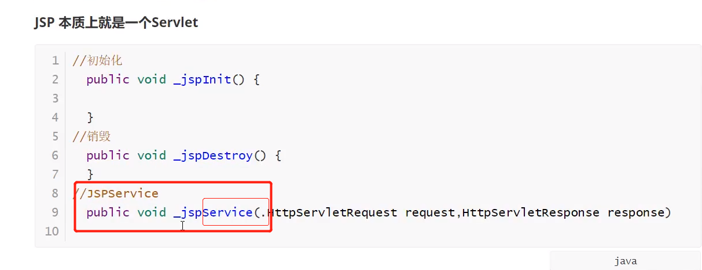
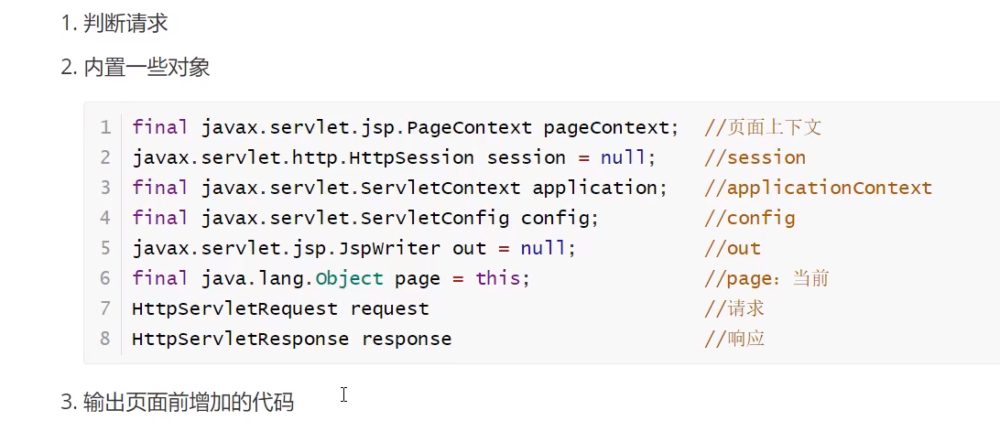
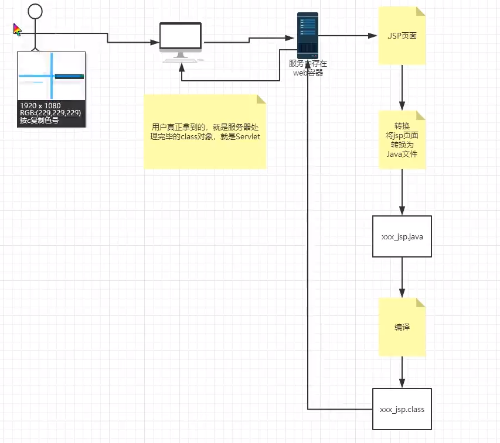
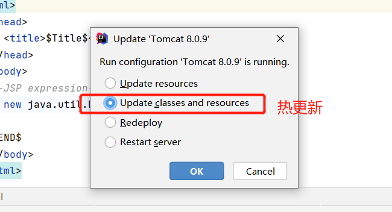

# JSP操作
### 重点是EL，以及一些常规操作，指令
- 项目DEMO网址：https://gitee.com/zhangjzm/java-web
-         https://gitee.com/zhangjzm/web-jsp-series
## JSP
- 1.什么是JSP
  - 1).Java Server Pages：java服务器端页面，也和Servlet一样，用于动态Web技术。
  - 2).最大特点：
    - 写JSP就像在写html
    - 区别：
      - HTML 只给用户提供静态的数据
      - JSP页面中嵌入JAVA代码，为用户提供动态数据
  - 3).浏览器向服务器发送请求，不管访问什么资源，其实都是在访问Servlet
  - 4).JSP最终也会转换成一个java类，**编译后就是java类**  
  - 5).JSP本质上就是一个**servlet**  
- 2.JSP原理
  - 思路：JSP是怎么运行的
  - 1).代码层面没有任何问题
  - 2).服务器内部工作
      - tomcat中有一个work目录
      - IDEA使用TOMCAT的话会在IDEA中生成一个work目录
      - ```C:\Users\lenovo\AppData\Local\JetBrains```
  ```
  C:\Users\lenovo\AppData\Local\JetBrains\IntelliJIdea2021.1\tomcat\
  1243d759-e030-4ae5-a8f3-eec5fc22a30e\work\Catalina\localhost
  ```
  






- 在jsp页面中 
  - 只要是JAVA代码就会原封不动的输出
  - 如果是HTML代码，就会被转换为：
  ```
    out.write("<html>\r\n")
  ```
  - 这样的格式，输出到前端
  




## JSP页面的编写：
### jsp基础语法
- 1.java表达式<%= %>
    ```
      <%--JSP expression
        作用：用来将程序的输出，输出到客户端
        <%= 变量或者表达式%>
      --%>
      <%= new java.util.Date()%>
    
    ```
  
- 2.jsp脚本片段<% %>
  ```
  <%--jsp脚本片段 --%>
    <%
      int sum = 0;
      for(int i = 0;i <= 100;i++){
        sum+=i;
      }
      out.println("<h1>Sum="+sum+"</h1>");
    %>
  ```
  
- 3.jsp脚本片段再实现<% %> html 语言 <% %>
  ```
    <%
      for(int i = 0;i < 5;i++){
    %>
      <h1>Hello,World <%=i%></h1>
    <%
      }
    %>
  ```
  
- 4.Jsp声明<%! %>
  ```
    <%!
      static {
        System.out.println("Loading Servlet");
      }
  
      private int globalVar = 0;
      public void zjz(){
        System.out.println("access method: zjz" + globalVar);
      }
    %>
  ```
  - JSP声明，会被编译到JSP生成到java类中！，其它的，就会生成到_jspService方法中！
  - 在jsp中嵌入java代码即可
  - 总之：
  ```
    <%%>  jsp脚本片段  --写一些for，if啥的
    <%= %>  java表达式 --写一些变量
    <%! %> 声明  
    
  ```

### jsp指令

```
<%@ %>-----include，page等等
  -  <%@include file="common/header.jsp"%>
  - `<%@ page errorPage="error/500.jsp" %>`
```
- 一般是将其它页面的内容直接弄到本页面
- 注：如果直接导入的几个页面中和本页面**有重复的元素**就会**报错**了
- 所以使用JSP标签，或者EL不错

### jsp标签
- <jsp:XXX />
  <jsp:include page="common/header.jsp"/>
  <jsp:include page="common/footer.jsp"/>
  
- 引入其它页面，不将其它页面的内容弄过来

### 9大内置对象
- PageContext  存东西
- Request     存东西
- Response  
- Session    存东西
- Application  【ServletContext】 存东西
- config  【ServletConfig】 
- out   
- page  //不用了
- exception  

  ```
    <%
      //从底层到高层（作用域）：page->request->session->application
      pageContext.setAttribute("name1","zjz01");      //保存的数据只在一个页面中有效
      request.setAttribute("name2","zjz02");          //保存的数据只在只在一次请求中有效，请求的转发会携带这个数据
      session.setAttribute("name3","zjz03");          //保存的数据只在只在一次会话中有效，从打开浏览器到关闭服务器
      application.setAttribute("name4","zjz04");      //保存的数据只在服务器中有效，从打开服务器到关闭服务器
    %>
  ```
  - request：客户端向服务器发送请求，产生的数据，用户看完就没用了，比如：新闻，用户看完没用的。
  - session：客户端向服务器发送请求，产生的数据，用户看完一会还有用，比如：购物车
  - application：客户端向服务器发送请求，产生的数据，一个用户用完了，其它用户还可能用。比如：聊天数据；

# JSP标签，JSTL标签，EL表达式

```
    <!-- https://mvnrepository.com/artifact/javax.servlet.jsp.jstl/jstl-api -->
    <!--JSTL表达式依赖-->
    <dependency>
        <groupId>javax.servlet.jsp.jstl</groupId>
        <artifactId>jstl-api</artifactId>
        <version>1.2</version>
    </dependency>

    <!-- https://mvnrepository.com/artifact/taglibs/standard -->
    <!-- standard标签库-->
    <dependency>
        <groupId>taglibs</groupId>
        <artifactId>standard</artifactId>
        <version>1.1.2</version>
    </dependency>
```

## EL表达式 ${} --就是获取参数
- 功能1：获取数据
- 功能2：执行运算
- 功能3：获取web开发的常用对象
- EL表达式获取表单中的数据 ${param.参数名}

## JSTL -- 重点是foreach
- JSTL 标签库：弥补HTML的不足，它自定义了许多标签，标签的功能和java代码的使用一样
  - jstl的使用要引入jstl核心标签库，我们才能使用jstl标签core
  - 在tomcat中也需要引入jstl包，standard包
  ```
      <%--jstl的使用要引入jstl核心标签库，我们才能使用jstl标签core--%>
      <%@taglib prefix="c" uri="http://java.sun.com/jsp/jstl/core" %>
      <%@taglib prefix="x" uri="http://java.sun.com/jsp/jstl/xml" %>

       <%--如果提交的用户是管理员，那就登录成功了--%>
      <c:if test="${param.username=='admin'}" var="isAdmin">
      <c:out value="管理员欢迎你"></c:out>
      </c:if>
      <c:out value="${isAdmin}"></c:out>
  
  
        <%--  
          var,每一次遍历出来的对象  类似for（Objec o:XX）中的o
          items,要遍历的对象	类似for（Objec o:XX）中的XX
          同时要遍历的值下标默认从0开始，否则要输入begin，end,,step
        --%>
        <c:forEach var="object" items="${list}">
        <c:out value="${object}"/> <br>
        </c:forEach>
        
        <c:forEach var="object" items="${list}" begin="1" end="5" step="2">
        <c:out value="${object}"/> <br>
        </c:forEach>

  ```


## JSP标签--不太用
- 设置参数,
  
    ```
        重定向事件，地址不变，内容改变
        <%--http://localhost:8080/JspTag01.jsp?name=zjz&age=22--%>
        <jsp:forward page="/JspTag01.jsp">
        <%-- 设置参数   --%>
            <jsp:param name="name" value="zjz"/>
            <jsp:param name="age" value="22"/>
        </jsp:forward>
    ```
  
- 获取参数：
  
  ```
    <%--取出参数--%>    
    name:<%= request.getParameter("name")%><br>
    age:<%= request.getParameter("age")%>
  
  ```
  
## jsp实现的如果不登录，别想访问
- 一般由过滤器操作，[NOTE_MVC](zh-cn/spring-series/NOTES/NOTE_MVC.md)中

  ```
    <%
        //如果不登录，别想访问
          Object userSession = request.getSession().getAttribute("USER_SESSION");
          if(userSession == null){
              response.sendRedirect("/hello/Login.jsp");
          }
      %>
  ```