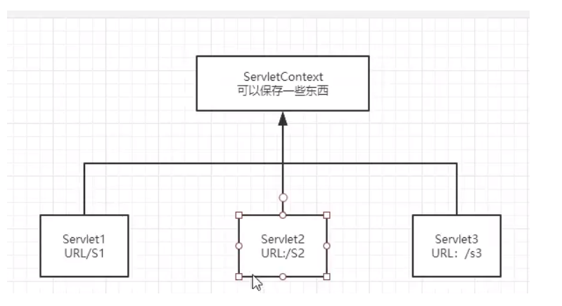
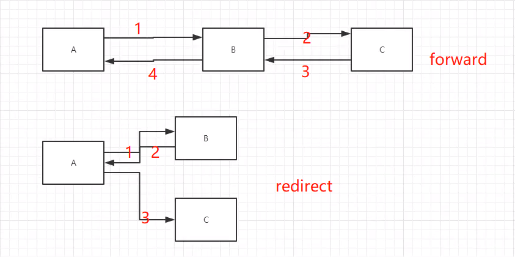

## web
  - 一个/表示当前路径
    - 转发不用/XXX/XXXX -- ` req.getRequestDispatcher("/success.jsp").forward(req,resp);`
    - 重定向需要 ----`resp.sendRedirect("/hello/success.jsp");`
  - 上级目录 `..`  来表示   当前目录 `.` 来表示 一般为./XX/XX

- ServletContext
  -web容器在启动时，他会为每个web程序都创建一个对应的ServletContext对象，他表现了当前的web容器
    - 共享数据

