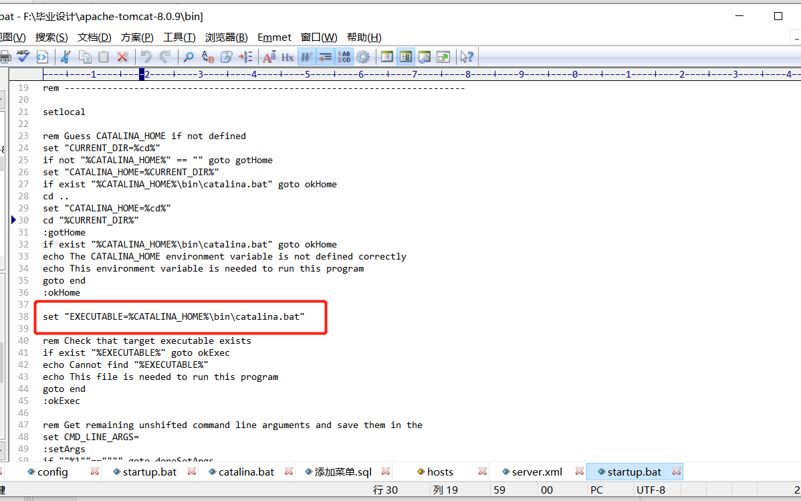
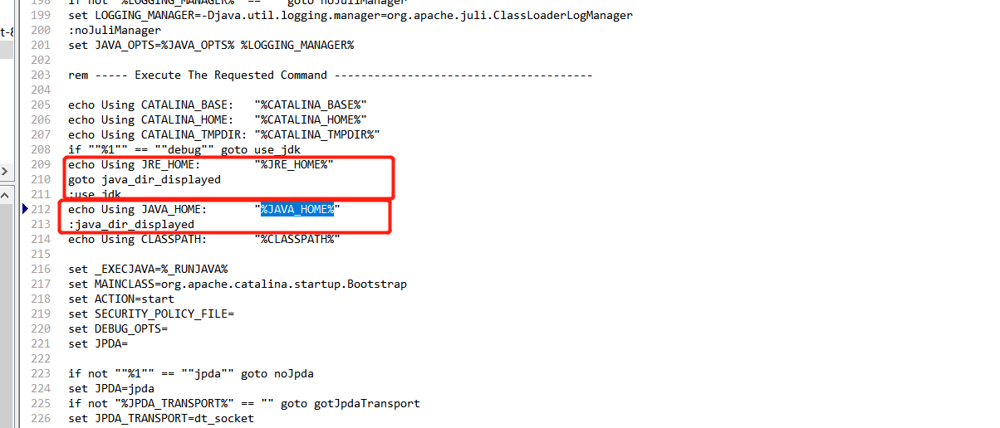

## 启动时出错
- 一个原因是没配JAVA_HOME
   - 1.看startup.bat发现里面没啥东西，主要时这个： 
    
 
   - 2.看catalina.bat里面发现需要jrehome或者javahome
       

    - 解决：配置javahome
- 一个双启动问题，仔细看看是不是idea启动的，同时外面启动的，肯定会有冲突
    - 可以直接打开文件夹目录下的\apache-tomcat-8.0.9\bin的shutdown.bat停止外部二代运行