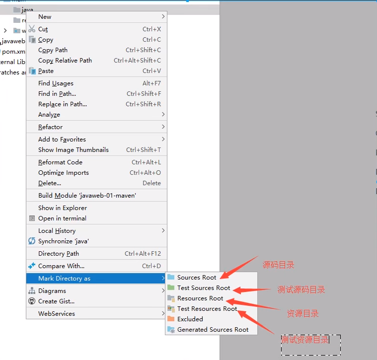
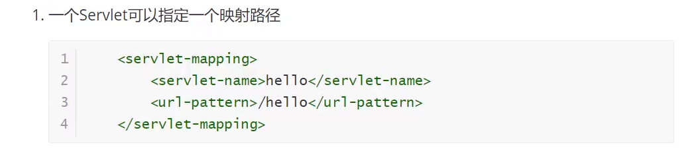
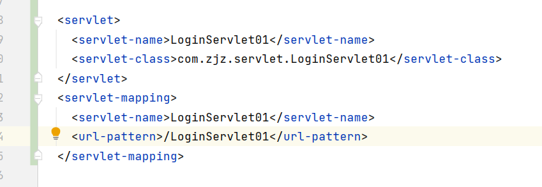

#项目地址
- https://gitee.com/zhangjzm/java-web
### 本文重点：Servlet，Session，跳转，路径问题

  


      
  ```
   - 缺点：
          - 加入的服务器的动态web资源出现了错误，我们需要重新编写我们的**后台程序**，重新发布
          - 停机维护
      - 优点：
           - web可以更新，所有用户看到的都是不同页面
           - 可以与数据库交互（数据可以持久化，用户可以交互）
      
  ```


    
- 


## Maven项目架构管理工具
- 我们目前用来方便导入jar包
- **核心思想**：**约定大于配置**
- 有约束，不要去违反

- web应用才有的

- 标记文件夹功能：
  
  


- maven的高级之处，他会帮你导入这个JAR包所依赖的其它jar

  
## Servlet
- Java Servlet 是运行在 Web 服务器或应用服务器上的程序（本质是java类，它extends HttpServlet）
  - 它是作为来自 Web 浏览器或其他 HTTP 客户端的请求和 HTTP 服务器上的数据库或应用程序之间的中间层。
- 使用 Servlet，您可以收集来自网页表单的用户输入，呈现来自数据库或者其他源的记录，还可以动态创建网页。
  - req，resp

- 3.maven环境优化
    - 1.修改web.xml为最新的
    - 2.将maven结构搭建完整
- 4.编写一个servlet程序
      

  
- 5.编写映射
    - 为啥需要映射：我们写的java程序，但是要通过浏览器访问，而浏览器需要连接web服务器，
    -  所以我们需要在web服务中注册我们写的servlet，还需要一个浏览器访问它的路径。
   
    

       
- 6.配置tomcat

 
  


- 7.mapping问题




  - 优先级问题：
    - 指定了固有的映射路径，优先级最高，如果找不到就会走默认处理请求。

- pom配置：
  ```
  <!--在build中配置resources，来防止我们资源导致失败问题-->
    <build>
      <resources>
        <resource>
          <directory>src/main/resource</directory>
        <includes>
          <include>**/*.properties</include>
          <include>**/*.xml</include>
        </includes>
        <filtering>true</filtering>
      </resource>
        <resource>
          <directory>src/main/java</directory>
          <includes>
            <include>**/*.properties</include>
            <include>**/*.xml</include>
          </includes>
          <filtering>true</filtering>
        </resource>
      </resources>
  
  ```


- 下载文件
    - 1.要获取下载文件的路径
    - 2.下载的文件是啥？
    - 3.设法想办法能让浏览器支持下载我们需要的东西
    - 4.获取下载文件的输入流
    - 5.创建缓存区
    - 6.获取OutputStream对象
    - 7.将FileOutputStream流写入到buffer缓存区
    - 使用OutputStream将缓存区中的数据写到客户端

    


- 自动刷新的验证码：用到随机数，图片


  - 路径在https://gitee.com/zhangjzm/java-web
  - 的src/main/java/com/zjz/servlet/ImageServlet.java

## 跳转
- 两种跳转方式
    - 1. 重定向：只有resp的sendRedirect
        - 网页地址栏改变
      ```
    
        resp.sendRedirect("/hello/OnlineCountJSP.jsp");//需要加前面的路径
    
      ```
    - 2.转发：req和context都可以：都是调用getRequestDispatcher的方法
      - 网页地址栏不变
      ```
      ServletContext context = this.getServletContext();
      context.getRequestDispatcher("/OnlineCountJSP.jsp").forward(req,resp);//不需要加前面的路径

              req.getRequestDispatcher("/success.jsp").forward(req,resp);//req也可以

          ```


- **重定向**：
  - 一个web资源在收到客户端请求后，他会通知客户端去访问另一个web资源，这个过程叫重定向
  - 为啥要用重定向？因为当你使用转发跳转到另一个界面时，地址不变，
  - servlet里的forward又不太好写好几个，所以再用另一个servlet进行操作多舒服  

  

  - 常用场景，
    - 用户登录（不同用户对应不同页面----VIP，普通，管理员……），每个人看到的不一样的界面
    - 重定向以后，再使用不同servlet的操作进行其它的操作    

   


## 路径问题
### 注意jsp中form的method要和servlet的doGet，doPost对应
- 一般都走post,因为网页地址安全
- servlet在doPost中写doGet
- form表单的action上要加上前缀（虽然在webapp下的可能不用，但是强烈推荐加上）${pageContext.request.contextPath}
- form表单的action可以跳转jsp页面，也可以交给servlet进行处理
- a href同from表单
```
 <form action="/hello/LoginServlet01" method="post"> //直接加
 //使用EL映射上路径，推荐使用第二种，比较灵活
 <form action="${pageContext.request.contextPath}/LoginServlet" method="post">
 <form action="/hello/Login.jsp" method="post">
 <form action="/hello/LoginServlet01" method="post">
 
 
 <p> <a href="/hello/Login.jsp">返回登录页面</a> </p>
 
```
- sendRedirect的路径使用req.getContextPath()+/mainPage.jsp
```

    resp.sendRedirect("/hello/sys/mainPage.jsp");
    resp.sendRedirect("/hello/error.jsp");
```

- forward的路径
```
     ServletContext context = this.getServletContext();
      context.getRequestDispatcher("/OnlineCountJSP.jsp").forward(req,resp);//不需要加前面的路径
      req.getRequestDispatcher("/success.jsp").forward(req,resp);//req也一样
```

```
 @Override
    protected void doPost(HttpServletRequest req, HttpServletResponse resp) throws ServletException, IOException {
        doGet(req, resp);
    }
```





## ServletRequest


  - **怎么获取前端输入的参数**
    - 1.jsp页面返回参数
    ```
     <form action="${pageContext.request.contextPath}/LoginServlet" method="post">
     </form>
    ```
    - 2.Servlet获取参数（LoginServlet）
     ```
        String username = req.getParameter("username");
        String password = req.getParameter("password");
  
        String[] hobbys = req.getParameterValues("hobbys");
      ```
     - 附加满足条件后，-----跳转
     ```
      //通过请求转发
        System.out.println("路径：" + req.getContextPath());//获取到jsp的路径（web里修饰过的）
        req.getRequestDispatcher("/success.jsp").forward(req,resp);
     ```


## ServletResponse
- 输出语句（会切换页面）
> 很常用的resp.getWriter(); // 注意是一个流
```
    resp.getWriter().println("密码错误");
```
- 设置文本类型 
`resp.setContentType("application/json");  // setContentType 设置文本的类型`


## Cookie Session
- 会话
  - 用户打开一个浏览器，点击了很多链接，访问了很多web资源，关闭浏览器，这个过程称之为会话。
  - **有状态的会话：**
    - 一个网站，怎么证明你来过
    - 1.服务器给客户端一个信件，客户端下次访问服务器带上信件就可以了：cookie
    - 2.服务器登记你来过了，下次来的时候来匹配你；session

- 保存会话的两种技术
  - cookie
    - 客户端技术（响应，请求）
    - 查看cookie
    


  - session
    - 服务器技术，利用这个技术，可以保存用户的会话信息？我们可以把信息和数据放在session中。
    - 常见：网站登录后，你下次就不用再登录了，第二次访问就直接上去了
  
## Session(重点)
- 什么是session
   - 服务器会给每个用户（浏览器）创建一个Session对象
   - 一个Session独占一个浏览器，**只要浏览器没关，这个session就存在。**
   - 用户登录之后，整个网站都访问他
  
## Session 的基本操作
> 登录--设置一个   退出--- 移除  中途--获取一些有关的东西
- 中途，是因为初始的时候，把对象放进去了

```
        // Constants类
        public class Constants {
            public final static String  USER_SESSION = "userSession";
        }
         //得到Session
        HttpSession session = req.getSession();
        //给Session中存东西，存key值，以及它的值（一般为对象）
        req.getSession().setAttribute(Constants.USER_SESSION,user);
        // 得到session中的值
        req.getSession().getAttribute(Constants.USER_SESSION);
         //移除用户的Session
        req.getSession().removeAttribute(Constants.USER_SESSION);
        //获取session的ID
        String sessionId = session.getId();
        
        <!--  设置Session失效时间  -->
          <session-config>
        <!--15分钟后Session自动失效，以分钟为单位-->
            <session-timeout>15</session-timeout>
          </session-config>
```


> session监听
- 编写监听器
    ```
        package com.zjz.listener;
        
        import javax.servlet.ServletContext;
        import javax.servlet.http.HttpSessionEvent;
        import javax.servlet.http.HttpSessionListener;
        
        //统计网站在线人数：统计session
        public class OnlineCountListener implements HttpSessionListener {
        
        
            //创建session的监听：看你的一举一动
            //一旦你创建一个session就会触发一次这个事件！
            @Override
            public void sessionCreated(HttpSessionEvent se) {
                ServletContext ctx = se.getSession().getServletContext();
        
                System.out.println(se.getSession().getId());
                Integer onlineCount = (Integer) ctx.getAttribute("OnlineCount");
                if(onlineCount == null){
                    onlineCount = new Integer(1);
                }else {
                    int count = onlineCount.intValue();
                    onlineCount = new Integer(count+1);
                }
        
                ctx.setAttribute("OnlineCount",onlineCount);
        
            }
        
        
            //销毁session的监听，看你的一举一动
            //一旦session销毁就会触发一次这个事件！
            @Override
            public void sessionDestroyed(HttpSessionEvent se) {
        
                ServletContext ctx = se.getSession().getServletContext();
                Integer onlineCount = (Integer) ctx.getAttribute("OnlineCount");
                if(onlineCount == null){
                    onlineCount = new Integer(0);
                }else {
                    int count = onlineCount.intValue();
                    onlineCount = new Integer(count-1);
                }
        
                ctx.setAttribute("OnlineCount",onlineCount);
        
            }
        
        
        }
        
        
        
    
    ```
  
- 配置监听器
    ```
        <!--监听器  -->
          <listener>
            <listener-class>com.zjz.listener.OnlineCountListener</listener-class>
          </listener>
          <servlet>
            <servlet-name>OnlineCountServlet</servlet-name>
            <servlet-class>com.zjz.servlet.OnlineCountServlet</servlet-class>
          </servlet>
          <servlet-mapping>
            <servlet-name>OnlineCountServlet</servlet-name>
            <url-pattern>/OnlineCountServlet</url-pattern>
          </servlet-mapping>
    
    
    ```


