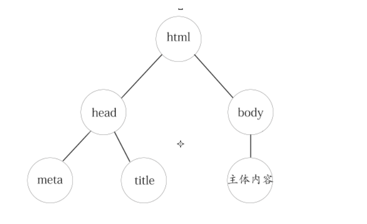
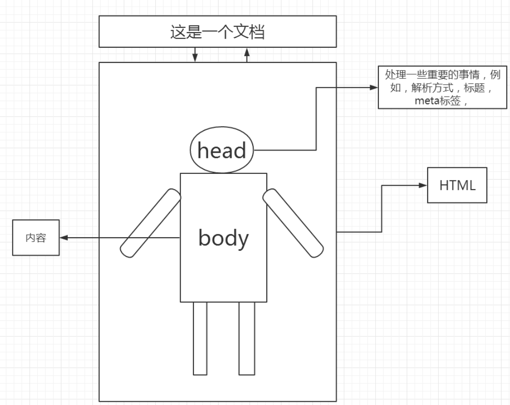

## 结构


- 标签：
    - 标签用来标记内容。
    - 标签使用"<",">"包围。
    - 标签分为成对标签和单标签 
- 元素： 
    
    - 一个元素通常是由一个开始标签，内容，其他元素以及一个结束标签组成的
- 属性：
    - 与元素相关的特性称为属性，属性由键值对组成。
    - <元素名 属性名="值1" 属性名="值2"></元素名>
    ```html
    大多数元素都可以使用的属性。
                        id		唯一标识
                        class	标识一类元素
                        style	样式
                        title	描述信息
    ```
- 规范：
- 元素名和属性名都不区分大小写。


- CSS简介																			
  - CSS(cascading style sheet，层叠样式表)是描述文档怎么样被呈现的语言，使用CSS可以对HTML文档进行描述。
  - CSS的理念就是让文档的结构和设计分离，达到解耦的目的。
  - 语法：
    - 1)CSS属性和值之间用冒号分隔
    - 2)CSS属性之间用分号分隔（建议每个属性后都书写分号）
    - 3)CSS的值有多个的时候使用空格分隔
  
- CSS在网页中的使用
  - 1）内嵌式
    - 每个HTML元素都包含有一个style属性，使用该属性可以直接指定样式
  `<p style=""></p>`
  - 存在问题：
      - 1.不方便修改
      - 2.结构与显示不能很好的分离
      - 3.建议在测试或个别情况下使用
  - 2）嵌入式
    - CSS样式定义内容位于style元素之间，其type属性必须被定义为text/css
  
  ```
  <head>
  <style type="text/css">

                </style>
            </head>
  ```

  - 3）外部引用时
    - 可以在多个文档间共享样式表，提高效率；可以改变样式表而无须改变HTML文档。
  
  ```
      <head>
          <link rel="stylesheet" href="url" type="text/css">
          或者
          <style type="text/css">
              @import "style.css";
              @import url("style.css");
          </style>
      </head>
  ```
  
## 重点`<CSS></CSS>`基本语法规则
  -  1）选择器
      - 用于选择html中的元素

     - html标签选择器
        - 即html标签，任何一个HTML元素的标签名都可以是css的选择器
       
     ```
     
     p{text-indent:10px}  /*段落第一行缩进10像素*/
     h1{color:red}  //H1 标题为红色
     
     ```
     
     - 优先级：
       - 默认情况下，子级通常先继承父级标签属性
       - 如果子级和父级拥有相同的属性，子级优先，就近原则
       - 类选择器的优先级高于标签选择器
     - 类选择器
      -  class属性
      - .类名(类名不能使用数字开头，不能使用关键字来命名)
     
      ```css
         .rr{ color :red}
              使用class属性来调用类名称
             <p class="rr">one</p>
             <p class="rr">two</p>
             <p class="rr">three</p>
      ```
     
  - 2)1.ID选择器
     - id属性
     - id名
      
     ```
    #two{background-color:green}
     <p class="rr">one</p>
     <p id="two" class="rr">two</p>
     <p class="rr">three</p>
    ```
    
  - 2.关联选择器
      - 它们的优先级比单一的选择器大。
      - 后代选择器  选择a元素里面所有后代元素中的b元素
        - a b{...}
      - 子代选择器  选择a元素里面第一代子元素中的b元素
        - a>b{...}

  -  3.组合选择器
     - 使用逗号,隔开选择器，可以减少样式表的重复声明
    ` h1,h2,h3,h4{color:red}`
    
  - 4.伪元素选择器
     - 是指对同一个HTML元素的不同状态的一种定义方式
     ```
    HTML标签:伪元素{}
     a:link{}	超链接没有任何动作前的状态
     a:hover{}	光标移动到超链接上的状态
     a:active{}	点击超链接时的状态
     a:visited{} 访问过超链接的状态
     text-decoration:none  去掉下划线
    ```

  -  2）选择器优先级
     - 多个CSS选择器同时作用于同一个html时，声明不同的属性具有继承的关系，如果声明的是相同的属性，则以优先级高的为主。

     - 内嵌式
     ```css
        > 关联选择器(后代，子代，组合(且))
        > ID选择器
        > 类选择器
        > HTML选择器
    
     ```

     - 同级别的后者覆盖前者
     - 就近原则
  -  3）样式
     
     -  样式是零个或多个以分号分割的【属性名：属性值】列表
  -  4）规则集
      -  选择器 样式
      -  选择器{属性名:属性值;属性名:属性值}
  -  5）注释
     ` /*
      注释内容
      */`


## CSS常见的样式属性和值
   - 1）CSS 尺寸属性
       - (注意块级元素和行内元素的区别)
       - height	设置元素高度。
       - width	设置元素的宽度。
   - 2） 字体属性
       -  font-family字体族科
            ```
             宋体 SimSun
             黑体 SimHei
             微软雅黑 Microsoft YaHei
             微软正黑体 Microsoft JhengHei
             新宋体 NSimSun
             新细明体 PMingLiU
             细明体 MingLiU
             标楷体 DFKai-SB
             仿宋 FangSong
             仿宋_GB2312 FangSong_GB2312
             楷体_GB2312 KaiTi_GB2312
            ```
         - font-size	字体大小
         - font-style	字体风格
            -  normal	正常;italic  斜体;oblique  倾斜
         - font-weight字体加粗
         - normal  正常;bold  粗体;bolder 更粗;lighter  更细
         - text-decoration 规定添加到文本的修饰 ：
         - none 		默认。定义标准的文本。
         - underline 	定义文本下的一条线。
         - overline 	定义文本上的一条线。
         - line-through定义穿过文本下的一条线。
         - blink 		定义闪烁的文本。
   -    3） 颜色
         - color	设定文本的颜色
         - opcity	设置透明度
            - 所有浏览器都支持 opacity 属性。
            - 注释：IE8 以及更早的版本支持替代的 filter 属性。
            - 例如：filter:Alpha(opacity=50)。
         -  一般两个属性一起写，保证兼容性
            - filter:Alpha(opacity=50);
            - opacity:0.5; 
        
   - 4）背景
        - 设置元素的背景颜色。background-color:#CCC;
            
            - background-image
        - 设置元素的背景图像。
            - url("1.png");
            - background-repeat 
        -  设置是否及如何重复背景图像。
          ```
              repeat 	默认。背景图像将在垂直方向和水平方向重复。
              repeat-x 	背景图像将在水平方向重复。
              repeat-y 	背景图像将在垂直方向重复。
              no-repeat 	背景图像将仅显示一次。
              inherit 	规定应该从父元素继承 background-repeat 属性的设置。
              background-attachment
          ```
        - 设置背景图像是否固定或者随着页面的其余部分滚动。
          ```
              fixed	固定
              scroll	滚动
              background-position
        ```
      - 设置背景图像的开始位置。这个属性设置背景原图像（由 background-image 定义）的位置，	背景图像如果要重复，将从这一点开始。您需要把 background-attachment属性设置为 "fixed"，才能保证该属性在 Firefox 和 Opera 中正常工作。
          ```
              横向关键字： left center right
              纵向关键字： top center bottom
              百分比：
              左上角是 0% 0%。右下角是 100% 100%。
              background
              简写属性在一个声明中设置所有的背景属性。
              background:#ff0000 url('smiley.gif') no-repeat;
        ```
          -  5） 边框属性
          
             ```
                border-style  设置4个边框的样式
                dotted 	定义点状边框。在大多数浏览器中呈现为实线。
                solid 	定义实线。
                double 	定义双线。
                dashed  定义虚线。
                none 	定义无边框
                ...
                如果4个值都给定了，分别应用于上，右，下,左
                border-style: solid dashed dashed solid;
                如果给定1个值，应用于各边;
                border-style: solid;
                如果给定2个值，第一个值应用于上下边，第二个值应用于左右边
                border-style: solid dashed;
            
                border-width  设置4个边框的宽度
                border-color  设置边框颜色
                border  在一个声明设置所有的边框属性。
                border:1px solid #ff0000
             ```


   - 6）鼠标光标属性


        ```
             cursor	属性规定要显示的光标的类型（形状）。
              none	无
              auto 	默认。浏览器设置的光标。
              pointer 光标呈现为指示链接的指针（一只手）
              wait 	此光标指示程序正忙（通常是一只表或沙漏）。
              help 	此光标指示可用的帮助（通常是一个问号或一个气球）。
        ```

   -  7） 列表属性
        ```
            
            list-style-image 	将图象设置为列表项标记。 
                list-style-image:url("/i/arrow.gif");
            list-style-position 设置列表项标记的放置位置。
                inside 	列表项目标记放置在文本以内，且环绕文本根据标记对齐。
                outside 默认值。保持标记位于文本的左侧。列表项目标
                    记放置在文本以外，且环绕文本不根据标记对齐。
                在Firefox中的查看器中选中ul即可看出区别

            list-style-type 	设置列表项标记的类型。
                none 	无标记。
                disc 	默认。标记是实心圆。
                circle 	标记是空心圆。
                square 	标记是实心方块。
                decimal 标记是数字。
                ower-roman	小写罗马数字(i, ii, iii, iv, v, 等。)
                upper-roman	大写罗马数字(I, II, III, IV, V, 等。)
                lower-alpha	小写英文字母The marker is lower-alpha (a, b, c, d, e, 等。)
                upper-alpha	大写英文字母The marker is upper-alpha (A, B, C, D, E, 等。)
                lower-latin	小写拉丁字母(a, b, c, d, e, 等。)
                upper-latin	大写拉丁字母(A, B, C, D, E, 等。)

             list-style 		在一个声明中设置所有的列表属性。 
                list-style: square inside url('/i/eg_arrow.gif')
        ```

   -  8）表格
      ```
            优先级：
          td,th-->tr-->tbody,thead,tfoot-->table (从里向外的规则)
          color,font-size
          text-align	文字对齐
          background
          border 		边框，只能用于table,th,td
          margin 		间距，只能用于table,caption
          padding 	内间距，只能用于th,td
          width 		宽，只能用于table,td,th
          height 		高，只能用于table,td,th、可以用于tr并且优先级高于td
          caption-side 标题位置：
          top/left/right/botton
      ```
      
## 盒子模型
- 盒子模型是所有布局的基础。 
    - 网页就是由许多个盒子通过不同的排列方式堆积而成，
    - 网页上每个元素都被浏览器看成是一个矩形的盒子，
    - 这个盒子由元素的内容，填充，边框，边界组成。
    - 默认盒子边框无，背景色透明，默认看不到盒子
    
-  1） 盒子模型
  ```html
        width   内容区的宽度
        height  内容区的高度
        padding 内边距（填充），是设置区块的内边距的属性，是边框和元素内容之间的间隔距离		    
        border  边框(注意边框是有内外俩条边界的)
        margin  外边距，定义区块外边界与上级元素距离的属性，值为长度
        
        内容	盒子里面所包含的元素和内容

        属性值：
            1个：上下左右都是该值
            2个：前者表示上下的值，后者表示左右的值
            3个：前者表示上边的值，中间表示左右的值，后者表示下边的值
            4个：上右下左，顺时针排序
   ```       
                
                    
- 2） 不同浏览器解析盒子模型的差异：
      ```
          IE5盒子  width = 内容 + border + padding
          盒子占据的宽度 = margin*2+width
          盒子占据的高度 = margin*2+height
          盒子实际的宽度 = width
          盒子实际的高度 = height

           W3C盒子
           内容区的宽高 = width,height
           盒子实际的宽度 = width+padding*2+border*2
           盒子实际的高度 = height+padding*2+border*2
           盒子占据屏幕的宽度 = width+padding*2+border*2+margin*2
           盒子占据屏幕的高度 = height+padding*2+border*2+margin*2
        ```         
                 
- 3） 设置浏览器去遵循w3c标准只需要在网页的顶部加上DOCTYPE声明即可
        
    ```html
        另外注意 !important 的使用
        p{
        color:red !important;
        color:blue;
        }
        当不加!important;的时候，后者覆盖前者，当加上之后说明第一个,样式优先级更高，采用前者，但是Ie6不支持!important;
               
    ```                
                
- 4）其他属性
     ```html
         border-width	边框高度
         border-color	边框颜色
         border-style	边框样式
             none	无样式
             dotted	点线
             dashed	虚线
             solid	实线
             double	双线
             groove	槽线
             ridge	脊线
             inset	内凹
             outset	外凸
     ```          
        
-  5）关于填充和边框的常见问题
    - 1. 大部分的html元素的盒子属性（margin,padding）默认值为0，有少数html元素的（marigin，padding不为0）例如：body,p,ul,li,form等标签，有时需要将其先设置为0
    - 2. 相邻两个兄弟元素的外边框会发生合并，一般浏览器会自动设定他们的外边距(注意我们可以margin设置为负值)        
    - 3. 如果没有设置父级元素的内边距或边框，那么它的子元素的边界会和其合并。(注意边框是有内外俩条边界的)
    - 4. 设置一个块元素居中： marigin:0 auto;        
        - 第一个表示top和bottom，第二个表示left和right
    - 5. margin可以设置负值，padding不可以设置        
    - 6. 行内元素的margin值，只有左右值，没有上下值
        
- 6）行内元素与块级元素
    - 行内元素
      - 行内元素不可以设置宽（width）和高（height【但是可以通过line-height设置】），但可以与其他行内元素位于同一行，行内元素内一般不可以包含块级元素。行内元素的高度一般由元素内部的字体大小决定，宽度由内容的长度控制。常见的行内元素有:em,font,b,span,a,strong
        
    - 块级元素
      - 块级元素排斥其他元素与其位于同一行，可以设定元素的宽（width）和高（height），块级元素一般是其他元素的容器，可容纳块级元素和行内元素。常见的块级元素有div, p ,h1~h6等
        
      - IE6/7及IE8混杂模式中(当IE浏览器识别不了DTD就会显示成混杂模式)，text- align:center可以使块级元素也居中对齐。其他浏览器中，text-align:center仅作用于行内内容上。
        
      - 改变元素类型：
```html
 display
              可以将一个行级元素转换为块级元素，但是这种转换并不能改变元素本质，转换的只是CSS的盒子的外观
              需要转换盒子类型的情况：
              水平的列表菜单，不断行的标题，隐藏元素
              none 	隐藏元素。不会被显示，不占空间
              block	块级元素。独占一行空间
              inline  默认。此元素会被显示为内联元素，元素前后没有换行符。
              inline-block	兼有块级和行级元素特性，在行内显示但是可以设定宽高
        
              list-item 		此元素会作为列表显示。
        
              table 	此元素会作为块级表格来显示（类似 <table>），表格前后带有换行符。
              inline-table 	此元素会作为内联表格来显示（类似 <table>），表格前后没有换行符。
              table-row-group 	此元素会作为一个或多个行的分组来显示（类似 <tbody>）。
              table-header-group 	此元素会作为一个或多个行的分组来显示（类似 <thead>）。
              table-footer-group 	此元素会作为一个或多个行的分组来显示（类似 <tfoot>）。
              table-row 		此元素会作为一个表格行显示（类似 <tr>）。
              table-column 	此元素会作为一个单元格列显示（类似 <col>）
              table-cell 		此元素会作为一个表格单元格显示（类似 <td> 和 <th>）
              table-caption 	此元素会作为一个表格标题显示（类似 <caption>）
              inherit 		规定应该从父元素继承 display 属性的值。
          float,position
              应用了浮动和绝对定位的元素，变成了块级元素，因此display属性一般被忽略
          如果元素应用了display:none，该元素（以及子元素）被隐藏起来，对其再使用float,position将不再有意义
  
```      
                   
-  7. 浮动 float 
    - 任何元素都可以浮动，可以改变普通文档流的排列方式，可以使得块元素在同一行中排列，使我们的布局更加方便，浮动是脱离文档流的，也就是其他元素看不见这个浮动的元素。
    - 浏览器将窗体自上而下分成一行一行,并在每行中按从左至右的依次排放元素,即为文档流。
    - 浮动何时停止？
        - 1. 当遇到一个浮动元素后
        - 2. 当遇到父级元素后 
        - 多个盒子都浮动后，就产生了块级元素水平排列的效果 
        - 多个浮动元素不会相互覆盖 
        - 若包含的容器太窄，无法容纳水平排列的多个浮动元素，那么最后的浮动盒子会向下移动，但如果浮动元素的高度不同，那么它们向下移动时可能会被卡住。
          
     ```html
          float:
            left 	元素向左浮动。
            right 	元素向右浮动。
            none 	默认值。元素不浮动，并会显示在其在文本中出现的位置。
     ```     
        
- 8. 定位 position
   -  定位属性：
       -  1.默认定位 static:
           -  默认属性，指定了元素按照常规的文档流进行定位，静态定位元素不允许使用top,left和类似其他属性定位。position的值为static为非定位元素，为其他值时候为定位元素，因为static元素不能自定义元素的位置，而其他可以
           -  文档流：标签在文档中的默认位置。
        - 2.相对定位 relative:
           - 元素不脱离文档流，原先位置保留。参照元素原来的位置进行移动，元素原来的空间位不变，元素在移动时会覆盖其他元素。
        - 3.绝对定位 absolute:
           - 元素完全脱离文档流，原先位置不保留。页面中的其他元素视它不存在，绝对定位是参照距离他最近的父级有定位属性的元素，如果父级元素没有定位属性，则会参照文档
           - 父级元素：外层元素。
        - 4.固定定位 fixed:
           - 将元素固定在窗口中的某个位置，绝对定位是相对于元素的，固定定位是相对于窗口的，会随着窗口的一定而移动。在低版本IE中不支持该属性
        - 5.定位元素可用以下属性：
            - 定位元素：使用absolute、relative、fixed修饰的元素都是定位元素。
    ```html
                top:  元素距离上方的距离
                bottom: 元素距离下方的距离
                left: 元素距离左边的距离
                right:元素距离右边的距离
                z-index ：  第三个维度 ，值高的元素会覆盖值低的元素。该属性可以使得元素脱离文档流，可能会覆盖其他元素。
                text-align:	横向排列 left right center			    			    
                line-height:行高，内容都在行的中间，可以使用这个属性设置内容垂直居中
    ```	