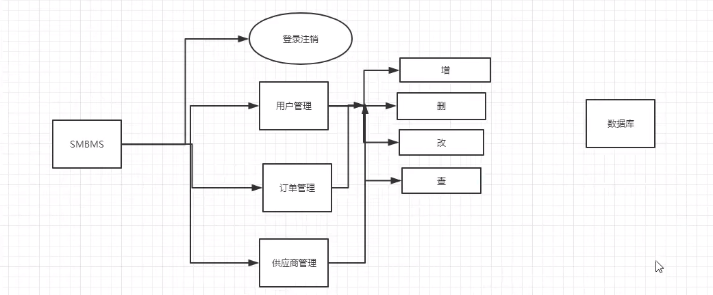
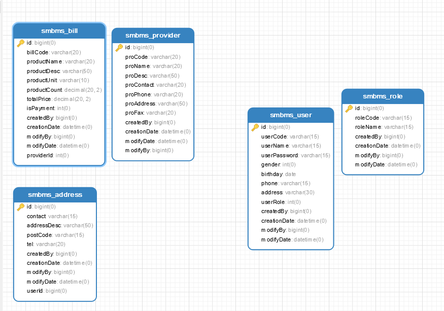
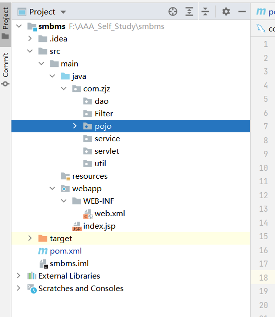
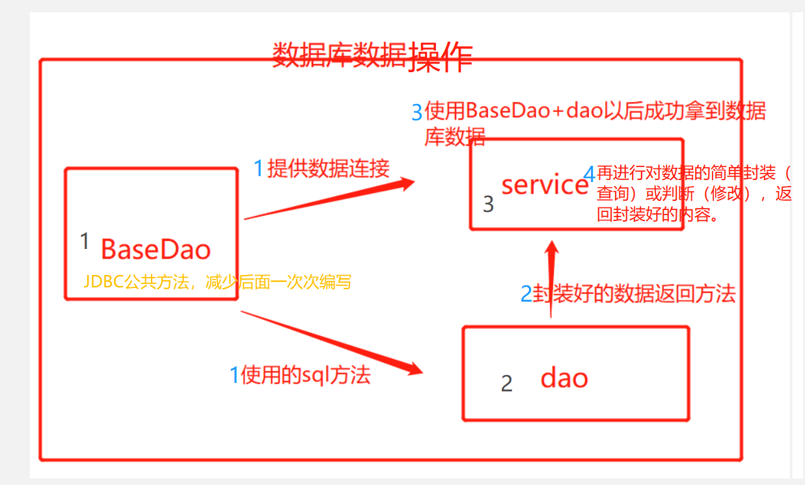
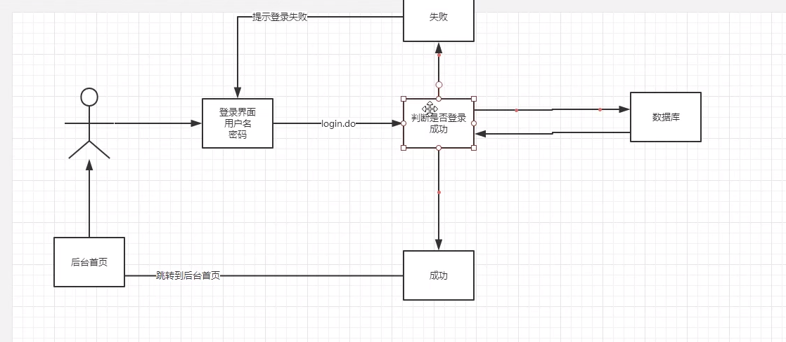
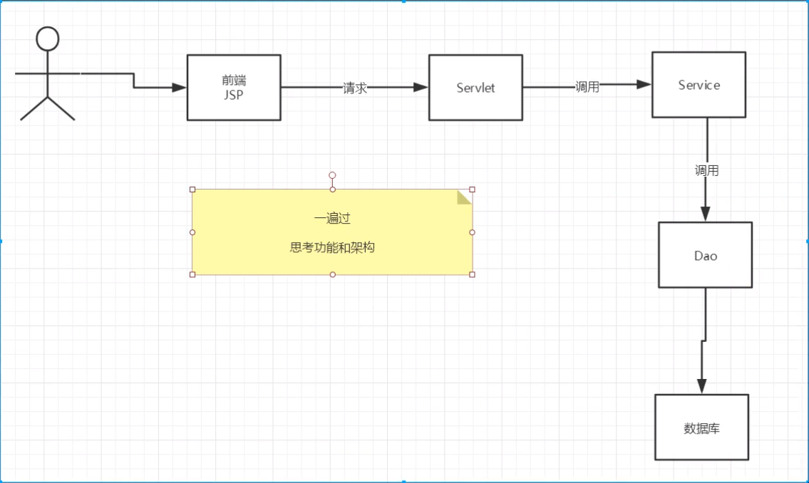
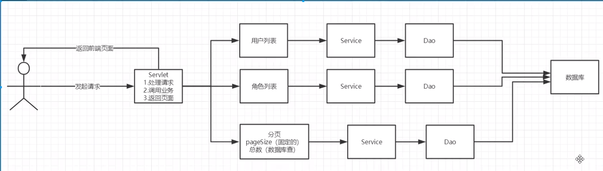

# 项目搭建
## 结构图





### 搭建maven web项目
- 1.搭建一个maven web项目
- 2.配置tomcat
- 3.测试项目是否能跑起来
- 4.导入项目中遇到的jar包
  - jsp，servlet，mysql驱动，jstl，standard
- 5.创建项目包结构    

- 6.编写实体类
  - ORM映射：表-类映射
- 7.编写基础公共类
  - 1）数据库配置文件
  - 2)编写数据库的公共类
- ------四部曲，1.使用Properties（IO流）获取连接数据 2.进行连接 3.执行体（ResultSet或int） 4.关闭流
- Properties对象类似Key Value取值
- InputStream inputStream = BaseDao.class.getClassLoader().getResourceAsStream("db.properties");  
- 类加载器  .class.getClassLoader().getResourceAsStream取值
-  properties.load(inputStream);//IO流取值
- 本质----------------获取数据库数据



> POJO  --- 提供一个实体，对对象的基本操作啊，set，get值
> Dao  --- 提供数据-怎么提供？--依照你输入的参数获取想要的返回（返回对象需new对象）
> Service --- 数据处理--怎么处理？--引入dao，拿到dao的数据封装一下（这么做的意义？Controller直接拿dao不好吗？）
> 作用：---实现本层数据共享（不同controller都可以调用Service）---1.获取数据---2.对数据进行处理，如：判别，对数据进行计算
> 怎么处理的？ 通过**入参**啊，然后**调用dao的**进行处理啊。。。
  - 答：1.从引入dao来说，如果你直接由controller来进行，那么DAO发生替换（比如从oracle迁移mysql），需要找到所有controller里的调用点，逐一修改。
  - 2.如果每个判别，操作都由controller来进行，那么同层的controller并不能互通（处理数据），比如：折扣计算，反作弊判定
> Controller

```
  package com.zjz.dao;
  
  import java.io.IOException;
  import java.io.InputStream;
  import java.sql.*;
  import java.util.Properties;
  
  //操作数据库的公共类
  public class BaseDao {
      private static String driver;
      private static String url;
      private static String username;
      private static String password;
  
      //静态代码块，类加载的时候就初始化
      static {
          Properties properties = new Properties();
          //通过类加载器读取对应的资源
          InputStream is = BaseDao.class.getClassLoader().getResourceAsStream("db.properties");
          try {
              properties.load(is);
          } catch (IOException e) {
              e.printStackTrace();
          }
  
          driver = properties.getProperty("driver");
          url = properties.getProperty("url");
          username = properties.getProperty("username");
          password = properties.getProperty("password");
  
      }
  
      //获取数据的连接
      public static Connection getConnection(){
          Connection connection = null;
          try {
              Class.forName(driver);
              connection = DriverManager.getConnection(url,username,password);
          } catch (Exception e) {
              e.printStackTrace();
          }
          return connection;
      }
  
      //编写查询公共类
      public static ResultSet execute(Connection connection,String sql,Object[] params,ResultSet resultSet, PreparedStatement preparedStatement) throws SQLException {
          preparedStatement = connection.prepareStatement(sql);
          int len = params.length;
          for(int i = 0;i<len;i++){
              //setObject 占位符从1开始，数组是从0开始
              preparedStatement.setObject(i+1,params[i]);
          }
          resultSet = preparedStatement.executeQuery();
          return resultSet;
      }
  
  
      //编写增删改公共方法
      public static int execute(Connection connection,String sql,Object[] params, PreparedStatement preparedStatement) throws SQLException {
          preparedStatement = connection.prepareStatement(sql);
          int len = params.length;
          for(int i = 0;i<len;i++){
              //setObject 占位符从1开始，数组是从0开始
              preparedStatement.setObject(i+1,params[i]);
          }
          int updateRows = preparedStatement.executeUpdate();
          return updateRows;
      }
  
      //释放资源
      public static boolean closeResource(Connection connection,ResultSet resultSet, PreparedStatement preparedStatement){
          boolean flag = true;
          if(resultSet!=null){
              try {
                  resultSet.close();
                  //GC回收
                  resultSet = null;
              } catch (SQLException throwables) {
                  throwables.printStackTrace();
                  flag = false;
              }
          }
  
          if(connection!=null){
              try {
                  connection.close();
                  //GC回收
                  connection = null;
              } catch (SQLException throwables) {
                  throwables.printStackTrace();
                  flag = false;
              }
          }
  
  
          if(preparedStatement!=null){
              try {
                  preparedStatement.close();
                  //GC回收
                  preparedStatement = null;
              } catch (SQLException throwables) {
                  throwables.printStackTrace();
                  flag = false;
              }
          }
  
      return flag; 
      }
  
  }

```  


- 8.编写字符编码过滤器
  - Filter类 
  - web配置
  
# 功能一 登录功能的实现



## 编写
- 1.编写前端
- 2.设置首页，web.xml
  
  ```
    <!--设置欢迎页面-->
      <welcome-file-list>
          <welcome-file>/login.jsp</welcome-file>
      </welcome-file-list>
  ```
  
- 3.编写dao层，用户登录的接口

  ```
    public interface UserDao {
        //得到要登录的用户
        public User getLoginUser(Connection connection,String userCode) throws SQLException;
    }
  
  ```
  
- 4.编写dao接口实现类

  ```
        public class UserDaoImpl implements UserDao{
          public User getLoginUser(Connection connection, String userCode) throws SQLException {
      
              PreparedStatement pstm = null;
              ResultSet rs = null;
              User user = null;
              if(connection != null){
                  String  sql = "select * from smbms_user where userCode = ?";
                  Object[] params = {userCode};
      
                  rs = BaseDao.execute(connection, pstm, rs, sql, params);
                  if(rs.next()){
                      user = new User();
                      user.setId(rs.getInt("id"));
                      user.setUserCode(rs.getString("userCode"));
                      user.setUserName(rs.getString("userName"));
                      user.setUserPassword(rs.getString("userPassword"));
                      user.setGender(rs.getInt("gender"));
                      user.setBirthday(rs.getDate("birthday"));
                      user.setPhone(rs.getString("phone"));
                      user.setAddress(rs.getString("address"));
                      user.setUserRole(rs.getInt("userRole"));
                      user.setCreatedBy(rs.getInt("createdBy"));
                      user.setCreationDate(rs.getTimestamp("creationDate"));
                      user.setModifyBy(rs.getInt("modifyBy"));
                      user.setModifyDate(rs.getTimestamp("modifyDate"));
      
                  }
                  BaseDao.closeResource(null,pstm,rs);
      
              }
              return user;
          }
       }
  
  ```

- 5.业务层接口
  
  ```
    public interface UserService {
    //用户登录
    public User login(String userCode, String password);
  }

  ```
  
- 6.业务层实现类

  ```
      public class UserServiceImpl implements UserService{
      
          //业务层都会调用dao层，所以我们要引入dao层
          private UserDao userDao;
          public UserServiceImpl() {
              userDao = new UserDaoImpl();
          }
          public User login(String userCode, String password) {
              Connection connection = null;
              User user = null;
              try {
                  connection = BaseDao.getConnection();
                  //通过业务层调用具体的数据库操作
                  user = userDao.getLoginUser(connection,userCode);
              } catch (SQLException throwables) {
                  throwables.printStackTrace();
              }finally {
                  BaseDao.closeResource(connection,null,null);
              }
              return user;
          }
      
          @Test
          public void test(){
              UserServiceImpl userService = new UserServiceImpl();
              User wen = userService.login("wen", "123");
              System.out.println("密码为：" + wen.getUserPassword());
      
      
          }
      }
  ```

- 7.servlet层实现

  ```
      public class LoginServlet extends HttpServlet {
      
          //Servlet:控制层，调用业务层代码
          @Override
          protected void doGet(HttpServletRequest req, HttpServletResponse resp) throws ServletException, IOException {
              System.out.println("LoginServlet---start");
              //获取用户的用户名和密码
              String userCode = req.getParameter("userCode");
              String userPassword = req.getParameter("userPassword");
      
              //和用户数据库中的密码对比，调用业务层
              UserService userService = new UserServiceImpl();
              User user = userService.login(userCode, userPassword);//登录的人查出来
      
                if(user != null&&(user.getUserPassword().equals(userPassword))){//查到有这个人
                  //将用户的信息放到session中
                  req.getSession().setAttribute(Constants.USER_SESSION,user);
                  //跳转到主页
                  resp.sendRedirect("jsp/frame.jsp");
              }else {//查无此人
                  //转发回登录页面，并提示错误
                  req.setAttribute("error","用户名，密码不正确");
                  req.getRequestDispatcher("login.jsp").forward(req,resp);
              }
          }
      
          @Override
          protected void doPost(HttpServletRequest req, HttpServletResponse resp) throws ServletException, IOException {
              doGet(req, resp);
          }
      }
  
  ```

- 8.注册servle 
  
  ```
       <servlet>
          <servlet-name>LoginServlet</servlet-name>
          <servlet-class>com.zjz.servlet.user.LoginServlet</servlet-class>
      </servlet>
      <servlet-mapping>
          <servlet-name>LoginServlet</servlet-name>
          <url-pattern>/login.do</url-pattern>
      </servlet-mapping>
  ```

- 9.编写过滤器，拦截没登录的

  ```
    public class SysFilter implements Filter {
        public void init(FilterConfig filterConfig) throws ServletException {
        }
    
        public void doFilter(ServletRequest servletRequest, ServletResponse servletResponse, FilterChain filterChain) throws IOException, ServletException {
            HttpServletRequest request = (HttpServletRequest) servletRequest;
            HttpServletResponse response = (HttpServletResponse)servletResponse;
            //从session中获取用户
            User user = (User) request.getSession().getAttribute(Constants.USER_SESSION);
            if(user==null){//说明已经注销了
                response.sendRedirect("/error.jsp");
            }else {
                filterChain.doFilter(servletRequest,servletResponse);
            }
        }
    
        public void destroy() {
        }
    }
  
  ```

  ````
    <!--用户登录过滤器-->
      <filter>
          <filter-name>SysFilter</filter-name>
          <filter-class>com.zjz.Filter.SysFilter</filter-class>
      </filter>
      <filter-mapping>
          <filter-name>SysFilter</filter-name>
          <url-pattern>/jsp/*</url-pattern>
      </filter-mapping>
  ````


- 10.由底层向上层写





# 功能二，修改密码-修当前的
> 修改所有的，还是修改当前的---两个可以调用同一个DAO（修改），但业务就不一样了吧，修当前的id需要通过session获取吧。
## 编写
- 设置文本类型
  `resp.setContentType("application/json");  // setContentType 设置文本的类型`


# 功能三，用户界面
## 编写
> 看到的页面显示多少条，当前页码，都得与当前的用户list绑定
> 每次点击切换的时候也就是再次执行SQL进行分页的处理，并不是同一批数据分割开。。。（可利用前端进行分割--）
> 所以总数量的获取需要单独写一个SQL
> 总数量的作用就是，帮助我们显示有几页
> 跳转由前端获取页数，或者上一页，下一页由前端参数直接控制

- 总体思路，用户展示
  - `List<User> userList = userService.getUserList(queryUserName, queryUserRole, currentPageNo, pageSize);`
  - 总数量--返回一个总数量
  - 分页Bean 专用于分页。。也就是一个服务类，利用总数量服务currentPageNo动态变化



- 1.导入分页的工具类
- 2.用户列表的导入
  - userlist.jsp
  
- 1.获取用户数量
  - UserDao UserDaoImpl  UserService UserServiceImpl
   

- 2.分页的逻辑
  - 在数据库中分页使用 Limit startIndex，pageSize; 总数
  - 0,5--第1页-- 6,5--第2页-- 11,5--第3页----每页五个
  - 当前页 （当前页-1） * 页面大小
  
- 3.获取用户列表
  - userdao 
  
  ```
  
        public List<User> getUserList(Connection connection,String username,int userRole,int currentPageNo,int pageSize)throws Exception;
  
  ```
  
  - userdaoImpl  UserService UserServiceImpl
  
- 4.用户显示的servlet
  - 1.获取用户前端的数据（查询）
  - 2.判断请求是否需要执行，看参数的值判断
  - 3.为了实现分页，需要计算当前页面的总页面，以及页面大小
  - 4.用户前端展示
  - 5.返回前端
  


