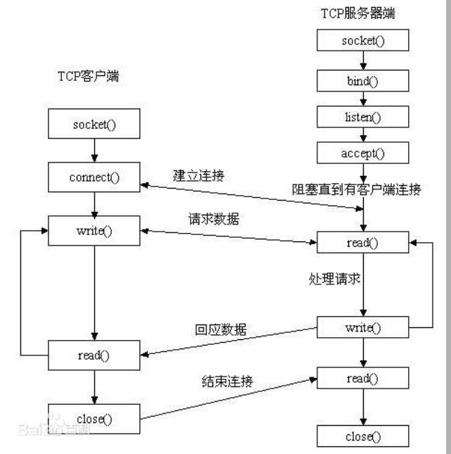

# REVIEW
>
> 先分为五大板块
>
> 基础-类，变量，抽象，接口，常规操作，异常 - [Review_javaBase](zh-cn/刷题/Review_java/Review_javaBase.md)
>
> 容器：- [Review_javaContainer.md](zh-cn/刷题/Review_java/Review_javaContainer.md)
>
> 网络编程 - [Review_NetWork](zh-cn/刷题/Review_java/Review_NetWork.md)
>
> 线程  - [Review_Thread.md](zh-cn/刷题/Review_java/Review_Thread.md)
>
> java同其他的交互 - [Review_javaInteraction](zh-cn/刷题/Review_java/Review_javaInteraction.md)
>

# 网络编程
> 核心：socket操作
> 
> 思路：思考客户端要干什么，服务器端要干什么？
> 

## 服务器端
- 服务器端初始流程4步如下：
 -（1）调用socket函数，建立一个套接字，该套接字用于接下来的网络通信。
 -（2）调用bind函数，将该套接字绑定到一个地址，并制定一个端口号，
 -（3）调用listen函数，使用该套接字监听连接请求
 -（4）当请求来到时，调用accept函数复制该套接字处理请求

## 客户端
- 客户端初始流程2步如下：
 -（1）调用socket函数，创建一个套接字
 -（2）调用connect函数使用该套接字与服务器进行连接

## 区别
- 服务器端和客户端程序的显著区别在于**客户端程序不需要调用bind函数**，
  bind函数的作用是**将套接字绑定一个IP地址和端口号**，因为这两个元素可以在网络环境中唯一地址表示一个进程。
  如果套接字没有使用bind函数绑定地址和端口，那么调用listen函数和connect函数的时候内核会自动为套接字绑定。
  由此可知，如果没有使用bind函数，调用listen函数和connect函数的时候内核会自动为套接字绑定。
  看起来好像bind函数是多余的，但事实并不是这样。

- 我们先来看看listen函数和connect是怎么绑定套接字的，connect函数绑定套接字的时候使用的是一个设置好的地址结构（sockaddr_in）作为参数，
  结构中指定了服务器的地址和需要通信的端口号。但是listen函数没有这个参数，多以listen函数不能够使用设置好的地址结构，
  只能由系统设置IP地址和端口号。也就是说在服务器端，如果不使用bind函数的话，创建套接字时使用的是当前系统中空闲端口的套接字。

- 这样的话，服务器端的程序不关心客户端的IP地址，也就说是对应的端口号是内核临时指派的一个端口，是随机的，
  每次执行服务器程序的时候，使用的都是不同的端口。但是在客户端是需要指定通信的服务器的端口的，
  如果不使用bind函数，每次的端口是随机的话，那么每次重启服务程序之后都要对客户端的程序进行调整，
  这样做不仅不合理，而且工作量很大，因此在服务器端bind函数作用非常重要。

