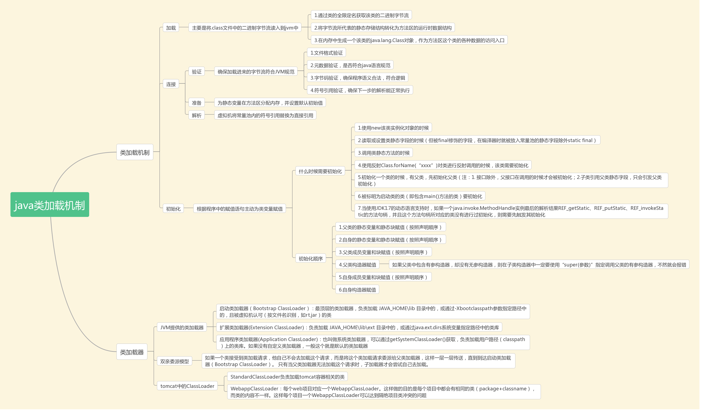

# REVIEW
>
> 先分为五大板块
> 
> 基础-类，变量，抽象，接口，常规操作，异常 - [Review_javaBase](zh-cn/刷题/Review_java/Review_javaBase.md)
> 
> 容器：- [Review_javaContainer.md](zh-cn/刷题/Review_java/Review_javaContainer.md)
> 
> 网络编程 - [Review_NetWork](zh-cn/刷题/Review_java/Review_NetWork.md)
> 
> 线程  - [Review_Thread.md](zh-cn/刷题/Review_java/Review_Thread.md)
> 
> java同其他的交互 - [Review_javaInteraction](zh-cn/刷题/Review_java/Review_javaInteraction.md)
>

# 前言
- Thinking is more important than learning
## java
- java 无非是一门操作语言，我需要将它的每一个基本操作都掌握
- 重点掌握的是容器，线程，java同其它的交互


# 基础

## 父子类

- 子类**不**可以继承父类的无参构造函数，**不**可以继承父类的有参构造函数。---都是**调用**
- 子类可以在自己的构造函数中使用`super关键字`来调用父类的含参数构造函数，但这个调用语句必须是子类构造函数的第一个可执行语句。
- 子类需要用`super()`调用父类**有参构造器**，且`super()`位于子类构造器的**第一行**。
- 在创建子类的对象时，若不含带参构造函数，将先执行父类的无参构造函数，然后再执行自己的无参构造函数

- 子类调用的方法都是实例化的子类中的重写方法，只有**明确调用**了super.xxx关键词或者是子类中**没有该方法**时，才会去调用父类相同的同名方法。

- 在调用子类构造器之前，会先调用父类构造器，当子类构造器中没有使用"super(参数或无参数)"指定调用父类构造器时，是默认调用父类的无参构造器，
  如果父类中包含有参构造器，却没有无参构造器，则在子类构造器中**一定要使用**“super(参数)”指定调用父类的有参构造器，不然就会**报错**。

  ```
      static class A {
        public static void main(String[] args) {
         System.out.println(new B().getValue());
        }
  
    
              protected int value;
              public A (int v) {
                  setValue(v);
              }
        public void setValue(int value) {
             this.value= value;
              }
         public int getValue() {
        
        try{
          setValue(value);
         }finally{
                out(value);
              return value;
            }
              }
              }
              
              class B extends A{
                public B(){
                  super(5);
                  setValue(getValue() - 3);
                }
                
                 public void setValue(int value) {
                  super.setValue(2 * value);
              }
              }
  
  
  ```

- 上述方法执行--- super（5） ---虽然进入了父类构造器，但是子类有set方法就得走子类的,所以5*2=10---
- 然后走get 故技重施--再走子类的set---输出---20 
- 再走20-3=17 再set 17*2=34  此时再走get 34*2---输出68 再走main的68
--- 20 68 68


## 构造函数**不能被继承**，构造方法只能被显式或隐式的调用。


## 构造器：
- 构造器本身并没有任何返回值
- 构造方法的主要作用是完成对类的对象的初始化工作
- 不能被继承,只能被调用

## 基本数据类型
- 基本数据类型包括byte、int、char、long、float、double、boolean和short。
- float x = 1；与float x = 1.0f，这两种对于float类型的变量来说定义的方式都是正确的，也是比较常见的笔试题里面考察类型转换的例子
- 常用的带小数的数字我们一般都直接使用double类型，而double类型直接定义是没有问题的：double x = 1.0。
- 由于float的精度没有double类型高，因此必须对其进行显示的格式书写，如果没有这个f，就默认是double类型了。

- 当多个精度的数字同时进行运算时，最终结果以**最高精度**为准

- 在多数情况下，整数和小数的各级混合运算中，一般结果都是double类型的。

### 注意:String不是基本数据类型
-  java.lang.String类是final类型的，因此不可以继承这个类、不能修改这个类。为了提高效率节省空间，我们应该用StringBuffer类。

## this
> this代表的是调用这个函数的**对象的引用**,而静态方法是属于类的,不属于对象,静态方法成功加载后,对象还不一定存在(super同理)
>
> 所以正常操作中区分一下是不是对象就可以知道this了。。
> 
- this的使用时针对在方法内部使局部变量等值于实例变量而使用的一个关键字，此处的n是静态变量而非实例变量 
- 什么是实例变量：就是需要new 一个对象出来才能使用的

- 有一个普通的原则, 
  - 因为静态方法(static method) 总是跟 CLASS 相关联(bind CLASS), 
  - 而动态方法( (instance method) 总是跟 instance object 相关联, 
  - 所以,静态方法(static method)永远不可以Access跟 object 相关的动态成员(instance member),
  - 反过来就可以, 一个CLASS的 instance object 可以 Access 这个 Class 的任何成员, 包括静态成员(static member).


### 3f
- final 用于声明属性，方法和类，分别表示属性不可变，方法不可覆盖，类不可继承。
- finally是异常处理语句结构的一部分，表示总是执行。
- finalize是Object类的一个方法，在垃圾收集器执行的时候会调用被回收对象的此方法，可以覆盖此方法提供垃圾收集时的其他资源回收，例如关闭文件等


### 请说明Comparable和Comparator**接口**的作用以及它们的区别
- Java提供了只包含一个compareTo()方法的Comparable接口。
  这个方法可以个给两个对象排序。
  具体来说，它返回负数，0，正数来表明输入对象小于，等于，大于已经存在的对象。
- Java提供了包含compare()和equals()两个方法的Comparator接口。
  compare()方法用来给两个输入参数排序，返回负数，0，正数表明第一个参数是小于，等于，大于第二个参数。
  equals()方法需要一个对象作为参数，它用来决定输入参数是否和comparator相等。
  只有当输入参数也是一个comparator并且输入参数和当前comparator的排序结果是相同的时候，这个方法才返回true。


## if
> 
> 两个点：一个是if() ()里的**走向**-----  然后if(true)才会走下面的语句
> 一个是（）里的**内容每次都会被执行**
> 
> if(a&&b)中，如果a结果为true时，才继续判断b,如果a结果为false,则直接不用判断b
> 
- if (++x > 2)  即便不成功，此时x也会增加的 
- if ((++x > 2) && (++y > 2) && (k++ > 2))
  - 运行逻辑 若(++x > 2) 成功就会走(++y > 2)
  - 然后  (++y > 2)成功就会走 (k++ > 2)
    
- 以后在循环判断中列出以下格式
    ```
    每次循环z,x,y,k对应数值为：
        z（控制）,x,y,k
           0    1,0,0
           1    2,0,0
           2    3,1,0
           3    4,2,0
           4    5,3,1
    
    ```
  

## 设计思想
### Is-a Has-a like-a
- Is-a(继承关系)
  - 比如 苹果，橘子，梨都是水果，那么就应该使用继承
- Has-a(从属关系)--聚合
  - 比如 电脑是由 显示器，CPU，硬盘等组成的  -- 那么应该把这些类聚合成电脑类
- like-a(组合关系)
  - 比如空调继承于制冷机，但它同时有加热功能，除湿功能 ---那么它应该继承制冷机，并且实现加热接口


### 面向接口编程。
- （该原则说得直白和具体一些就是声明方法的参数类型、方法的返回类型、变量的引用类型时，
  尽可能使用抽象类型而不用具体类型，因为抽象类型可以被它的任何一个子类型所替代，请参考下面的里氏替换原则。）
  
- 里氏替换原则：任何时候都可以用子类型替换掉父类型。--关于里氏替换原则的描述，Barbara Liskov女士的描述比这个要复杂得多，
  - 但简单的说就是能用父类型的地方就一定能使用子类型。
    里氏替换原则可以检查继承关系是否合理，
    如果一个继承关系违背了里氏替换原则，那么这个继承关系一定是错误的，
    需要对代码进行重构。
    例如让猫继承狗，或者狗继承猫，又或者让正方形继承长方形都是错误的继承关系，因为你很容易找到违反里氏替换原则的场景。
    

- 需要注意的是：**子类一定是增加父类的能力而不是减少父类的能力**，因为子类比父类的能力更多，把能力多的对象当成能力少的对象来用当然没有任何问题。

- 接口隔离原则：接口要小而专，绝不能大而全。
 - 例如，琴棋书画就应该分别设计为四个接口，而不应设计成一个接口中的四个方法，
   - 因为如果设计成一个接口中的四个方法，那么这个接口很难用，毕竟琴棋书画四样都精通的人还是少数，
   - 而如果设计成四个接口，会几项就实现几个接口，这样的话每个接口被复用的可能性是很高的。
     
- Java中的**接口代表能力、代表约定、代表角色**，能否正确的使用接口一定是编程水平高低的重要标识。


- 合成聚合复用原则：优先使用聚合或合成关系复用代码
- 记住：任何时候都不要继承工具类，工具是可以拥有并可以使用的，而不是拿来继承的。(直接拿方法把>?)

- 迪米特法则：
    - 迪米特法则又叫最少知识原则，一个对象应当对其他对象有尽可能少的了解。
    - 再复杂的系统都可以为用户提供一个简单的门面，
    - Java Web开发中作为前端控制器的Servlet或Filter不就是一个门面吗，
      浏览器对服务器的运作方式一无所知，但是通过前端控制器就能够根据你的请求得到相应的服务。
      
- 调停者模式也可以举一个简单的例子来说明，
  - 例如一台计算机，CPU、内存、硬盘、显卡、声卡各种设备需要相互配合才能很好的工作，
  - 但是如果这些东西都直接连接到一起，计算机的布线将异常复杂，
  - 在这种情况下，主板作为一个调停者的身份出现，它将各个设备连接在一起而**不需要每个设备之间直接交换数据**，这样就减小了系统的耦合度和复杂度


### 请你谈谈如何通过反射创建对象？
- 方法1：通过类对象调用newInstance()方法，
  - 例如：String.class.newInstance();
  
- 方法2：通过类对象的getConstructor()或getDeclaredConstructor()方法获得构造器（Constructor）对象并调用其newInstance()方法创建对象，
  - 例如：String.class.getConstructor(String.class).newInstance("Hello");
  


## java处理流程

### 类中
- 静态成员变量或静态代码块>main方法（也是static的）>非静态成员变量或非静态代码块>构造方法


- 方法名不能以数字开头，编译通不过
- ，t.run();并不是对线程的启动，如果是t.start();才是对线程的启动，因此就是一个简单方法的调用。
  按照代码的执行顺序输出结果即可

- out中的值，如果在out中也会参与运算。


### 接口
- 静态方法，只能通过**接口名调用**，不可以通过实现类的类名或者实现类的对象调用。default方法，只能通过**接口实现类的对象**来调用。

- 接口**多继承**:::`interface abcd extends a,b,c,d{}`


### 抽象类
- 有方法体(带有{}的就是方法体，即使里面是空的)，就不能作为抽象方法
- 被动引用不会出发子类初始化
  - 1.子类引用父类的静态字段，只会触发子类的加载、父类的初始化，不会导致子类初始化
  - 2.通过数组定义来引用类，不会触发此类的初始化
  - 3.常量在编译阶段会进行常量优化，将常量存入调用类的常量池中， 本质上并没有直接引用到定义常量的类，因此不会触发定义常量的类的初始化。
- 抽象方法是仅声明，并不做实现的方法

- 1、抽象类不能被实例化，实例化的工作应该交由它的子类来完成，它只需要有一个引用即可。
- 2、抽象方法必须由子类来进行重写。
- 3、只要包含一个抽象方法的类，该类必须要定义成抽象类，不管是否还包含有其他方法。
- 4、抽象类中可以包含具体的方法，当然也可以不包含抽象方法。
- 5、abstract不能与final并列修饰同一个类。
- 6、abstract 不能与private、static、final或native并列修饰同一个方法。


## 接口和抽象类的语法区别：
- 1）接口**不能有构造方法**，抽象类可以有。-----所以我尝试用spring获取接口的bean失败...
- 2）接口不能有方法体，抽象类可以有。
- 3）接口不能有静态方法，抽象类可以有。
- 4）在接口中凡是变量必须是public static final，而在抽象类中没有要求。


- (short)10/10.2*2，而不是(short) (10/10.2*2)，前者只是把10强转为short，又由于式子中存在浮点数，所以会对结果值进行一个自动类型的提升，
  浮点数默认为double，所以答案是double；后者是把计算完之后值强转short。
- 强制类型转换的优先级高于+ - * /

### 重写，重载
- 重写。。，--同名同参--equals,toString
  - 两同两小一大原则，
    - 即：方法名相同，参数类型相同。
    - 子类返回类型小于等于父类方法返回类型。
    - 子类抛出异常小于等于父类方法抛出异常。
    - 子类访问权限大于等于父类方法访问权限。
- 重载  --- 同名，不同参--构造器
  - 返回类型不能作为重载的依据
    - 方法重载的定义：同一个类或与他的派生类中，**方法名相同**，而**参数列表不同的方法**。其中参数列表不同指的是参数的类型，数量，类型的顺序这三种至少有一种不同。
  - 方法重载与下列无关：
    - 与返回值类型无关；与访问修饰符无关
    - 构造方法也可以重载

## 变量
- 局部变量是指类方法中的变量，必须初始化。int i = 0；
  局部变量运行时被分配在栈中，量大，生命周期短，如果虚拟机给每个局部变量都初始化一下，是一笔很大的开销，但变量不初始化为默认值就使用是不安全的。
  出于速度和安全性两个方面的综合考虑，解决方案就是虚拟机不初始化，但要求编写者一定要在使用前给变量赋值。

- 定义在类中的变量是类的成员变量，可以不进行初始化，Java会自动进行初始化，
- 被static关键字修饰的变量是静态的，静态变量**随着类的加载而加载**，所以也被称为类变量
  被final修饰发变量是常量


## 数组与容器的区别
> 容器和数组的区别：
> 
> 数组是一个对象，不同类型的数组具有不同的类
> 
- 1.创建方式：
  - 创建数组时必须指定其大小；
  - 而容器不必指定，可动态改变其大小。
- 2.存储方式：
  - 数组在内存空间上是连续存储的；
  - 而容器中顺序容器vector和deque是连续存储的（deque与vector 不同的是它支持高效地在其首部插入和
    删除元素），但list是链式存储的。
- 3.访问效率：
  - 访问数组元素时可根据数组下标直接访问相应位置的元素；而容器中顺序容器vector和deque支持对元素
    的随机访问(也支持下标访问元素，或at()函数，如ivec.at(5)返回容器ivec中第6个元素)，但list不支
    持。
- 4.元素操作：
  - list支持在容器中间位置插入或删除元素，而其他的不支持。
  - 一个指针必然是三种状态之一：
    - 保存一个特定对象的地址，指向某个对象后面的另一个对象，或者是0值，表明不指向任何对象


- 数组(Array)和列表(ArrayList)的区别？什么时候应该使用Array而不是ArrayList？
- Array和ArrayList的不同点：
  - Array可以包含**基本类型和对象类型**，ArrayList只能包含**对象类型**。-->对象类型..(数组也属于对象类型)
  - Array大小是固定的，ArrayList的大小是动态变化的。
  - ArrayList提供了更多的方法和特性，比如：addAll()，removeAll()，iterator()等等。
  - 对于基本类型数据，集合使用自动装箱来减少编码工作量。但是，当处理固定大小的基本数据类型的时候，这种方式相对比较慢。
  
### 数组

- 数组分配：
  - 先分配高维空间，再分配低维空间，所以二维是必须先定义，一维可以后续分配。
  

### 类
- 虚拟机规范严格规定了有且只有五种情况必须立即对类进行“初始化”：
  - 1. 使用new关键字实例化对象的时候、读取或设置一个类的静态字段的时候，已经调用一个类的静态方法的时候。
  - 2. 使用java.lang.reflect包的方法对类进行反射调用的时候，如果类没有初始化，则需要先触发其初始化。
  - 3. 当初始化一个类的时候，如果发现其父类没有被初始化就会先初始化它的父类。
  - 4. 当虚拟机启动的时候，用户需要指定一个要执行的主类（就是包含main()方法的那个类），虚拟机会先初始化这个类；
  - 5. 使用Jdk1.7动态语言支持的时候的一些情况。

### hashCode--equals
- (1)如果两个对象相同（equals方法返回true），那么它们的hashCode值一定要相同
- (2)如果两个对象的hashCode相同，它们并不一定相同。


### 形参与实参
> 通过形参与实参在函数中位置来进行区分，两者区别如下：

- 一、主体不同
  - 1、实参：在调用有参函数时，函数名后面括号中的参数为“实际参数”。
  - 2、形参：不是实际存在变量，又称虚拟变量。
- 二、目的不同
  - 1、实参：可以是常量、变量或表达式， 无论实参是何种类型的量，在进行函数调用时，都**必须具有确定的值**， 以便把这些值传送给形参。
  - 2、形参：定义函数名和函数体的时候使用的参数，目的是用来接收调用该函数时传入的参数。
- 三、特点不同
  - 1、实参：在调用函数过程中，系统会把实参的值传递给被调用函数的形参。或者说，形参从实参得到一个值。该值在函数调用期间有效，可以参加该函数中的运算。
  - 2、形参：形参的本质是一个名字，不占用内存空间。


# 序列化
- 把你看得懂的转换为看不懂的，就是序列化。
  把你看不懂的转换为看得懂的，就是反序列化。

- String的源码 public final class String implements java.io.Serializable, Comparable<String>, CharSequence


# JVM
- 首先理解一下内存泄漏的概念，内存泄漏就是对象引用消失了，对象内存却没有被回收。
  - FullGC 是老年代内存空间不足的时候，才会触发的，老年代一般是生命周期较长的对象或者大对象，频繁的 FullGC 不会可能会影响程序性能（因为内存回收需要消耗CPU等资源），但是并不会直接导致内存泄漏。
  - JVM奔溃的可能是内存溢出引起的，也可能是其他导致 JVM崩溃的操作，例如设置了错误的JVM参数等。
  - 内存异常，最常见的 就是 StackOverFlow 了把，内存溢出，其实内存泄漏的最终结果就是内存溢出。所以，基本上C是对的答案。
  - Java 进程异常消失，这个明显不对的。
  


# 异常
- 如果不使用 e.printStackTrace();  是不会打印异常的,直接运行结果
- 如果catch中  有throw new RuntimeException();  那么程序运行完finally就不运行了,不会运行主类下来的步骤了
   - 如果是打印e.printStackTrace();  那主类的接下来还会走的
   - try中加异常主类也还是会继续走.
  
- 所以正常异常处理try-catch代码块中的,但是catch抛出,直接影响到类


# 类加载




