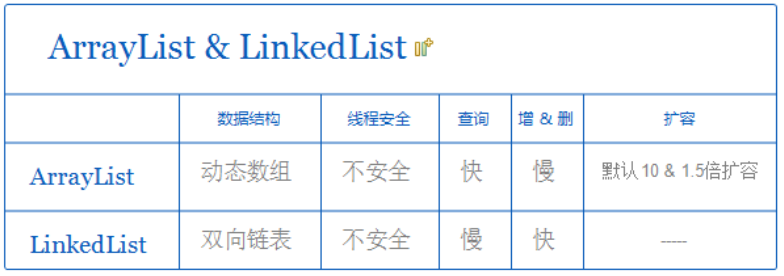

# REVIEW
>
> 先分为五大板块
>
> 基础-类，变量，抽象，接口，常规操作，异常 - [Review_javaBase](zh-cn/刷题/Review_java/Review_javaBase.md)
>
> 容器：- [Review_javaContainer.md](zh-cn/刷题/Review_java/Review_javaContainer.md)
>
> 网络编程 - [Review_NetWork](zh-cn/刷题/Review_java/Review_NetWork.md)
>
> 线程  - [Review_Thread.md](zh-cn/刷题/Review_java/Review_Thread.md)
>
> java同其他的交互 - [Review_javaInteraction](zh-cn/刷题/Review_java/Review_javaInteraction.md)
>

# 容器
# SET LIST
## list
- ArrayList与LinkedList都实现了List接口，继承了AbstractList类。
- ArrayList底层是动态数组是实现，随机位置添加和删除，都需要移动数组的数据，而LinkedList底层是双向链表，只需要修改Node节点的引用。

# MAP
> Map 里的key、value**不能**为基本数据类型
## HashMap
- HashMap实现了Map接口的，它的Key和Value都可以是null，但是Hashtable(注意大小写：不是HashTable)，Key和Value都不能是null
- HashMap中只能有一个键作为null，但是可以有多个value为null；
- HashMap中是不允许使用基本数据类型作为key与value的，其实和HashMap底层的存储原理有关，
    - 1.HashMap**存储数据的特点**是：无序、无索引、不能存储重复元素。
    - 2.存储元素采用的是hash表存储数据，每存储一个对象的时候，都会调用其hashCode()方法，算出其hash值，
      如果相同，则认为是相同的数据，直接不存储，如果hash值不同，则再调用其equals方法进行比较，如果返回true，则认为是相同的对象，不存储，
      如果返回false，则认为是不同的对象，可以存储到HashMap集合中。
    - 3.对于HashMap，**首先判断**其key与HashMap中存储的元素是否相同，不同**再判断**value是否相同，
      2个都不相同就会认为这个键值对在HashMap中不存在，将其放入。
    - 4.之所以key与value**不能为基本数据类型**，则是因为基本数据类型不能调用其hashcode()方法和equals()方法，进行比较，
      所以HashMap集合的key与value只能为引用数据类型，不能为基本数据类型，可以使用基本数据类型的包装类，例如Integer Double等

- TreeMap实现SortMap接口，能够把它保存的记录根据键排序,默认是按键值的升序排序，也可以指定排序的比较器，当用Iterator 遍历TreeMap时，得到的记录是排过序的

- 一般情况下，我们用的最多的是HashMap,在Map 中插入、删除和定位元素，HashMap 是最好的选择。但如果您要按自然顺序或自定义顺序遍历键，那么TreeMap会更好。
  如果需要输出的顺序和输入的相同,那么用LinkedHashMap 可以实现,它还可以按读取顺序来排列.

- HashMap不支持线程同步，即任一时刻可以有多个线程同时写HashMap，可能会导致数据的不一致性。
  如果需要同步，可以用Collections的synchronizedMap方法使HashMap具有同步的能力。

- Hashtable与HashMap类似，不同的是：它不允许记录的键或者值为空；
  它支持线程的同步，即任一时刻只有一个线程能写Hashtable，因此也导致了Hashtable在写入时会比较慢。
  

