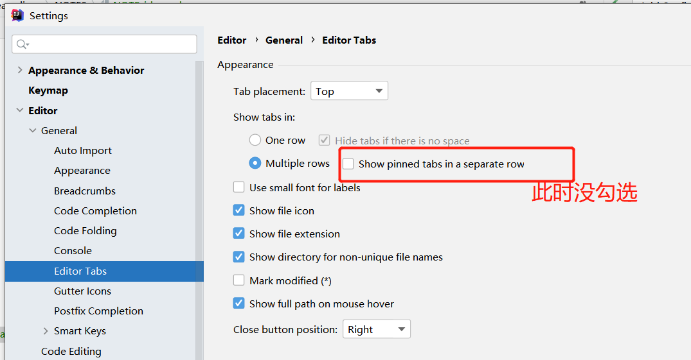
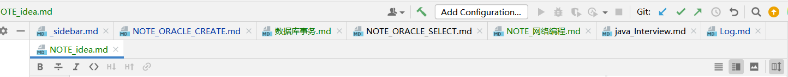
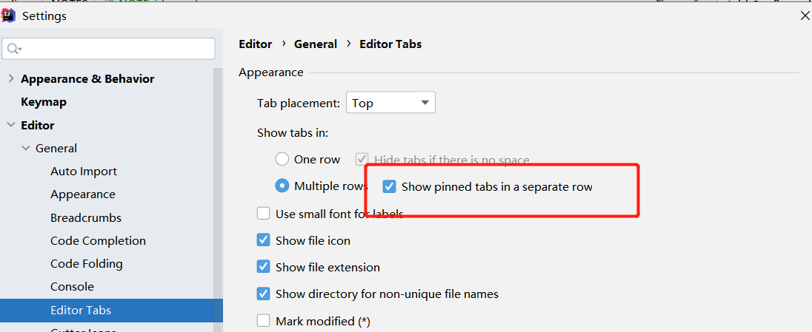
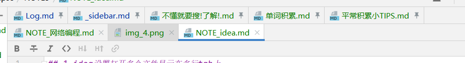
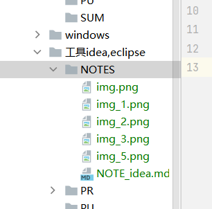
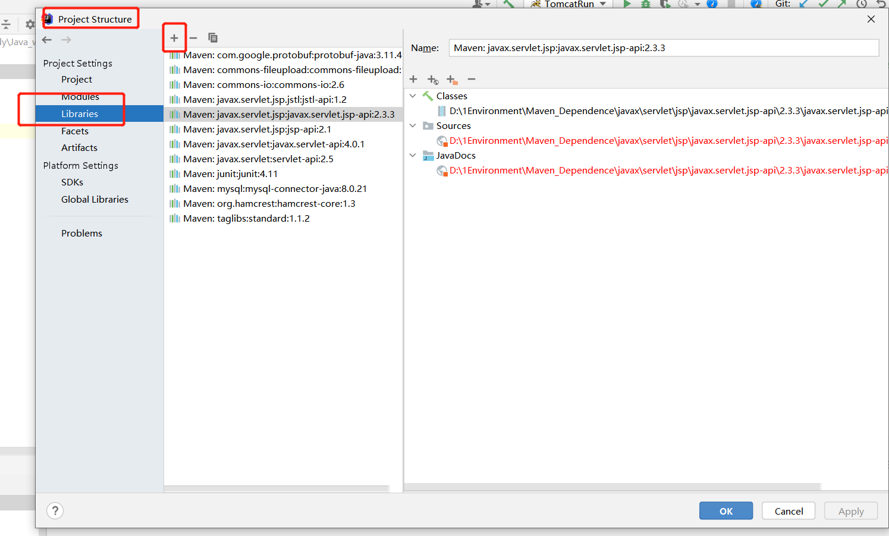
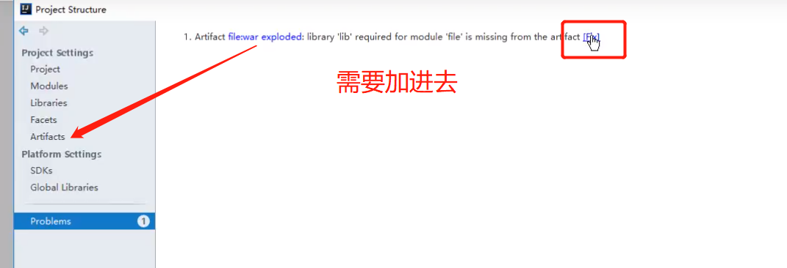

## 1.idea设置打开多个文件显示在多行tab上
idea上打开多个文件编辑时如果文件全部显示在同一个tab中，我们可以设置显示出所有的文件

设置方法：
File -setting
- Editor->General->Editor tabs
    - 2021之前的版本 不勾选show tabs in single row
    - 2021后的 
  

      


-


      
      两种都是开多了，会自动关闭一些（**要注意**） 勾选后，你右键标签选过的pin tap将会在上层显示

## 当你复制图片时，会在本地导入一个
  

  值得注意的是，你目前10，**删除第四个，新建的便是第四个**  
  
## 更改新建文件的作者名
- idea\idea64\bin  idea目录下的 两个文件  
  -  idea.exe.vmoptions
  - idea64.exe.vmoptions
  - 两个里面加入-Duser.name=zjz（要设置的）


## 回退
- 开发项目最头疼的就是代码版本迭代管理，不过这个问题可以通过版本控制工具 Git、SVN 等工具来解决。
- IDEA 还提供了本地历史记录功能，方便回滚。项目右键 -> Local History -> Show History。


## 手动导包
- 1.先加到文件夹下，
- 2.配置到library



- 3.添加到发布中Artifacts




## module
- 我们知道：在 IntelliJ IDEA 中Project是最顶级的结构单元，然后就是Module，
  一个Project可以有多个Module。目前，主流的大型项目结构基本都是多Module的结构，
  这类项目一般是按功能划分的， 比如：user-core-module、user-facade-module和user-hessian-module等等，
  模块之间彼此可以相互依赖。通过这些Module的命名可以看出，它们都是处于同一个项目中的模块，彼此之间是有着不可分割的业务关系。
  因此，我们可以大致总结出：一个Project是由一个或多个Module组成，
  - 当为单Module项目的时候，这个单独的Module实际上就是一个Project；
  - 当为多Module项目的时候，多个模块处于同一个Project之中，此时彼此之间具有互相依赖的关联关系。
  
> 子module会继承父的所有依赖，配置
> 
> 怎么将一个普通项目变module --- 需要将它的pom文件激活（maven编译）
```
    IntelliJ IDEA 的Project是一个不具备任何编码设置、构建等开发功能的概念，
    其主要作用就是起到一个项目定义、范围约束、规范类型的效果，
    或许，我们也可以简单地理解Project就是一个单纯的目录，
    只是这个目录在命名上必须有其代表性的意义。
    在缺省情况下，IntelliJ IDEA 是默认单Project单Module的，
    这时Project和Module合二为一，在没有修改存储路径的时候，显然Project对Module具有强约束作用！
    不过说实话，这里就是将Module的内容放在了Project的目录下，实际上还是Module自己约束自己。
```

- 上面加作者信息
- File--->Settings---->Editor---->File and Code Templates --->Includes--->File Header:

