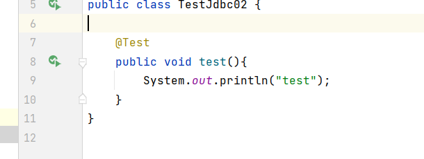

# 单元测试
- 只要简简单单的就可以执行方法
## 步骤
- 1.导包
```
    <!-- 单元测试 -->
    <dependency>
        <groupId>junit</groupId>
        <artifactId>junit</artifactId>
        <version>4.11</version>
    </dependency>
```
- 2.简单使用
 - 在要测试的**方法**上加入一个@Test就行，然后左栏运行
 - 只在方法上使用
