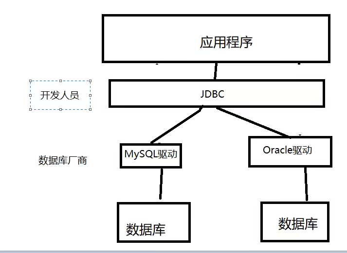
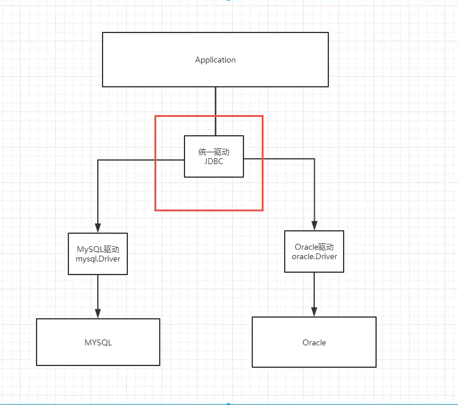

[TOC]
#JDBC
### 带着问题去学习，每学完部分后回来思考

> 定义？
 - java操作数据库的规范------思考：规范什么？ 

   
 
> 
> 作用？
> 
> 基本操作
> 
> 涉及（查缺补漏）
- 反射： Class，类加载器的操作
- 


## 一.概述及配置
- 位置所在

  
- 需要jar包的支持
    - java.sql
    - javax.sql
    - mysql-connect-java…连接驱动，必须要导入--Oracle导入Oracle
    

## 二.JDBC固定步骤：
- 1.加载驱动,         ------驱动管理者注册
- 2.连接数据库，代表数据库  -----驱动管理者连接
- 3.**创建**向数据库发送SQL的**对象Statement**：CRUD  -----创造一个对象（数据库的声明）
- 4.编写SQL（根据业务，不同的SQL）
- 5.执行SQL           -   ------用对象Statement的方法来执行（execute）
    - 执行 select 语句后有结果集
    - 增删改都是update
- 6.如果有结果集，遍历处理结果集信息  对象Statement的next方法
    - next()如果有下一条记录返回 true,否则为 false; 有，则游标向下一条记录.
- 7.关闭连接

### 对于connection 代表数据库
- 它可以处理数据库事务 
  - 设置自动提交   connection.rollback();
  - 事务提交   connection.commit();
  - 事务回滚   connection.setAutoCommit();
  
- 用于创建Statement和prepareStatement
  
### 对于Statement和prepareStatement（防止SQL注入）
- 1.Statement = connection.createStatement();   // 此时没参数进入
  - ResultSet resultSet = Statement.executeQuery();  // 执行查询，返回结果集----之后结果集获取(get)参数
  - int i = Statement.executeUpdate(); // 执行增删改，返回一个影响的行数
  - Statement.execute();  // 执行任何sql
- 2.preparedStatement = connection.prepareStatement(sql); // 预处理的参数
  - ResultSet resultSet = preparedStatement.executeQuery(); // 执行查询，返回结果集----之后结果集获取(get)参数
  - int i = preparedStatement.executeUpdate();// 执行增删改，返回一个影响的行数
  - Statement.execute();  // 执行任何sql

### 对于ResultSet
- 获取数据：
  - resultSet.getInt("id");   // 参数为列类型
  - resultSet.getString("name");
  - resultSet.getObject("列名"); // 在不知道列类型的时候使用
- 遍历，指针
  - resultSet.next(); // 移动到下一个数据
  - resultSet.beforeFirst();  // 移动到最前面
  - resultSet.afterLast(); // 移动到最后面
  - resultSet.previous(); // 移动到前一行
  - resultSet.absolute(); // 移动到指定行
  
- 设置数据时需注意：：：
  - resultSet.setInt(1,5);      // 占位符从1开始的值是从1开始记，而数组是从0开始记的
  - resultSet.setString(2,"name");
  - resultSet.setObject(3,"列名");
  - 一般set值直接 
  ```
       for(int i = 0;i<len;i++){
          //setObject 占位符从1开始，数组是从0开始
          preparedStatement.setObject(i+1,params[i]);
      } 
  ```

## 三.连接过程
### 正规流程 
- 直接获取确定的值 Statement
```
  //1. 注册一个 driver
  a。反射机制方式---直接加载完。。
  Class.forName(“oracle.jdbc.driver.OracleDriver”);  //oracle
  Class.forName("com.mysql.jdbc.Driver");           //sql
  b。对象方式---需要DriverManage辅助
  Driver drv = new oracle.jdbc.driver.OracleDriver(); //oracle
     DriverManager.registerDriver(drv);
       Driver driver = new com.mysql.jdbc.Driver();//sql
        DriverManager.registerDriver(driver);
        
   //2.连接数据库,代表数据库
        Connection connection = DriverManager.getConnection(url, username, password);
     //3.获得一个 Statement 对象
        Statement statement = connection.createStatement();
        
       //4.编写sql
        String sql = "select * from users;";
        
        String sqlI = "users(id,name,password,email,birthday)
       values(6,'哈六','123456','zjz06@qq.com','2020-08-29');";
        String sqlD = "delete from users where id = 6";       
        String sqlU = "update from users set name = '改' where id = '6';
        
        
        //5.执行查询sql，返回一个ResultSet：结果集
        statement. executeUpdate(sqlI/D/U);//执行 update 方法--增删改都走这
        //可以拿int 拿update的值，它只会返回受影响的行数
        int i =  statement. executeUpdate(sqlI/D/U);
        ResultSet resultSet = statement.executeQuery(sql);  //执行查询方法 
        //6.遍历处理结果集信息
         while (resultSet.next()){
            System.out.println("id： " +resultSet.getObject("id"));
            System.out.println("name： " +resultSet.getObject("name"));
            System.out.println("password； " +resultSet.getObject("password"));
            System.out.println("email； " +resultSet.getObject("email"));
            System.out.println("birthday； " +resultSet.getObject("birthday"));
            System.out.println("--------------------------------------------");
        }
```
### 预编译流程（重要）
- preparedStatement

```
 
  public class TestJdbc01 {
      public static void main(String[] args) throws ClassNotFoundException, SQLException {
          //配置信息
          //解决中文乱码
          String url = "jdbc:mysql://localhost:3306/jdbc?useUnicode=true&characterEncoding=utf-8";
          String username = "root";
          String password= "123456";
  
          //1.加载驱动
  //       Driver drv = Class.forName("com.mysql.jdbc.Driver"); // 获取Driver对象
          Driver driver = new com.mysql.jdbc.Driver();  // 获取Driver对象
          DriverManager.registerDriver(driver);
          //2.连接数据库,
          Connection connection = DriverManager.getConnection(url, username, password);
  
          //3.编写sql
          String sql = "insert into users(id, name, password, email, birthday)values (?,?,?,?,?)";
  
          //4.获得一个 Statement 对象
          PreparedStatement preparedStatement = connection.prepareStatement(sql);
          preparedStatement.setInt(1,6);//给第一个占位符？的值赋值
          preparedStatement.setString(2,"zjz");//给第二个占位符？的值赋值
          preparedStatement.setString(3,"123456");//给第三个占位符？的值赋值
          preparedStatement.setString(4,"zjz@qq.com");//给第四个占位符？的值赋值
          preparedStatement.setDate(5,new Date(new java.util.Date().getTime()));//给第五个占位符？的值赋值
  
          //5.执行sql
          int i = preparedStatement.executeUpdate();
          if(i>0){
              System.out.println("update成功！");
          }else{
              System.out.println("update失败！");
          }
         //6.关闭连接，释放资源（一定要做）先开后关
          preparedStatement.close();
          connection.close();
      }
  }

```

## SQL注入问题-----使用拼接--获取值
> sql存在漏洞，会被攻击导致数据泄露
  - 比如输入语句种输入"' or '1=1"  将会将所有数据打印出来
  - 正常的语句`select * from smbms_user where userCode = 输入的userCode  AND userPassword = 输入的userPassword;`
    
  - 结果给你送进来 '' or '1=1'
  - ` select * from smbms_user where userCode = '' or '1=1' AND userPassword = '' or '1=1';`
  - userService.login("' or '1=1","' or '1=1");
- 而PreparedStatement可以防止，它将输入进来的参数当作字符，，其中如果存在转义字符（比如说'），自动忽略了
- 所以，很多时候使用PreparedStatement来防止sql注入


## 数据库连接池
>
> 定义，作用
>
> 怎么用？配置


- 1.缘由：：数据库连接--执行完毕--释放
  - 连接---释放，是十分浪费资源的
  - 不池化时，，一个人来了 开门-服务-关门----再来 --再开门--------浪费资源
- 2.池化技术：准备一些预先资源，过来就连接预先准备好的
  - 池化---开门---准备好服务员---服务-----  直到不用了 ---关门
  - 但是请多少服务员合适呢？--- 最小连接，最大连接，等待超时
    - 常用连接10个，，，
    - **最小连接**设置10----**最大连接**：15 业务最高承载上限
    - 如果超了怎么办，，，等待
    - **等待超时**：。。1000ms

- 3.编写连接池，实现一个接口
> 开源数据源实现
- DBCP C3P0  Druid:阿里巴巴的

- 使用了这些数据库连接池之后，我们在项目种就不需要编写连接数据库的代码了！

> DBCP
- 需要的jar包
- commons-dbcp  commons-pool

> C3P0
- 需要的jar包
- mchange-commons-java  c3p0

- 不管使用哪种数据源  DataSource接口不会改变，方法就不会变


