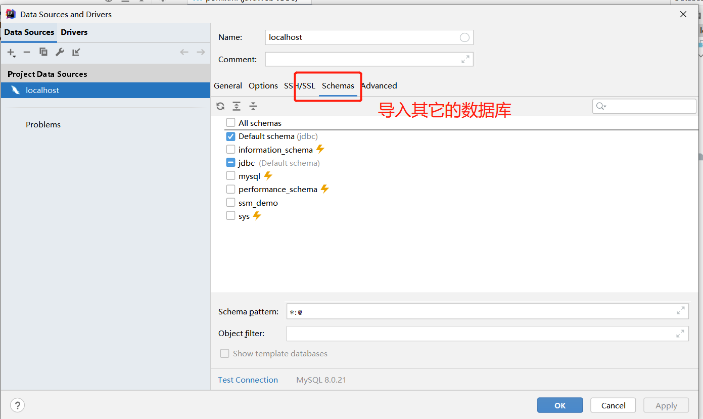

# idea配置数据库

- 1.导入合适的sql，maven依赖
```
<!-- mysql-->
        <dependency>
            <groupId>mysql</groupId>
            <artifactId>mysql-connector-java</artifactId>
            <version>8.0.21</version>
        </dependency>
```
详细见- [①mysql8021安装包及安装](zh-cn/数据库/SQL/NOTES/mysql8021安装包及安装.md)

