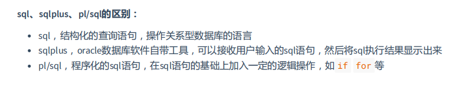

## 基本查询命令

### 1. **数据库对象**是数据库的组成部分，常常用 **CREATE命令**进行**创建**，可以使用 **ALTER 命令修**改，用 **DROP
- 执行删除**操作。常见的数据库对象有：
    ```  
        用户（user）
        表（table）
        视图（view）
        索引（index）
        触发器（trigger）
        存储过程（procedure）
        同义词（synonym）
        序列（sequence）
    ```

### 2.**DML语句需要事务的支持（产生事务），DDL语句会自动提交事务**   
    
    ```
        DQL (Data Query Language)，数据查询语言
        用于检索数据库中的数据，主要是 SELECT 语句
    
        DML (Data Manipulation Language)，数据操纵语言
        用于改变数据库中的数据，主要是 INSERT , UPDATE , DELETE 语句
    
        
        DDL（Data Define Langage)，数据定义语言
        用来建立、修改、删除数据库对象，主要是 CREATE 、 ALTER 、 DROP 、 TRUNCATE 语句
    
        TCL (Transaction Control Language)，事务控制语言
        用于维护数据的一致性，主要是 COMMIT , ROLLBACK , SAVEPOINT 语句
    
        DCL（Data Control Language），数据控制功能
        用于执行权限授予和权限收回操作，主要是 GRANT , REVOKE 语句
    ```



## 3.select语句，
- 可以通过列名，把一行行的数据给查询出来，语法为：
- select查询语句
    ```
    select 字段1,字段2
    from 表 
    where 条件 
    group by 分组条件 
    having 分组筛选条件 
    order by 排序条件
    ```
- select语句执行顺序：
    - 1. from子句，组装来自表的数据，有可能是多张表
    - 2. where子句，基于指定的条件对记录行进行筛选
    - 3. group by子句，将数据划分为多个分组
    - 4. 使用聚合函数对没个小组中的数据进行计算
    - 5. having子句，进行条件筛选，这里可以使用聚合函数的计算结果
    - 6. 计算所有的运算表达式，主要是select部分
    - 7. order by子句，对结果集进行排序
    ```
    SELECT AVG(TRAN_TIME) AS aaa 
    FROM ENSEMBLE.CIF_CLIENT_DOCUMENT 
    WHERE DOCUMENT_TYPE = '120' 
    GROUP BY CLIENT_NO 
    HAVING CLIENT_NO ='1000001802'  //不能用aaa操作
    ORDER BY aaa DESC
    
    ```

- 注意1，where后面一定【不能】出现组函数    错误的ex: where AVG(TRAN_TIME) = xxx
- 注意2，如果select、having语句后面出现了组函数，那么select、having后面没有被组函数修饰的列，就必须出现在group by 后面 （非常重要）   


- 聚合函数能够出现的位置：
    - 1. select后面
    - 2. having后面
    - 3. order by后面

## 聚合函数：

- 常用的聚合函数有：直接在列上使用
    - avg ，求平均值
    - count ，计算有多少条数据  与group by配合
    ```
    SELECT CLIENT_NO,COUNT(*) 
    FROM CIF_CLIENT 
    GROUP BY CLIENT_NO
    ```
    - max ，求最大值
    - min ，求最小值
    - sum ，求和
    ```
    SELECT AVG(TRAN_TIME) AS aaa 
    FROM ENSEMBLE.CIF_CLIENT_DOCUMENT 
    GROUP BY CLIENT_NO 
    ORDER BY aaa DESC
    ```


    ```
    select [distinct] * 或者col_name1,col_name2,.. from tb_name;
    ```

- 注意1，语法中出现的中括号[]，表示该部分可有可无
- 注意2，*号表示所有列
- 注意3，col_name1，col_name2代表列名，如果有多个可以**逗号**分开
- 注意4，select语句永远不会对原始数据进行修改
    ```
    //可以进行运算操作
    select  col_name1,col_name2 * 555,.. from tb_name;
    ```


### 4.别名  
    ```
    select old_column [as] new_column_name from tb_name;
    似乎不能 这样操作
    select old_column [as] new_column_name from tb_name where new_column_name = value;
    ```

- 注意，中括号里面的as是可选的

### 5.拼接

    ```
    select col_name||'自己想写的也可加入其中'||col_name from tb_name
    ex:select id,first_name||' '||last_name||','||title as name
    from s_emp;
    ```

- 注意，数据库中的字符串，需要使用单引号括起来

### 6.nvl：使用nvl函数可以将null进行替换
    ```
    select nvl(行,自己想要的value) from tb_name;
    ```

### 7.distinct
- 该关键字可以将重复数据去除。
- 注意，distinct关键词只能放在select关键词后面

### 8.排序

    ```
    select col_name,...
    from tb_name order by col_name [asc|desc]
    ```

- 注意1，order by语句，只对查询记录显示调整，并不改变查询结果，所以执行权最低，最后执行
- 注意2，排序的默认值是asc：表示升序，desc：表示降序
- 注意3，如果有多个列排序，后面的列排序的前提是前面的列排好序以后有重复（相同）的值。


### 9. 条件查询
    ```
    select col_name,...
    from tb_name where col_name 比较操作表达式
    ```
- 注意1，限制查询条件，使用where子句
- 注意2，条件可以多个，使用逻辑操作符或者小括号进行条件的逻辑整合
- 注意3，where子句的优先级别最高
- 注意4，比较操作表达式由操作符和值组成
- 逻辑比较操作符
    - = > < >= <= != 不等于操作符，!= <> ^=三个都表示不等于的意思，经常用的是 **!=**   


- between and 操作符，表示在俩个值之间

    ```
        SELECT BASE_ACCT_NO 
        FROM ENSEMBLE.MB_ACCT 
        WHERE BASE_ACCT_NO BETWEEN 1 and 100
    ```

### in('','',....) ，表示值在一个指定的列表中（常用）


- where 列名 in('value1','value2','value3,'value4','value5')
    ```
        SELECT * 
        FROM ENSEMBLE.MB_ACCT 
        WHERE ACCT_SEQ_NO in('0','1')
    ```

### like 模糊查询，在值不精确的时候使用
- like '%XXX%' ，通配0到多个字符(**常用**)
- like 'XXX_XX' ，通配一个字符，并且是一定要有一个字符
- \ ，转义字符，需要使用 escape 关键字指定，转义字符只能转义后面的一个字符

    ``` 
    %
    SELECT * 
    FROM CIF_CLIENT_DOCUMENT 
    WHERE DOCUMENT_ID LIKE '%12003%'
    ```

    ```
    _
    SELECT * 
    FROM CIF_CLIENT_DOCUMENT 
    WHERE LAST_CHANGE_DATE LIKE '2030070_'
    ```

### 10.is null ，
- 判断值为null的时候使用，null值的判断不能使用等号
    ```
    select id,last_name,commission_pct
    from s_emp where commission_pct is null;
    ```

### and,or 逻辑操作符
- 当条件有多个的时候可以使用
- 注意，and比or的优先级要高


## 函数
- oracle数据库中，内置了很多常用的函数，整体分为：
    ```
    1. 单行函数  每操作一行数据（某个字段值），都会返回一个结果
          字符函数
          日期函数
          数字函数
    2. 转换函数
    3. 聚合函数（多行函数） 它可以操作多行数据，并返回一个结果  
       一般会结合着group分组来使用 也可以独自使用（此时默认全部数据就是一个小组）
      
    ```
   

## 转换函数，
- 可以将一个类型的数据转换为另一种类型的数据
- 1. TO_CHAR ，把一个数字或日期数据转换为字符
- 2. TO_NUMBER ，把字符转换为数字
- 3. TO_DATE ，把字符转换为日期

# TO_DATE('2021-04-15 00:00:00', 'YYYY-MM-DD HH24:MI:SS')（非常常用）


### dual被称之为哑表
- 它是一个单行单列的虚拟表，是Oracle内部自动创建的，这个表只有1列：DUMMY，
- 数据类型为VERCHAR2(1)，dual表中只有一个数据'X'，Oracle有内部逻辑保证dual表中永远只有一条数据。

    ```
    函数    说明
    ASCII(X)   返回字符X的ASCII码 CONCAT(X,Y) 连接字符串X和Y INSTR(X,STR[,START][,N) 从X中查找str，可以指定从start开始，也可以指定从n开始
    LENGTH(X)   返回X的长度
    LOWER(X)   X转换成小写
    UPPER(X)   X转换成大写
    INITCAP(X)   X首字母转换为大写，其他字母小写
    LTRIM(X[,TRIM_STR])   把X的左边截去trim_str字符串，缺省截去空格
    RTRIM(X[,TRIM_STR])   把X的右边截去trim_str字符串，缺省截去空格
    TRIM([TRIM_STR FROM]X)   把X的两边截去trim_str字符串，缺省截去空格
    REPLACE(X,old,new)   在X中查找old，并替换成new SUBSTR(X,start[,length])返回X的字串，从start处开始，截取length个字符，缺省length，默认到结尾
    ```


- ROUND(X[,Y])   X在第Y位四舍五入   ROUND(3.456，2)=3.46
    - 第一个参数表示要进行四舍五入操作的数字
    - 第二个参数表示保留到小数点哪一位
    ```
    //保留到十位 select round(45.923,-1) as result
    from dual; //运行结果： RESULT
    ----------
    50
    ```

- TRUNC(X[,Y])   X在第Y位截断      TRUNC(3.456，2)=3.45

- MOD(X,Y) ，X除以Y的余数

## 日期函数
- sysdate ，是Oracle中用来表示当前时间的关键字，并且可以使用它来参与时间运算。
- 注意， sysdate 参与时间的加减操作的时候，单位是天


## 多表查询

- 笛卡尔积  两个集合X和Y的笛卡尓积（Cartesian product），又称直积，表示为X × Y


## 连接查询
    ```
    连接查询又可以大致分为：
    1. 等值连接
        利用一张表中某列的值，和另一张表中某列的值相等的关系，把俩张表连接起来，满足条件的数
    据才会组合:
        select se.last_name,se.dept_id,sd.id,sd.name
        from s_emp se,s_dept sd 
        where se.dept_id=sd.id;
    2. 不等值连接
    3. 外连接
       左外连接(右边+)
       select last_name,dept_id,name
        from s_emp,s_dept where s_emp.dept_id=s_dept.id(+);
       右外连接（左边+）
       全连接
       select last_name,dept_id,name
        from s_emp full outer join s_dept on s_emp.dept_id=s_dept.id;
       
    4. 自连接  别名的方法
    ```

## 操作结果集
- union ，取俩个结果集的并集
- union all ，把俩个结果集合在一起显示出来
- minus ，第一个结果集除去第二个结果集和它相同的部分
- intersect ，求俩个结果集的交集

-    使用方法：

 ```

    select last_name,dept_id,name
    from s_emp,s_dept where s_emp.dept_id=s_dept.id(+) 
    union 
    select last_name,dept_id,name
    from s_emp,s_dept where s_emp.dept_id(+)=s_dept.id;
    
  ```


## rownum 伪列  用于限制数据的显示
- Oracle中，有一个特殊的关键字rownum，被称为：伪列。
- rownum只有Oracle数据中才有。
- rownum当做条件查询时，只能：
    - 等于1
    - 大于0
    - 小于任何数

- rownum 可以小于任何数（限制显示的数据）
- 将来在实际的使用中，Oracle数据库中伪列rownum最核心的作用就是：完成**分页查询**。
    ```
    select last_name
    from s_emp where rownum<7
    ```
    
    ```
    // 6-10
    select t.id,t.last_name,t.dept_id
    from (select rownum rn,id,last_name,dept_id
    from s_emp where rownum<=10 ) t 
    where t.rn>=6;
    ```


## 子查询 where in 操作

- 子查询，也称嵌套查询，即一个select语句中嵌套了另外的一个或者多个select语句 
    - 子查询的思路就是，把第一个sql语句的查询结果，在第二个sql语句中使用，这时候第一条sql语句的结果
    - 在第二条sql中就可以充当一个where条件中的一个值，或者充当一张虚拟的表。

    ```
        select ----
        from ----
        where XXX in(   //这里的in 也可以< 或>，前提是查出来的是数字
        select ----
        from ----
        where ----(可无)
        )
    ```


## UNION 操作符用于合并两个或多个 SELECT 语句的结果集。

请注意，UNION 内部的每个 SELECT 语句必须拥有相同数量的列。列也必须拥有相似的数据类型。同时，每个 SELECT 语句中的列的顺序必须相同。


