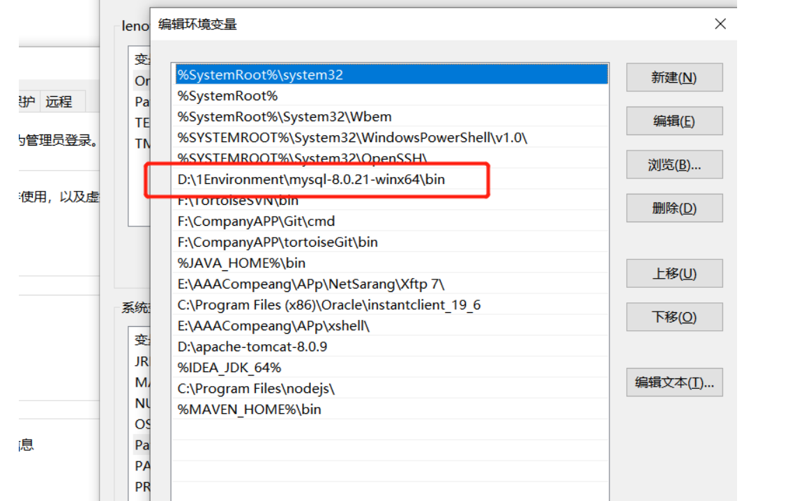
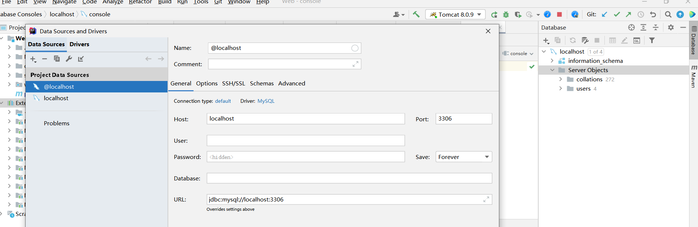

# mysql安装包及安装

##  1.下载
- 链接：mysql下载路径：https://dev.mysql.com/downloads/file/?id=496745
记得要把自己之前的卸载了

##  2.配置my.ini

```
[mysqld] 
# 设置 3306 端口 
port=3306 
# 设置 mysql 的安装目录 
basedir=D:\1Environment\mysql-8.0.21-winx64  //配置自己的路径就行
# 设置 mysql 数据库的数据的存放目录
datadir=D:\1Environment\mysql-8.0.21-winx64\data  //配置自己的路径就行
# 允许最大连接数 
max_connections=200 
# 允许连接失败的次数。这是为了防止有人从该主机试图攻击数据库系统 
max_connect_errors=10 
# 服务端使用的字符集默认为 UTF8 
character-set-server=utf8 
# 创建新表时将使用的默认存储引擎 
default-storage-engine=INNODB 
# 默认使用“mysql_native_password”插件认证 
default_authentication_plugin=mysql_native_password 
[mysql] 
# 设置 mysql 客户端默认字符集 
default-character-set=utf8 
[client] 
# 设置 mysql 客户端连接服务端时默认使用的端口 
port=3306 
default-character-set=utf8

```

## 3.配置环境变量




## 4.管理员cmd

```
//停止mysql
PS C:\Windows\system32> net stop mysql
MySQL 服务正在停止.
MySQL 服务已成功停止。
//初始化mysql
PS C:\Windows\system32> mysqld --initialize-insecure

//初始化语句
PS C:\Windows\system32> mysqld --defaults-file=D:1Environment\mysql-8.0.21-winx64\my.ini --initialize –console
//安装mysql
PS C:\Windows\system32> mysqld install                                                    Service successfully installed.

//启动mysql
PS C:\Windows\system32> net start mysql
MySQL 服务正在启动 .
MySQL 服务已经启动成功。
//设置密码
PS C:\Windows\system32> mysqladmin -u root -p password 123456
Enter password:  //此时直接回车，别输入
mysqladmin: [Warning] Using a password on the command line interface can be insecure.
Warning: Since password will be sent to server in plain text, use ssl connection to ensure password safety.
//进入mysql
PS C:\Windows\system32> mysql -u root -p

  //进入mysql
  PS C:\Windows\system32> mysql -u root -p
   Enter password: ******
  mysql> show variables like '%time_zone%';
  +------------------+--------+
  | Variable_name    | Value  |
  +------------------+--------+
  | system_time_zone |        |
  | time_zone        | SYSTEM |
  +------------------+--------+
  mysql> set global time_zone='+8:00';
  Query OK, 0 rows affected (0.00 sec)


```

## 要想在idea里使用
- 配置maven
  ```
         <!-- mysql-->
        <!-- https://mvnrepository.com/artifact/mysql/mysql-connector-java -->
        <dependency>
            <groupId>mysql</groupId>
            <artifactId>mysql-connector-java</artifactId>
            <version>8.0.21</version>
        </dependency>
  ```
- 配置database
