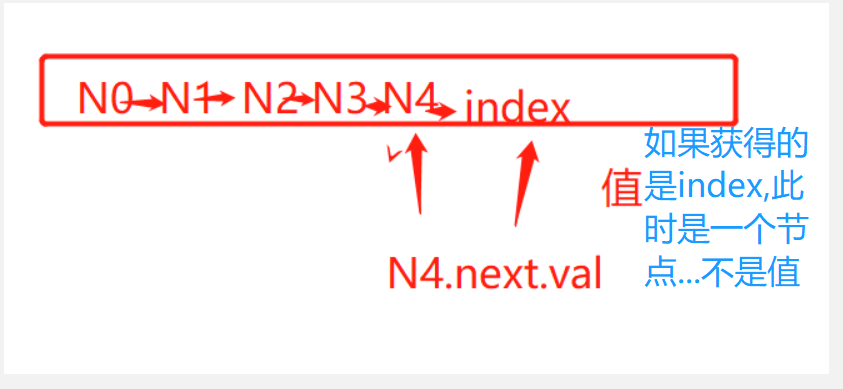

# 链表
## 前言
> 保证自己的思想清晰!
- 1.了解链表:[2021_10_12+13](zh-cn/Diary/DiarySum/ALG/2021_10_12+13.md)
- 2.首先懂java里的链表吧.
- 


## java中的链表
> 1.如果要定义一个操作的玩意!!!保证各个组件化到位!!!!
> 
> 2.链表也就节点(值,next)的形式
> 
> 3.我们欠缺的就是链表在语言中的使用!

- @Target: 自建链表,并且要求实现基本功能! ---- 定义结构!-->初始化-->先查-->增-->删

> 1.定义结构:  --是套娃吗?
- 节点(值,next)   -- 值得注意的是,这个next是一个节点(值,next)..
- ```
   class Node{  // 节点定义
    int val;  // 值定义
    Node next; // 指针next ,,,这里是一个对象,,
    
    Node(int val){ this.val = val;}  // 对象构造器
  
  }
  ```
  

> 2.初始化--目的是:长度,头节点!!!
- 声明:size,head节点
- 初始化
- ```
   int size;
   Node head;
  
    public void LinklistInit(){
        this.size = 0;
        this.head = null;
    }
  ```
  
> 3.查,get  ---值得注意的是,我们要获取的是值,不是节点
- 思考:怎么获取第二个数据的值...Node1(1,Node2(2,Node3))  ---Node1.next.val




- 编写:先排除`<0` || `>size` || `head==null`
    - head为null的话,代表着没头节点..也就是**没有这个链表**
    - `<0` || `>size`  是防止我们在寻找的时候**数组越界**

- ```
    public int get(int index){
        if(index < 0 || index > size || head == null){  // 不满足的条件
            return -1;
        }
  
        Node temp = this.head;  // 从头节点开始
  
        for(int i = 0; i < index; i++){
            temp = temp.next;   // 不读指向下一个节点,temp是节点
        }
  
        return temp.val;   // 节点的值
      
    }
  ```


> 增:
> 三增:头增,中增,末增
> 头增:增一个Node(值,next)--next指--->头节点(值,next)就好了
> 中增:考虑Node(值,next)   如果要增,涉及前一个节点(next),本节点(值,next)
> 
- --------------------------
> 头增(val)单参数
- 新建Node(val,next)---next指向问题
    - 指向头节点,头节点就是我
    - 长度增加
- ```
    public void addAtHead(int val){
        Node node = new Node(val);
        node.next = this.head;  // 这个节点的next指向初始化或者后来加的头对象的
        this.head = node;
        size++;
    }
  
  
  ```
  
> 尾增(val)单参数
- 跑到末尾,判断后面没有了,将旧末尾的next指向新加的,新加的指向null
- 先从两个方向出发,size为0(新建为头节点)和不为0,(新建尾节点) 
  - 需要遍历(temp!=null)找尾节点,,找到后就正常指定就行
- ```
  
    public void addAtTail(int val){
    
    // 先判断是不是空链表
      if(size==0){
        this.head = new Node(val);
        head.next = null;
        size++;
      }else{
      // 从头开始找,找到末尾节点
        Node temp = this.head;  
        while(temp.next!=null){
          temp = temp.next;
        }
      // 现在末尾也有了,新加的节点新建
      Node tail = new Node(val);
      tail.next = null;
      temp.next = tail;
      size++; 
      }
     }
  
  
  ```

> 中间增(index,val) --两个参数
- 1.考虑:前面没的话那就直接为head,,长度超过直接不通过,
- -2.头(<=0)----中(正常)----------3.末(末尾,增加末尾)---1.(>size中断)----------
- 先123 然后正常加 ----正常加需要先遍历长度,找到加的前一个,然后next指对,
  - 怎么找???依据head,,然后index一个个循环找
- ```
    public void addAtIndex(int index,int val){
      // >size 中断
      if(index > this.size){return;}
      
      // <=0 头增
      if(index <= 0){
        addAtHead(val);
        return;
      }
  
      // ==size 尾增
      if(index == this.size){
        addAtTail(val);
        return;
      }
  
      // 正常加 先找到加的位置
      Node temp = this.head;   // 先抓到头
      for(int i = 0; i < index-1;i++){ // 依据坐标进行for寻找
        temp = temp.next;   
      }
  
      Node newNode = new Node(val);  // 新建一个
      
      newNode.next = temp.next;  // 先获取到下一节点的坐标
      temp.next = newNode;   // 原节点next指向现节点
      size++;
  
    }
  ```

> 删除节点::(index)
- ---(<0头,中断)头(=head,删,弄成null链表)----(>头,正常删)----中--------(==尾(删,赋next值null))尾(>尾,中断)-------------
- ```
    public void deleteAtIndex(int index){
      
      if(index < 0 || index >= size){return;}
        // 如果index是头节点:::要判断是不是只有头节点
      if(index==0){
        
        if(size!=1){   // 不仅仅头节点
         Node temp = this.head.next;
         this.head = temp;
          size--;
          return;
        }else{   // 仅仅头节点
          this.head = null;
          size--;
          return;
        }
    }
  
    // 正常删除  --- 找位置 ---目标前节点的next指向目标后节点 --front(next->back)--target--back-----
        Node temp = this.head;
      for(int i = 0;i < index-1;i++){  // 找到目标前一个节点
        temp = temp.next;
    }
  
      Node deleteNode = temp.next;
      temp.next = deleteNode.next;
      size--;
      
    }
  
  
  
  ```


- 对于链表问题，返回结果为头结点时，通常需要先初始化一个预先指针 pre，该指针的下一个节点指向真正的头结点head。
使用预先指针的目的在于链表初始化时无可用节点值，而且链表构造过程需要指针移动，进而会导致头指针丢失，无法返回结果。
- 对于链表问题，返回结果为头结点时，通常需要先初始化一个预先指针 pre，该指针的下一个节点指向真正的头结点head。
使用预先指针的目的在于链表初始化时无可用节点值，而且链表构造过程需要指针移动，进而会导致头指针丢失，无法返回结果。


- zjz说
  - 对于这个链表,判断条件很多,需要画数轴来进行判断头中尾边界
  - 对于中间增加,中间删除,我们需要获取到索引的前一个,因为要前一个的next进行操作,,,直接获取目标,next是没办法操作的
  - 对于删除时的>=size,即删除末尾元素


