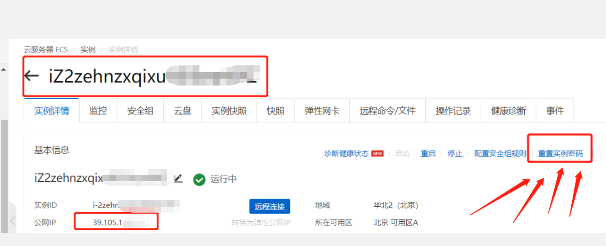
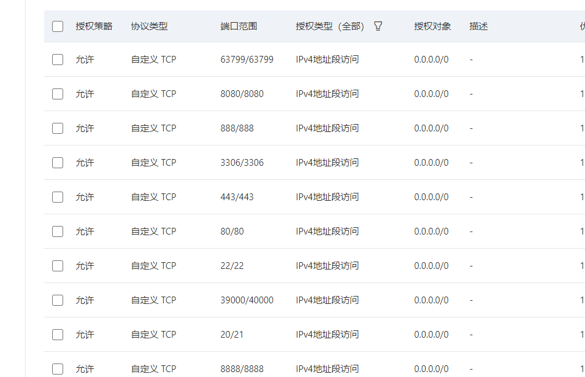

# 服务器
- 1.买
- 2.改实例密码
  



- 3.找到公网Ip地址
    - 39.105.11X.XX


- 4.端口设置
    - https://www.bt.cn/bbs/thread-2897-1-1.html

## 连成功后
- 1.傻瓜式(宝塔)
  - 1.下载管理面版
    - ```yum install -y wget && wget -O install.sh http://download.bt.cn/install/install_6.0.sh && sh install.sh```
    
  - 2.进网址
    - 然后找到软件商店可以安东西
    - `安全`,放行端口---开端口在这里开,如:3306
- 2.命令式
- 后面的yum,解压


## 修改一些密码等配置
- 面板设置
- 一个是云服务器的,一个是BT面板的



- 软件商店安装
 - tomcat 9
 - Mysql 5.7.26  -- 然后测试数据库,端口啥的
 - nginx 1.16  先nginx再apache
 - apache 2.4

## 放行一些东西
- tomcat:8080服务器安全组,宝塔都得配
  
- 数据库连接 3306放行 ---然后新建数据库 然后用户 然后navicat连接主机,
  - 这个数据库不是用root连接的，你得自己创建数据库，用数据库连接---具体--数据库---添加数据库--添加完可以navicat测试(端口打开)---`权限设置所有人`
### 导入自己的项目
- 软件商店--tomcat ---有个文件的按钮 ,进去
- 项目丢到webapps下----/www/server/tomcat/webapps


## 环境安装
> 三种方式:rpm,解压缩,yum在线安装
>


> yum安装
- yum -y install 包名
  - yum -y install gcc
  - yum -y install gcc-c++

- 安装docker

- 切换到 /etc/yum.repos.d 目录下，将所有 docker 相关的 repo全部删掉
- yum install -y yum-utils device-mapper-persistent-data lvm2
- sudo yum-config-manager --add-repo https://download.docker.com/linux/centos/docker-ce.repo

- yum makecache fast
- yum -y install docker-ce docker-ce-cli containerd.io
- 启动::systemctl start docker

- 测试

    ```
        docker version
         docker run hello-world
          docker images
    
    ```


## redis远程访问
- 安装:.508版本zip
  - 移动mv redis-5.0.8.tar.gz /opt
  - 解压  tar -zxvf XXX.gz 
  - yum gcc c和c++ 安装  gcc -v 查看
  - make ---make完我们的环境就配好了--在usr里
  - 默认安装路径 usr下进去local/bin/ --cp一份redis的config
- 配置安装目录下的redis.conf文件
  
- bind 0.0.0.0  修改为这个
- port 6379 这个为redis端口
  
- #修改这个为yes,以守护进程的方式运行，就是关闭了远程连接窗口，redis依然运行
- daemonize yes

- #将protected-mode模式修改为no
- protected-mode no


- #设置需要密码才能访问,password修改为你自己的密码
- requirepass 密码

- 如果boot项目连接
  - pom依赖
  - application配置
  - RedisTemplate测试  


## 初始化服务器
- 1.服务器初始化前提条件：
  - 阿里云服务器初始化之前需要先停止ECS实例，停止实例教程：
- 2.登录到ECS云服务器管理控制台；
  - 找到目标实例，点击“更多”--“磁盘和镜像”--“更换操作系统”
  
- 3.更换系统盘须知
  - ECS实例更换系统盘后，磁盘ID会变更，原系统盘会被释放。
  
- 初始化服务器后（更换系统盘）数据就找不回来了，然后点击“确定，更换系统盘”。
- 选择最初的系统镜像即完成服务器的初始化


## 阿里云配置加速
- 左上角弹性计算
- 容器镜像服务
- 申请一个个人的实例
- 创建镜像仓库
- 点开左边的镜像工具中的加速..
  - 操作文档
  
