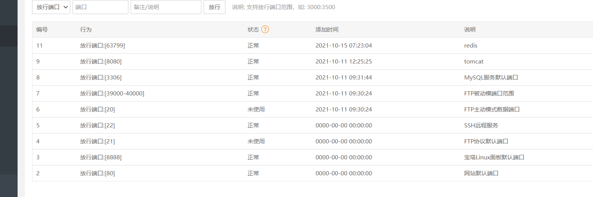
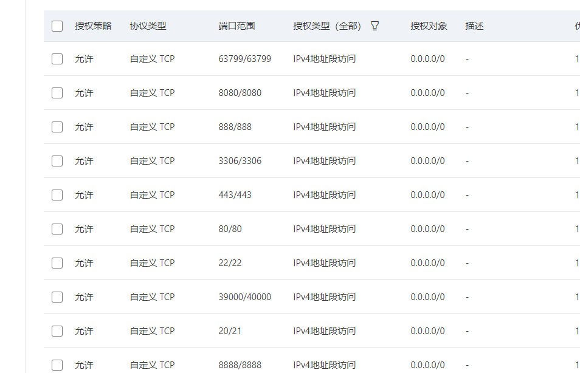

# 服务器常用操作


- 1.查看面板入口：/etc/init.d/bt default  
- 得到后,自己主机IP:8888,加它的后缀就行...


## 服务器问题
- 自己买的服务器学redis别开安全组的6379端口，会中病毒，好家伙我学生机就中病毒了，挖矿程序，占用率瞬间100%
- 弄了个密码，换了个端口

## 看CPU以及杀死高CPU进程
- 查看进程
- `TOP`
- 使用kill结束掉该服务。
> 以PID 文件dhpcd举例  
- kill -9 PID号
- 结束掉此进程后，删除 dhpcd的文件
- cd /bin
- rm -rf dhpcd ###删除服务文件


- 可以在使用crontab -l查看是否还有被植入的任务计划，黑客惯用的手段。
- 如果有 crontab -e XX进入计划中，删除带有dhpcd的计划
- 如果还继续CPU100%,删不了
-  cd /proc/PID号查看可疑exe,由于删除不了（删除还是在那里），那就把权限设为0，删除其他三个文件

- kill -9 PID号 杀死这个进程，至此问题解决。


- rpm -qa | grep ssh 可以看到系统中ssh安装包
- ps -ef | grep ssh查看ssh服务有没有运行,如果有,可以看到类似以下内容:
    - root 2659 1 0 18:31 ? 00:00:00 /usr/sbin/sshd
    
- 如果没有运行,可以通过以下命令运行之:
  - service sshd start
  - 再看下这个ssh服务的网络连接情况:
  - netstat -ntlp


## CPU,负载100%
- 宝塔服务器面板cpu、负载都是100%，一般来说这种问题的可能性很多，有可能是程序性能、服务器负载能力、
  PHP或Mysql并发访问、PHP-FPM进程占用、磁盘空间不足、木马病毒、被植入了挖矿程序等等

- 1.初步来说首先考虑使用 top 查看一下当前的负载情况，使用XSHELL工具连接到命令行操作界面，或通过宝塔面板->文件  点击终端进入命令行操作也可。





## 定时任务
```

    Linux系统安装crontab服务
    1.确认crontab是否安装
    
    # crontab -l
    
    如果报 “command not found” ，就说明该crontab服务没有安装
    
    如果报 “no crontab for root” ，就说明已经安装crontab服务了，请跳过步骤一，至于出现这个提示的解决办法请往下看。
    
    
    
    2.安装crontab服务
    
    CentOS系统，请执行以下命令：
    
    //vixie-cron软件包是cron的主程序；
    
    # yum install -y vixie-cron　　
    
    //rontabs软件包是用来安装、卸装、或列举用来驱动 cron 守护进程的表格的程序
    
    # yum install crontabs
    
    //启动服务
    
    # /sbin/service crond start   或者  systemctl crond start
    
    //加入开机自动启动
    
    # chkconfig --level 35 crond on
    
    Ubuntu、debian系统，请执行以下命令：
    
    //安装crontab服务
    
    # apt-get install cron　　
    
    //启动crontab服务（同时还有service cron stop 停止服务，service cron restart 重启服务）
    
    # service cron start 　　
    
    
    
    3.测试是否安装成功了
    
    继续执行上面第一条命令：crontab -l
    
    这时会出现 “no crontab for root” 这是由于你还没有创建任何定时任务或者命令打错，即没有使用crontab -e命令去创建任何任务。但是到了这里，你的安装基本可以了。crontab命令详情请看下步
    
    　　
    
    二、crontab命令详解
    1.crontab命令主要有3个参数：
    
    -e ：编辑用户的crontab
    
    -l ：列出用户的crontab的内容
    
    -r ：删除用户的crontab的内容
    
    
    
    2.功能说明：设置计时器
    
    补充说明：cron是一个常驻服务，它提供计时器的功能，让用户在特定的时间得以执行预设的指令或程序。只要用户会编辑计时器的配置文件，就可以使用计时器的功能。其配置文件格式如下：
    
    语法：crontab [-u <用户名称>][配置文件] 或 crontab [-u <用户名称>][-elr]
    
    参数：
    
    -e 　　编辑该用户的计时器设置。
    
    -l  　　列出该用户的计时器设置。
    
    -r 　　删除该用户的计时器设置。
    
    -u<用户名称> 　指定要设定计时器的用户名称。
    
    　　
    
    3.crontab -e命令详解
    
    # crontab -e
    
    如果第一次执行上面命令时，会让你选择编辑器，不过有些终端会默认帮你选择nano编辑器的，一般我们都会修改编辑器为vim，具体方法请看步骤三。
    
    然后会打开一个crontab的文件，然后点击 i 进行输入模式，输入一下内容：
    
    //每隔一分钟执行一次test.php
    
    # * * * * * php /var/test.php
    
    输入完后保存退出，:wq。然后重启crontab服务
    
    // 不同服务器命令不一样，详情请看步骤一
    
    # service cron restart
    
    
    
    4.crontab -l
    
    查看crontab有哪些定时任务在执行，这里没什么好弊述的。
    
    　　
    
    5.crontab格式
    
    基本格式：* * * * * command
    
    格式说明：上面的*代表着不同的时间点，具体排序如下：分　时　日　月　周。
    
    例如：
    
    * * * * * php /var/www/hello/index.php >> /tmp/log/index.txt
    
    //表示每分钟执行一次，整句话的意思是说每分钟执行使用php执行index.php文件，并将信息打印到/tmp/log/index.txt文件中，具体路径自己改
    
    这里加个技巧关于查看某个文件，但又不想vim <文件名>的。可以使用cat <文件名>命令
    
    1. * */2 * * * php /var/www/index.php >> /tmp/index.txt
    
    2. * * */1 * * php /var/www/index.php >> /tmp/index.txt
    
    // 如果要设置没隔多久执行，则写为“*/数字”，在哪个位置就代表每隔多久执行一次。上面命令分别代表：
    
    1.每隔2小时执行一次
    
    2.每隔一天执行一次
    
    
    
    三、修改crontab默认编辑器为vim
    1.debian终端下默认编辑器为nano，比如crontab -e就会打开nano，这个编辑器用起来很不习惯，想修改为vim,当然,你的debian系统必须先安装vim.如果已经安装vim,请输入如下命令:
    
    # update-alternatives --config editor
    
    　　
    
    然后选择/usr/vim/vim.basic就可以了,vim.tiny与vim.basic的区别是vim.basic为完全版的vim,而vim.tiny为简化版,功能上有所区别,如不支持高亮等等.
    
    输入数字   2   ，回车，再次打开crontab -e即可。


```


# 上传下载
- 需要上传或者下载，需要使用rz和sz命令,如果rz,sz不可用
- yum install lrzsz
- 4、如果需要下载linux上的文件，使用sz命令。sz加上文件完整路径，比如：sz install.log。这样就下载到了本地一个默认的文件夹。
- 5、使用rz上传的时候，选择框会事先打开在是一个默认的目录。使用sz下载时，也会下载到一个默认目录。这个默认目录时可以设置的。
- 6、需要设置上传和下载的默认目录，点击SecureCRT的菜单栏中的 选项=》会话选项。打开会话选项对话框，点击分类中的 终端=》X/Y/Zmodem。


# 查看文件
> 1. more指令 —— 分页显示文件内容
- more指令会以一页一页的形式显示文件内容，按空白键（space）显示下一页内容，按Enter键会显示下一行内容，按 b 键就会往回（back）一页显示，其基本用法如下：
  - more    file1             查看文件file1的文件内容；
  - more   -num   file2    查看文件file2的内容，一次显示num行；
  - more   +num   file3   查看文件file3的内容，从第num行开始显示；

> 2. less指令 —— 可以向前或向后查看文件内容
- less指令查看文件内容时可以向前或向后随意查看内容；
- less指令的基本用法为：
  - less   file1    查看文件file1的内容；
  - less   -m    file2     查看文件file2的内容，并在屏幕底部显示已显示内容的百分比；
  - 按空格键显示下一屏的内容，按回车键显示下一行的内容；
  - 按U向前滚动半页，按  Y   向前滚动一行；
  - 按[PageDown]向下翻动一页，按[PageUp]向上翻动一页； 
  - 按Q退出less命令；

> 3. head指令 —— 查看文件开头的内容
- head指令用于显示文件开头的内容，默认情况下，只显示文件的头10行内容；
- head指令的基本用法：
  - head  -n  <行数>   filename      显示文件内容的前n行；
  - 例如：head   -n   5   file1     显示文件file1的前5行内容
  - head   -c  <字节>    filename      显示文件内容的前n个字节；
  - 例如：head  -c  20  file2      显示文件file2的前20个字节内容

> 4. tail指令 —— 显示文件尾部的内容
- tail指令用于显示文件尾部的内容，默认情况下只显示指定文件的末尾10行；
- tail指令的基本用法：
  - tail    file1      显示文件file1的尾部10行内容；
  - tail  -n  <行数>  filename    显示文件尾部的n行内容；
  - 例如：tail  -n  5   file1    显示文件file1的末尾5行内容
  - tail  -c  <字节数>   filename     显示文件尾部的n个字节内容；
  - 例如：tail  -c  20   file2    显示文件file2的末尾20个字节
  - tail -f 实时看文件
  
> 5. cat指令 —— 显示文件内容
- 使用cat命令时，如果文件内容过多，则只会显示最后一屏的内容；
- cat指令的基本用法：
  - cat  file1       用于查看文件名为file1的文件内容；
  - cat  -n   file2    查看文件名为file2的文件内容，并从1开始对所有输出的行数（包括空行）进行编号；
  - cat  -b   file3   查看文件名为file3的文件内容，并从1开始对所有的非空行进行编号；


> 搜索文件
- 描述：在文件中搜寻字符串匹配的行并输出
- 语法：grep -iv 【指定字符串】【文件】
 -  -i 不区分大小写
 -  -v 排除指定字符串
 -  eg：查找 /root/install.log 文件中包含 mysql 字符串的行，并输出
 -  grep mysql /root/install.log   查找 /root/install.log 文件中包含 mysql 字符串的行，并输出
 - grep -iv "#" redis.conf   不要#的查询
