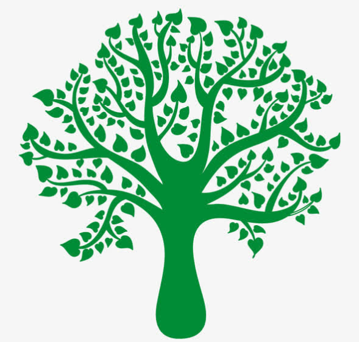

# SAD——Reality（可悲的现实）
> 目前还没有想好总架构，所以采用随想随写吧
> 
> 看到本文章的,作者希望你去,[博客](https://www.cnblogs.com/zjz0818/) 或 [码云](https://gitee.com/zhangjzm) ,点个赞,或者评论个,zjz
> 
> 有疑惑也可以进行提问

## 一.序言
- 生活&生存中，每个人似乎都有着他活着的意义，从底层到高层，我们无时不刻的干着些事情，这些事情为啥要干？
- 因为要生活&生存---有人闲，有人忙，原因是：人与人之间的后台资源不同
- 我写此篇文章是希望看到我此文章的人，希望他能去实现他的价值，实现他自己的后台资源（自我创造）
  
## 二.从zjz说起
- &emsp;&emsp;我的故事，开始于毕业，在大学期间没有好好的正式自己的人生观，导致毕业之时遇到了很多很多无法逃避的现实和妥协。于毕业之后，我自己进了一个外包公司，虽然是项目外包，但我从各种途径（百度，知乎）了解到，似乎外包这个词在人们认知中非常不好。但实际上取决于个人看法吧，有的人认为有钱就好了，而有很多的人观点都不同，我同样有着自己的观点。
- &emsp;&emsp;我在刚开始的时候觉得有点钱赚，然后再努力去学，到时换个公司就好了，，持续到现在我依然觉得这个目标很好，至少是大多数人的想法。当然有的无时不刻加班的外包，我觉得该考虑了。
- &emsp;&emsp;持续至今天，我依然无时不刻在补充着自己，积累着，沉淀着。这个过程中通过询问前辈啊，搜索啊，各种途径吧，他们每个人都有着每个人不同的观点，而我的观点也不断形成了。而我的观点是，如何去实现自己的价值-也就是之前说的拥有后台资源。
- add by time for 20210907

### 二.1.现在的局势

- &emsp;&emsp;目前的局势，有很多方面，最为关键的便是现在的处境，我身边人的处境---同样也是90%人的处境，从开始到现在，很多人都是**忙忙碌碌**的。
- &emsp;&emsp;为啥说忙忙碌碌？你可以思考下你除了学习，上班是不是在娱乐着，干着些其它的事情，而这些事情（如游戏，小说，短视频），他们无时不刻的吸引着你，就如同毒品般的让你情不自禁的继续完成它的暗示（为啥资本家赚钱？），时间一长，你就如同做着任务般的去忙碌着它。---它们从你的关注到它，最后到形成完成它的任务的习惯，来让你成功实现**重复**。（一种赚钱的方法）
- &emsp;&emsp;而我的建议是，这个世界很大，你可以去了解更多有价值的东西，而不是在**重复**中去休息自己的大脑，减低自己的眼界。休息大脑完全可以来个舒服的懒觉。

### 二.2.我的开始

- &emsp;&emsp;从麻痹，上瘾的**重复型事件**中走出，我自己如同拥有了自己的控制权一般，虽然有着生活&生存上的压力，可这也是一个人真正自我解放的开始。你可以去完成**想要做**的事情，去实现自己的**初心**，不必在众多的重复中傻傻的循环着。而此时，很多人已经迷失了，迷失了他想要的东西了，觉得在重复中生活就是一个很好的格局了，**那么我想说的是，如果你在没有家人的那一刻，你还能生存吗？你在失去你不想失去东西（家人，喜欢的人，喜欢的事情……）的那一刻，你有什么办法去不失去他？**可能你只能懦弱的哭泣吧！好好思考下，思考下，思考下，你的安全区还能有多久？思考下我说的话，用你此生最认真的心，最清晰的脑袋去想想！
- &emsp;&emsp;如上，可能我的开始，就是不想再失去我应该有机会留住的东西。`不想去面对失去时候的无力！`
- &emsp;&emsp;在目前，我明白了如何摆脱重复，可重复在我们生活可以说是必有的，有的重复只是为了让你加深映像，方便以后的使用，有的重复是为了让你无脑的重复，望你有个判断能力。
- &emsp;&emsp;同样，它也是我第一个想说的事情，就如同我的公司一样，外包，每天重复干着一些事情。我应该做的是汲取其中有用的，高速率完成其中没用的。针对这两件事：我个人想法，1.有用的无非是设计者的思想，为什么要弄它？完成什么事情？它怎么设计（大小？）？用什么完成？---这才是你该做的！2.无用的无非是一些你需要搬运的工作，将它们搬运到你的东西中。涉及到---①定位（还是依靠有用的思想），②有效快速搬运----工具的使用，没工具，自己造！③整合（小型设计思路）

  
- 一句话送给努力的你，于有用中成长，积累。于无用中创造！
### 二.3.对于IT行业

> 我想说的第一句话就是，你知道计算机是干什么的吗？
>
> 第二句话就是，你知道你学的要用来干什么吗？
> 
> 第三句话，技术没有高低之分（一辈子都该思考的问题）

- 第一句话，我的解答是：计算机是用来服务社会的，所以不仅要明白计算机，你也要明白你想要服务社会中的什么，当然也有计算机服务计算机，深入了解计算机---极客。
- 第二句话，我的解答是：我目前选择的是程序员，去干啥？是去满足客户的需求，但是是**我自己设计出来的东西去满足人家的需求**，而不去去搬运一些东西给人家。
- 总：至少目前：我的路该是一个去做有用的**设计之路** ---设计之道

### 二.4.对于傻子的劝告
> 很多人总觉得学的不踏实，每天拼命学，却无所收获？（不是傻子是什么？）
> 
> **注意**，是不踏实的！！！
- 道理很简单，没学会，没学进去（思路不清）
    - 一种核心的做法，**比对法**：
        - 将自己的同他人的比较（老师？同辈？）
        - 这就涉及到多看，多观察了，多看看人家怎么做的（**重要！**）比对自己做的（**更重要！**）
        - 为啥看别人的？---了解别人的流程？是这样吗》》不会的当然是学习。。会的人呢？
        - 重点：**对照**他人的思路，**重走**自己思路--顺通它，干掉！
    - 这样即便下次不会，想起来比对过程---ByeBye-problem
    
    
    

### 
### 二.5.自我的无效学习
> 努力了好多好多天，有多少收获呢？
- 今天仔细一看，一眼看去，发现虽然学了很多，可实际操作很多做不来了（不是不会，而是忘了，需要再巩固）
> 针对这个效率低的方式想一个方法---**印证法**
- 之前也提到过，重复的事情，而现在减少了重复却缺少了收获的效率
- 三部走--实现最大效益---遗忘时，自我理一遍目标，核对最终总结图(纸？电脑？--》反正画出你的思维！)
  - **开始时**明确目标！ - 定义，作用，使用
  - **中途时**证实目标！ - 每天走完核对目标，理思路（五分钟内）
  - **最终时**走目标思路 ！ - 绘图形式核对自我想法

- 可参考！！！ zjz的想法--  

  

- ps：写在最后---真正的麻烦才是**麻烦**，能平时写写总结下的麻烦是**真正的收获**--亲测有效！

### 二.6.一些心得
> 我写的文章最近加上了一句话，之前就加上了一句话
> 
> Thinking is more important than learning
> 
> Interaction is the principle
> 

- 第一句话：思想大于学习
    - 我们只有带着思考，思想，思维（三思）去学习才能将一件事情效率最大化！
      - 三思：考虑这个玩意，自己的思想，逻辑运转
    - 经这段时间测试，效果很是不错，减少了很多大脑休息，身体运行的情况
    - -……
- 第二句话，交互才是根源--针对性的交互才是王道！
> 首先你得明白如何针对性的交互---就是将问题变成两个东西之间的交互（拆解！），进而得到n个人的交互
- 一件事情的发生，必然是两个东西之间的（比如，我打了你一巴掌（你我），再比如我走在地上（我与地））
    - 比如应用在我们IT行业，要进行的每一步都是要有依据的，比如我这一步是给下一步的铺垫（逻辑），
      比如我这一步是给web服务器的，我这一步是给用户看的
    - 再比如数学中，z=2*x+3*y；---- x = 2*y+100+z;--- y =x-100+z; 
        - 这句话很明显z要与x和y进行交互 x要z与y交互  而 y也要与x和z交互  
        - 三个之间都要互相交互，那么就要想办法确定一个根源，即**将它们变成两两交互**
        - 比如上面的可以根据运算二和三可以干掉z，我们就可以推出x，y再进一步推出z----当然正常计算不可能这么简单，但这是一个交互性的问题。
      
- 所以为啥强调这句话呢。是希望你将这句话运用到生活，学习中，不仅仅是明白，更多的是由基本的（1:1交互）推动到无数的复杂问题中！！！  由复杂的问题拆解到（1:1）的基础    
- **重点**的是（1:1）不一定是确定的，很多时候是带有联系的，比如（Y*关系）:(X*关系) 它代表着每个人都有着私藏，并不会全部都暴露出来！！
  然而我们的**需要可能就是这个`（X*关系）:(Y*关系)`就足够了**！！所以有句话说---知道越多，越挖，就离生命的终结不远了！！
    - 解释下吧，，就比如我把你一巴掌，别人想知道的是（X:Y）我打了你一巴掌，
      - 而正常的我打了你一巴掌，用了多少劲，为啥要打？，等等因素（风速啊，摩擦啊……）-（X*关系）
      - 而作为你，收到多大的打击力度，身体上，心里上，思想上……（Y*关系）
    
- 写在最后；有时候背会了`X:Y`，但是对于（X*关系）:(Y*关系)其中的关系，该知道就得知道（一个人的深度），毕竟大神都喜欢知道的！！！（方便送你去GameOver）
- 哦，对了，画图解析这种事情很不错！！！

## 三.有了思想,我们该怎么持续走下去
> 之前不断的刷新自己的考虑,做事有规划,做事要动脑.各种不断培养自己的思想能力.
> 
> 现在的你,或许已经有了自己的思想,脑海中有了自己的**图**
> 
> 那么该如何有效的发展呢?
> 

### 三.1.目前的做法
- 1.现状分析:
    - **正常**情况下,我们**往往是被动的思考**.比如问题的到来,上级,老师发放了任务,这时脑袋才开始运作,思想才开始动起来.
      - 简单描述下:比如任务到来之时,思想:我的总任务优先完成什么,我之前还有什么.简单看一看,能不能快点做完(脑海中的图飞快动起来).--动起来是要再次巩固下
      - 最后依据难易,以及老师的需求进行解决--
    - 而我**之前**的让你画图,让你脑海构建,它是属于一种积累,但是它却属于你主动引起思考,然后再去积累的过程.
    - **现在**应该做的是,怎么提升自己的思考能力,提升逻辑能力----
    
- 2.发现get点:
- 我最近学到的一个方法就是,**偷取**别人的思想方式,融合进自己的思想体系中!----(初始的做法吧)我现在还不够,无法从深处的去获取人家的思想
 - 举个例子:生活中有思想的人不在少数,他们或多或少的去使用着自己的思想去做事.
   - 1.有很多的人,他们处于半思想状态---通过**强制写标志**,让自己想到:自己该走的思考,该走的流程
   -  怎么区分是半思想还是全思想,
      - 1.**自己的**语言描述出**自己的**图,--风格的形成
      - 2.开始的时候标志自己该思考的(高手不会,已经全局走自己的图!).后面的使用,将自己的思想充分的表达出来了.--有独属于自己的风格描述--**偷取的地方**!!!
      - 3.在不断描述的过程中,走着自己的图,**遇到卡顿**,会将自己的**卡住的点指明**,说为啥要走这个???
    
   - 2.而上面的关键在于??小系列总结---因为很多时候走着走着就忘了自己的思想了,盲目顺着解决问题的流程运行了.
     - 所以在**很关键的时候**,**千万**要小系列总结,刷新自己的思想,刷新自己的图---什么是关键的时候??? 难点?重点?前面学的与后面的交互?
     - 很多时候说的重点,难点--:::陌生的新东西的产生(要记!)-----:::前后的交互,产生一系列逻使用!(图)-**关键**--有图知自己要记的哪里没记!!!
        - 说个我高中时候的事情吧--可能这也是很多很多勤奋人的悲哀:---我依稀记着我高中,高三吧,有个非常非常努力学习的女生,她每天6.00多就开始学了,
          每天最后一个,23.00多吧,才会离开教室,从她身上我才明白了,什么是教育之间的差距,同样的学生,同样的人.为什么好的学校总能出来更好的...有的学校确实
          是死记硬背系列的,比如我妹在的初中,每天都很拼命的学,拼命的背..但是这个女生好像也和我妹同校.她身上有着令我惊讶的拼命精神,却同样让我有着质疑的
          事情,她那么努力,却始终没进我们班前10,要知道当时只是一个普通班..而且至多只有三个能上大学..或许从她身上我明白了书呆子的含义了吧.
          - 首先,咱们从一个关键点进行分析: 努力 != 成功(!=是不等于的意思),
            - 然后咱们从爱因斯坦说的话:成功==99％的汗水+1％的天才(如果你盲目顺从这句话!!那么请你去度娘看一看!!!)
            - 首先分析等式右边:汗水---指的是努力+时间上的非常压榨式的使用...而天才---指的是天赋吗???--天生我才?哈哈哈哈哈哈哈哈哈
            - 天生的固然重要--但是比如两个清华的(5岁就会整本字典的)生了个普通人,, 天生的是人家的,你只能羡慕,他也没法给你帮助
            - 好吧,,咱们说咱们的关键---后生的**才**用天生的**才**---后才直接超越普通人,甚至超越天才(是不是觉得和玄幻小说一般..主人公也努力修炼的,
              他懂得起码比你多得多,然后人家努力修炼,你却在看人家,人家牛逼,你却在幻想自己....),说的有点多了
            - 后才的崛起..1.思想 2.图 3.偷 4.找到自己的天赋,实现天才自我---很多大佬都是后期的天才,前期的在误导之下种地去了(当然人家也是种地的高手)  
                - 要记住,徒弟学会饿死师傅,而我不想你们将此传播,希望有缘者能看到!!!
       - .
    - 3.看下怎么偷吧..  
     - .
    
       - .
    - 这是我写的,提醒自己,然后学习路上不断揣测(小总结,小分析)  
      - .
      
    - .
    - 高手级别,直接找故事衬托要说的东西,但是全程都在体现思想(让人一下就懂了),但是它的想法被他删掉了(在发自己的文章,选择性的删掉自己的思想过程)  
    - .
      
     - .    
   - 4.看到此时,麻烦再从本段的开始看一遍吧!!!---相信你有了一定的想法了  
    
 - 似乎有个关键遗忘了,下次讲,如何定位到本问题,事情的关键之处!---你们可以提前思考下.

- 此处插入----- [MyGrowth](zh-cn/自嘲(self_mockery)/MyGrowth.md)

- 描述,思考-->目标重要吗?

### 三.2.讲述下关键点怎么抓
> 举例是个数学问题,但是不仅仅是数学,是**所有问题**哈,不分生活,学习的问题.
> 

### 1.(方法一:目标定位)
> 依据需求进行识别,看题不要从头开始看,先看?前面的一句,也就是最后一句,再重写看整个题
>
> 同人一样,活着就要有目标,事,问题,都是有了目标才会产生!
> 
--ps:有目标的人不会迷茫,不会傻乎乎去吃饭,却拿着碗筷进了厕所(别认为自己不是)
> 
> 要求达到的水平:别人说出口(看到问题),就要抓住关键,然后题解,最后依据经验(图-->课本-->百度)选择解决问题的办法
> 

- 现在解析下目标定位的思想:

- 如图:比如第10题:
    - 1.我们看到了题需求(最后一句)是:下次生产,时间,开始(1.找到要素)
    - 2.同时我们也知道了最后目的是-求时间,所以读题见到时间都画出来(2.关键解题)  
    - 2.对应下次生产看看涉及-发现是库存量--(实际上后面的题目越来越长,所以要抓到**主语**)--所以再往后,我会写一篇如何写出题的逻辑
    - 3.对应时间:看下时间要干啥,发现时间
        - x月,存货量f(x)的公式
    - 4.开始???就算不太懂,也知道有个库存量公式吧...
    - 5.于是本题就想出来了,下次生产(没货了吧?--为啥这么想,想想库存量白给你了???还和时间x挂钩!!!)
    - 至于解题,,我相信课本上有公式..同样我想说的不是你的课本,而是你的图---有图可能只需30s就ko了
- 希望以后每次看题,看事,看更多的都这样做,因为我们有了目标,方便找东西
    - 好比语文阅读,英语阅读,哪个不是先知道目标是啥,然后再找就好找了
    - 有一个问题就是,很可能第一次读需求(问题)时,有的人可能经验不到位,没读懂,那就**找要素**
    - 然后再带到整个流程中,找到核心要的东西,有这思想的人必定省事哈!
    
- 自己可以解析8,9练练脑
  
- 最后:再从头看一遍(30s)我写的,相信你已经有思考,有图了!
    - 额,对了,这个也是一种让你百分百掌握东西的一种方法,叫做回手掏---看别人的掏回来,成为自己的
    

### 2.(方法二:读心术)
> 1.这是一个进阶,如果想不通的就先当作没有
> 
> 2.读心要求有着一定的经验,当然也不全是,思维+幻想能力到位也足以达到读心的目的
> 
> 3.读心:读的是出题人的心,要求具有很强的换位思考,以及幻想对方处境,目的的能力

        
        
## 对于现在还没有图的人
> 前言:你可以将它认为是一种修行之路,你也可以将它认为是一场游戏
### 1.种子
- 1.人的脑袋好比是一个种子,而这颗种子很多人都是让它死在了脑袋中,原因是根本就没发现有这个种子
- 2.所以我之前很大的程度去让你们发现这颗种子
- 3.当你知道有这个种子之时,已经表明你拥有了自己独立的思想
- 4.而让这颗种子发芽,破壳而出是很难的,不是说想直接发芽就能发芽的
- 5.这颗种子的外壳是非常坚硬的,它有着你对自己的不了解,有着你对这个社会依赖性的思考,有着从小到大,身边人给你层层加固的思想
- 6.这颗种子的外壳是一种营养,你需要整理他们,吃掉营养,也就能破壳了,你也就懂得他们一直以来的所学所知
    
### 2.水滴-掌控者
- 1.种子的一切,其实本就是由你的思想去掌控的,从你开始有自己的想法之时,你就会发现这颗种子
- 2.而你想法不断思考,不断发展时,你就在一点点吃着这个外壳(思考起来,动起来)
- 3.当你明白你自己的情况,明白家长,老师的思想和用意之时,你就即将破壳而出了
- 4.然后这是有瓶颈的,这个瓶颈取决于能否攻克诱惑--来自于所处环境(同龄人,网络产品)的诱惑,来自于懒的诱惑
- 5.解释:1,走自己的路,让别人去说吧--2,世上无难事,只要肯攀登
- zjz说:水滴的数量,取决你的思考,思考的越多,水滴越多

### 3.破壳而出
- 先前我们分别说了种子,水滴,也就是不在糊涂的开始(修行必备)
- 吃掉外壳,这时的你才算是破壳而出了,此时你已经具备自我的思想,前辈(父母,老师,同学,社会...)的知识
- 1.首先你得明白,失去外壳得时候,就意味着你变相的已经从家人,教师的庇护之下走了出来了
- 2.以后路上的各种事情,你都有着自己的思想,你该干什么,老师,家人的建议有用就听,没用就舍弃
- 3.最关键的是,你迎接来了光明,与社会上的战争
    - 光明:你可以依据你所想要的目标,针对性的去干它.
      为什么说光明了,是因为你思想带来的.你的学习,你想达成的目标,不在依托于老人的教导,你可以随心所欲的去完成别人有的东西.
        - 随心所欲:以前我们可以看一些人的书,现在我们可以在网络上寻找,zjz推荐:B站,知乎,贴吧,百度
    - 社会上的战争:当你看向社会时,你会发现不仅你的老师在战争(拿到教导主任,校长位置),你的家人(生活美满,让别人羡慕)也在战争着,他们很多是为了钱战争
        ,当然还有其它的战争,就比如你旁边的人,很可能是在打比赛,(打比赛是一个很好的成长),清华北大很多人都是打比赛(战争的胜者)进去的
      

### 4.发芽
> 由于之前的积累,每个人的发芽都是不同的,每个人的经历是不同的
> 
> 但是,关键的是,我们的发芽以及成长为大树,都是依托于水滴(思考),所以我们的主干都是一样的
> 
- 而发芽也就是你的思考,开始运行起来了,同时:::出现了思维!
- 思维是什么?你可想象成一颗树

  
- 发芽了也就相当于树了,直接看树,zjz说:发芽与否,取决于思维有没有出现

### 5.树
- 在这个树上,我们需要利用我们的思考,思维,将每一个枝干,每一个树叶都要铺满
    - 枝干:有主枝干,副枝干,你可以把他们区分为生活,技能,知识等等...,很小的枝干表示你学习的一个体系,比如数学,英语,计算机,机械,做饭,
    - 树叶:就之前我说的图,因为整个枝干很难断,而你的树叶,可能到了秋天(记忆力不足)就落叶了

- 在这个树上,对于每个枝干,我将它分为了很多段位,比如基础知识类型,战争类型,成果类型  
    - 基础知识段位:-初级段位,有自己的图 - 中级段位:能灵活的使用自己的图(可进入战争) - 高级段位:我可以将它非常灵活的使用,并能联系生活,其它知识将它使用
    - 战争类型段位:-初级段位:我可以在同辈人之间的考试取得一个60%的成绩 - 中级段位:我可以拿到80%的成绩(保证85%可进入成果类型) -高级段位:我可拿到95%以上的成绩
    - 成果类型段位:-初级段位:我有资格参与市级比赛 -中级段位:我有资格参与省级比赛 -高级段位:我有资格参与国家级比赛,再往后有国际比赛(诺贝尔)
    
- zjz说:对于树的发展千奇百怪,但是思想,思维是控制它成长的关键,同时我说的段位通用于所有世间的一切!

### 6.此后希望你们能开启段位制
- 从种子开启你的修行之路

