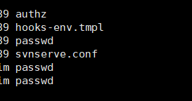
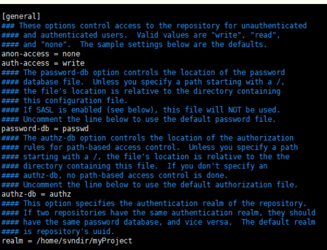

# SVN的搭建
- 为啥要开始这个呢。--because 我需要一个好的实时的文件交互

## 准备
- 1．VisualSVN-Server-3.6.3-x64.msi（svn服务端）
- 2．TortoiseSVN-1.9.6.27867-x64-svn-1.9.6.msi（svn客户端）
- 3．LanguagePack_1.9.6.27867-x64-zh_CN.msi（TortoiseSVN 的汉化包）
### 地址
- http://subversion.apache.org/packages.html


## LINUX上进行
- 1.安装svnserver (yum install -y subversion)
- 2.验证是否安装成功 (svnserve --version)
- 3.进入到svn的资源目录 (cd /home/svndir)
  - 这个是随便进入一个你要把它作为svn的地址。
- 4.创建svn资源库 (svnadmin create myProject)
- 5.新增用户
  - 在你新建的目录下有一个conf
  -   
- 6.配置用户权限
  - authz    是权限相关的配置 
    - 注意是在【/】下配置
    - 格式为 用户名=权限 (rw) 为读写权限
  - passwd   是帐号相关的配置 
    - 格式为 用户名 = 密码
  - svnserve.conf 是资源库相关的配置
- 7.配置资源库权限
  - 
- 8.启动或者重启
  - 如果是第一次启动 直接执行命令 svnserver -d -r 目录(可以是绝对路径)
    - svnserve -d -r share_file
    - 值得注意的是：启动时候的是A文件，那么你外面拉取的时候只能是A文件里面的文件的路径
    - ```
        svnserve -d -r share_file
        /app/share_file/file_totals
        svn://101.200.56.48/file_totals/
      ```
- 9.测试

- 需要确保1.svn需要linux服务器防火墙打开3690端口，。实例和宝塔记的打开。
