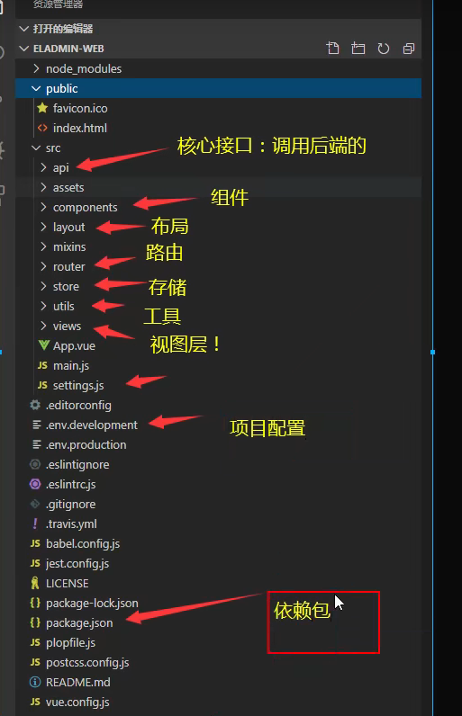

# 解析eladmin
注意:::先看协议!!!!

## 地址
- 后端网址:https://gitee.com/elunez/eladmin
- 前端网址:https://gitee.com/elunez/eladmin-web

## 介绍

- 下载完,解压,,
- 观察:
    - 1.用的什么技术(SpringBoot,Vue,Redis,MQ..)
    - 2.是否有数据库(Mysql,Oracle)
    - 3.环境是否匹配(如:Springboot对应的maven,npm,webpac,nodejs,redis)
    - 满足了,再运行
    
- 1.跑数据库
- 2.前端运行
- 3.后端项目导入,跑起来
- 4.启动后端项目

  
- 只要发现了swagger,那么跑起来第一步就是进入swagger-ui页面!!!因为这里面都是接口!!

## 看common
- 明白这个项目之前要不要启动reids啥的

## 看system
- 1.看一些配置
  - 默认端口号,配置一些,改为自己的项目和环境地址
  

## 前后端分离固定套路
- 1.从前端开始分析.打开控制台,点一个接口,分析一波调用关系!
- 2.前后端端口调用不一致--8013--8000 ,怎么操作的
  - 肯定封装的,ajax,axios request封装
  

- 前端项目固定套路

  

- 审查元素,然后Network找到,有接口,然后前端API里找,然后前端找到再去后端找
- 后端--controller--service---dao ----
- 现在从前到后可以分析了!!!但是如何渲染到视图上的呢?---看前端

- vue标准套路
  - 三层,,1.template--视图层 2.script---js操作,接口的调用,  3.style---页面的样式
  

- 如果你现在建自己的项目,或者要学习某一模块,将这个模块独立抽出来即可!删除法!

## 如何找到一个好的开源项目
- 用码云做案例
- 1.找分类 Java
- 2.看收藏,开源项目,所有人都觉得不错的,就是好的
- 3.看具有价值的
- 4.根据自身的理解情况去看,

